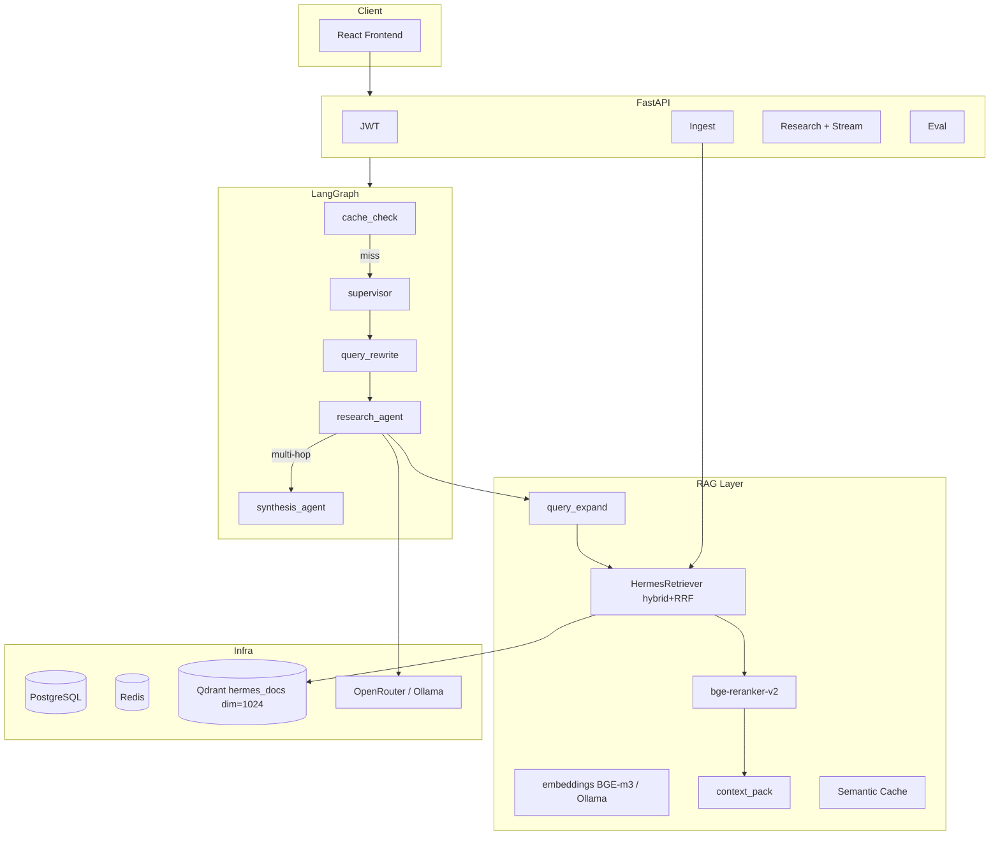

# HERMES — Complete Project Handoff Document

**Version:** 0.3.0 (clean-slate RAG win locked)  
**Last updated:** 2026-07-14  
**Repository:** `/home/mhamd/HERMES-clean`  
**Remote:** `https://github.com/hamdan-ishfaq/HERMES.git` (`main`, **2 commits ahead of origin** — push blocked pending GitHub auth)

**Cite metrics only from** [`backend/eval_report.json`](backend/eval_report.json) and [`docs/EVAL.md`](docs/EVAL.md).

---

## Next-agent status (read this first)

| Item | State |
|---|---|
| Clean-slate rebuild | Done — Docker wipe, Qdrant volume recreate, Redis Hermes-key flush, BGE re-ingest |
| Gold set | `backend/eval/gold_v2.json` v2.1 — 20Q, answerable from 3 URLs + `eval/kb/hermes_architecture.md` |
| Retrieval gate | **hit_rate 1.00** (`clean_slate_retrieval_v1`) |
| RAGAS win | **`clean_slate_winning`** — faith 1.00 / relevancy 0.87 / precision 0.83 / recall 1.00 |
| Industry targets | All met (faith ≥0.90, others ≥0.75–0.80) |
| Local commits | `96510e8` eval win · `aadfaf6` remaining stack — **not pushed** (no `gh`/SSH/token here) |
| Do not | `FLUSHDB` Redis globally; cite old 10Q scores (0.72–0.81); re-run expensive RAGAS unless stack changes |

**Winning env (pin in `backend/.env`):**

```
CHUNK_STRATEGY=fixed_large
EMBED_MODEL=bge-m3
EMBED_DEVICE=cuda
RERANK_MODEL=BAAI/bge-reranker-v2-m3
RERANK_DEVICE=cuda
MIN_RERANK_SCORE=0.0
CONTEXT_PACK_TOP_K=5
RETRIEVAL_CANDIDATES=50
HERMES_MULTI_QUERY=1
HERMES_CRAG_LITE=0
HERMES_GRAPH_RAG=0
HERMES_SIMPLE_MODEL=complex
LLM_PROVIDER=openrouter
RAGAS_MAX_WORKERS=4
RAGAS_BUILD_WORKERS=1
```

On RTX 4050 6GB: keep `RAGAS_BUILD_WORKERS=1` (4× concurrent BGE load OOMs).

---

## Portfolio role (2026-07-14)

HERMES is the **Applied AI / agentic-RAG star** (JurisGuard is supporting only). Story: LangGraph + hybrid RAG + semantic cache + honest RAGAS on a fixed gold set + multi-source ingest.

**CV order:** Applied → HaulRank → HERMES → Juris (short) → TALASH · Agentic → NEXUS → HERMES → Juris (short) → HaulRank.

Ready-to-paste bullets: [`docs/CV_BULLETS.md`](docs/CV_BULLETS.md) — **update that file to cite `clean_slate_winning` numbers before using in a CV.**  
Public summary: [`README.md`](README.md). Code walkthrough: [`EXPLANATION.md`](EXPLANATION.md). Architecture notes: [`RAG_ARCHITECTURES/`](RAG_ARCHITECTURES/).

---

## Table of Contents

1. [Executive Summary](#1-executive-summary)
2. [What HERMES Does](#2-what-hermes-does)
3. [System Architecture](#3-system-architecture)
4. [The Life of a Query](#4-the-life-of-a-query)
5. [Backend Components](#5-backend-components)
6. [Frontend](#6-frontend)
7. [Data Stores](#7-data-stores)
8. [API Reference](#8-api-reference)
9. [Configuration Reference](#9-configuration-reference)
10. [Performance & Quality Metrics](#10-performance--quality-metrics)
11. [Running the Project](#11-running-the-project)
12. [Testing & Evaluation](#12-testing--evaluation)
13. [Recent history (what changed)](#13-recent-history-what-changed)
14. [Known Limitations & Out of Scope](#14-known-limitations--out-of-scope)
15. [Troubleshooting](#15-troubleshooting)
16. [File Map](#16-file-map)

---

## 1. Executive Summary

HERMES is an **agentic Retrieval-Augmented Generation (RAG) research assistant**. Users ingest PDFs, URLs, and YouTube transcripts, then ask questions and get grounded answers with citations.

| Capability | Current implementation |
|---|---|
| Multi-source ingestion | PDF, URL (trafilatura), YouTube transcripts |
| Hybrid retrieval | Dense (**BGE-m3**, 1024-d) + sparse BM25 in Qdrant, RRF fusion |
| Reranking | **`BAAI/bge-reranker-v2-m3`** (CUDA); soft empty floor if filter clears all |
| Chunking | `CHUNK_STRATEGY=fixed_large` — parent 1200/120, child 150/50 |
| Multi-query | Optional paraphrases via `HERMES_MULTI_QUERY` + `query_expand.py` |
| Agent orchestration | LangGraph: cache → supervisor → rewrite → research → synthesis |
| Streaming | `POST /api/research/stream` (token SSE) |
| Tools / MCP | `hybrid_search`, `fetch_parent`, optional graph/web; MCP `hermes_search` |
| API & auth | FastAPI + JWT; workspace `user_id` ACL on Qdrant points |
| Semantic caching | Redis, cosine ≥ 0.95 (Hermes-key scoped flush only) |
| Quality | Retrieval-only eval + RAGAS; gold v2.1 answerable KB |

**Stack:** Python 3.11+ · React 19 · PostgreSQL · Redis · Qdrant · Ollama (optional embeds/LLM) · OpenRouter (eval/production answers + judge)

---

## 2. What HERMES Does

### User-facing workflow

1. **Register / log in** — JWT in `localStorage`.
2. **Ingest** — PDF / URL / YouTube → chunk → embed → Qdrant.
3. **Ask** — Chat + optional streaming; citation cards (URL / page / timestamp).
4. **Analytics** — Query volume, cache hit rate, latest RAGAS from `eval_report.json`.

### Four resume claims (defendable)

1. Q&A over PDF/URL/YouTube with citations.
2. Hybrid dense+BM25, RRF, cross-encoder rerank (BGE stack in winning config).
3. LangGraph + JWT FastAPI (+ stream + tool_trace).
4. Semantic cache + RAGAS — **cite `eval_report.json` only** (winning run beats industry targets).

---

## 3. System Architecture



### Technology choices (winning path)

| Layer | Technology | Notes |
|---|---|---|
| Dense embed | `BAAI/bge-m3` (CUDA) | 1024-d; wipe collection when switching from nomic 768 |
| Sparse | fastembed BM25 | Hybrid with dense |
| Reranker | `bge-reranker-v2-m3` | Logit scores; default filter `MIN_RERANK_SCORE=0.0` |
| Chunking | `fixed_large` | Via `chunk_strategies.py` |
| LLM | OpenRouter Gemini flash-lite + Llama 3.2-3b classify | `HERMES_SIMPLE_MODEL=complex` |
| Cache | Redis cosine ≥ 0.95 | Never `FLUSHDB` if shared |
| Optional | GraphRAG-lite, CRAG-lite | Off in winning eval (`HERMES_GRAPH_RAG=0`, `HERMES_CRAG_LITE=0`) |

---

## 4. The Life of a Query

```
POST /api/research { query, session_id? }
        │
        ▼
cache_check  → hit (≥0.95) → END with cached answer
        │ miss
        ▼
supervisor → simple | multi_hop | synthesis
        ▼
query_rewrite (multi-turn short history from Postgres)
        ▼
research_node
  1. expand_queries (if HERMES_MULTI_QUERY=1)
  2. hybrid_search top_k=10  (dense+BM25 → RRF → parent expand → rerank)
  3. soft filter: keep score ≥ MIN_RERANK_SCORE;
     if empty, keep top-1 if score ≥ −2.0
  4. pack_contexts (CONTEXT_PACK_TOP_K=5)
  5. LLM draft (+ optional CRAG-lite retry)
  6. simple → cache+END; else → synthesis
        ▼
{ answer, citations[], model_used, cache_hit, session_id, tool_trace? }
```

### Ingestion

```
Loader → HierarchicalChunker (strategy from CHUNK_STRATEGY)
      → dense embed + BM25 sparse → upsert hermes_docs
      → stamp user_id / workspace_id (eval uses user_id=eval)
```

**Switching `EMBED_MODEL`:** delete Qdrant collection `hermes_docs` (or wipe volume) and re-ingest. Dim mismatch will error.

---

## 5. Backend Components

| Area | Path | Role |
|---|---|---|
| App | `src/main.py` | FastAPI entry |
| Auth | `src/auth.py` | JWT |
| Agents | `src/agents/*` | LangGraph nodes; `stream_research.py` SSE |
| RAG | `src/rag/*` | retriever, embeddings, reranker, chunk strategies, context_pack, query_expand, graph_index |
| Tools | `src/tools/*` | hybrid_search, fetch_parent, graph_search, web_fetch |
| MCP | `src/mcp/server.py` | `hermes_search` / research tools |
| Ingest | `src/ingestion/*` | PDF / URL / YouTube |
| LLM | `src/llm/providers.py` | OpenRouter / Ollama routing |
| Eval | `src/evaluation/*` | gold loader, `ragas_eval`, **`retrieval_eval`** (no LLM judge) |
| Gold / KB | `backend/eval/gold_v2.json`, `backend/eval/kb/hermes_architecture.md` | Fixed eval corpus |

Shared retriever: `src/rag/factory.get_retriever()` — never instantiate a second Qdrant-backed retriever for server path.

---

## 6. Frontend

React 19 + Vite + Tailwind. Key pages: `ResearchView` (chat + stream), `KnowledgeBaseView` (ingest), `AnalyticsView` (reads eval dashboard / report). Auth via `AuthContext` + Bearer Axios client.

---

## 7. Data Stores

| Store | Use |
|---|---|
| PostgreSQL | users, ingestion jobs, query_logs, multi-turn turns, optional `entity_nodes` / `entity_edges` |
| Qdrant `hermes_docs` | Hybrid dense (1024) + sparse; payload `parent_text`, `user_id` |
| Redis | `hermes:cache:index*`, `hermes:query:*` only — **scoped deletes, never FLUSHDB** |

---

## 8. API Reference

**Base:** `http://localhost:8000` · Docs: `/docs` · Auth: Bearer except `/api/auth/*` and `/health`.

| Method | Path | Notes |
|---|---|---|
| POST | `/api/auth/register`, `/login` | JWT |
| POST | `/api/ingest/url\|youtube\|pdf` | 422 on extract failure |
| POST | `/api/research` | Full graph |
| POST | `/api/research/stream` | Token SSE |
| POST | `/api/eval/run` | Background RAGAS; respect `EVAL_ADMIN_EMAILS` |
| GET | `/api/eval/dashboard`, `/golden` | Stats + report |

---

## 9. Configuration Reference

Copy `backend/.env.example` → `backend/.env` (gitignored). Critical levers:

| Variable | Winning / default | Purpose |
|---|---|---|
| `EMBED_MODEL` | `bge-m3` | Dense backend (`ollama` fallback = nomic 768) |
| `EMBED_DEVICE` / `RERANK_DEVICE` | `cuda` | Local GPU |
| `RERANK_MODEL` | `BAAI/bge-reranker-v2-m3` | Cross-encoder |
| `CHUNK_STRATEGY` | `fixed_large` | Child 150/50 |
| `MIN_RERANK_SCORE` | `0.0` | Hard filter; soft floor −2.0 if empty |
| `CONTEXT_PACK_TOP_K` | `5` | Max contexts to LLM |
| `RETRIEVAL_CANDIDATES` | `50` | Pre-rerank pool |
| `HERMES_MULTI_QUERY` | `1` | Paraphrase retrieval |
| `HERMES_CRAG_LITE` | `0` | Off for winning run |
| `HERMES_GRAPH_RAG` | `0` | Off for winning run |
| `HERMES_SIMPLE_MODEL` | `complex` | Avoid tiny model on “simple” answers |
| `LLM_PROVIDER` | `openrouter` | Answers + judge |
| `RAGAS_MAX_WORKERS` | `4` | Judge concurrency |
| `RAGAS_BUILD_WORKERS` | `1` | Serial gen on 6GB GPU |
| `SECRET_KEY` | required | JWT |
| `EVAL_ADMIN_EMAILS` | optional | Eval API allow-list |

---

## 10. Performance & Quality Metrics

### Authoritative RAGAS (`clean_slate_winning`, 20Q)

**Source:** [`backend/eval_report.json`](backend/eval_report.json) · Log: [`docs/EVAL.md`](docs/EVAL.md)

| Metric | Score | Industry target |
|---|---|---|
| Faithfulness | **1.0000** | ≥ 0.90 |
| Answer relevancy | **0.8711** | ≥ 0.80 |
| Context precision | **0.8327** | ≥ 0.75 |
| Context recall | **1.0000** | ≥ 0.75 |

### Retrieval-only gate

`uv run python -m src.evaluation.retrieval_eval --n 20`  
→ hit_rate **1.000**, mean gold-term recall **1.000** (~30s/query with multi-query + BGE rerank on CUDA).

### Why older runs failed (do not regress)

| Symptom | Root cause |
|---|---|
| Recall ~0.65, empty contexts | Gold Qs not in 3-URL KB (BEIR, parent-child, semantic cache, BM25 defs) |
| Precision ~0.54 | Wrong/empty retrieved parents packed top-3 |
| “Stack upgrades no lift” | Cannot retrieve text never ingested; leftover `CHUNK_STRATEGY=semantic` polluted index |
| Parallel NaNs | OpenRouter storm at 12–16 workers — use `_safe` mean of non-null rows + workers=4 |

### Latency notes

- Cache hit: sub-second semantic bypass.
- Cache miss + BGE CUDA + OpenRouter: seconds–tens of seconds (multi-query triples retrieve+rerank).
- First RAGAS build: load BGE once; keep build workers at 1 on 6GB VRAM.

---

## 11. Running the Project

```bash
cd /home/mhamd/HERMES-clean
docker compose up -d postgres redis qdrant

# Embeddings/rerank: CUDA BGE preferred for winning config
# Ollama optional fallback: ollama pull nomic-embed-text llama3.2:3b llama3.1:8b

cp backend/.env.example backend/.env   # then pin winning block above + OPENROUTER_API_KEY

cd backend && uv sync
uv run uvicorn src.main:app --host 0.0.0.0 --port 8000 --reload

cd frontend && npm install && npm run dev
```

**Clean-slate re-index (after env change):**

```bash
cd backend
# wipe hermes_docs / qdrant volume if switching embed dim
uv run python -m src.evaluation.ragas_eval --n 5 --exp-name smoke_reindex
# or ingest URLs + kb_files then:
uv run python -m src.evaluation.retrieval_eval --n 20 --exp-name check
RAGAS_BUILD_WORKERS=1 RAGAS_MAX_WORKERS=4 \
  uv run python -m src.evaluation.ragas_eval --n 20 --exp-name my_exp --no-fresh-kb
```

---

## 12. Testing & Evaluation

```bash
cd backend
uv run pytest -m "not integration" -v
uv run pytest -m integration -v   # needs live Qdrant/Redis/Ollama-or-BGE

# Cheap iteration (no OpenRouter judge):
uv run python -m src.evaluation.retrieval_eval --n 20

# Full RAGAS (sparing OpenRouter):
RAGAS_BUILD_WORKERS=1 RAGAS_MAX_WORKERS=4 \
  uv run python -m src.evaluation.ragas_eval --n 20 --exp-name name --no-fresh-kb
```

CI: unit tests only (no RAGAS, no GPU models).

---

## 13. Recent history (what changed)

### Resume-honest foundation (earlier)

Shared retriever factory, `parent_text` in Qdrant, real ingest 422s, cache at graph layer, honest RAGAS wiring, citation metadata end-to-end.

### HE elevation / stack upgrades

Multi-query, context pack, chunk strategies, BGE embeds/rerank, optional GraphRAG-lite + CRAG-lite, MCP tools, streaming, OpenRouter path, `retrieval_eval`, parallel RAGAS workers with NaN-safe aggregates.

### Clean-slate fix (2026-07-14) — **winning**

1. Recreate infra; wipe Qdrant volume + Hermes Redis keys + graph tables.  
2. Rewrite gold + add `hermes_architecture.md`; verify all `gold_contexts` substrings.  
3. Soft retrieval gate + top_k=10 + pack 5 + `MIN_RERANK_SCORE=0.0`.  
4. Fresh BGE-m3 ingest (dim 1024, `fixed_large`).  
5. retrieval_eval ≥0.90 then one RAGAS pass → all targets met.  
6. Committed report + `docs/EVAL.md` locally (push pending auth).

---

## 14. Known Limitations & Out of Scope

| Limitation | Detail |
|---|---|
| Push | Local `main` ahead of GitHub until credentials configured |
| VRAM | RTX 4050 6GB → serial RAGAS build / careful concurrency |
| GraphRAG / CRAG | Implemented but **off** in winning eval |
| RAGAS not in CI | Manual / API only |
| ACL | Pre-ACL points need re-ingest with `user_id` |
| Embed switch | Must wipe collection when changing dim/model |

**Still deferred:** public demo deploy, Langfuse, full ReAct tool loop as default, Juris-class SSO/WORM, Mem0 long-term memory.

---

## 15. Troubleshooting

| Symptom | Action |
|---|---|
| Vector dim / collection error | Delete `hermes_docs` or qdrant volume; re-ingest with current `EMBED_MODEL` |
| Empty answers / no contexts | Check ingest `user_id=eval` for eval queries; soft floor should keep ≥1 weak hit |
| Redis “fix clears everything” | Delete only `hermes:*` keys — never `FLUSHDB` |
| OpenRouter 404 | Use valid model IDs (`gemini-2.5-flash-lite`, not retired `gemini-2.0-flash-001`) |
| GPU OOM mid-eval | `RAGAS_BUILD_WORKERS=1`; kill stray python holding CUDA |
| Stale shell env | Unset leftover `CHUNK_STRATEGY` / `EMBED_MODEL` / OpenRouter overrides before runs |

```bash
# Scoped Redis clear
docker exec hermes-clean-redis-1 redis-cli --scan --pattern 'hermes:*' | \
  xargs -r -n 100 docker exec -i hermes-clean-redis-1 redis-cli DEL
```

---

## 16. File Map

```
HERMES-clean/
├── HANDOFF.md                 ← this document
├── README.md · EXPLANATION.md · fix.md
├── docs/EVAL.md · docs/CV_BULLETS.md
├── RAG_ARCHITECTURES/         ← vendored architecture reference
├── docker-compose.yml
│
└── backend/
    ├── eval_report.json       ← AUTHORITATIVE scores (clean_slate_winning)
    ├── eval_details.json
    ├── eval/
    │   ├── gold_v2.json
    │   ├── kb/hermes_architecture.md
    │   └── experiments/*.json
    ├── src/
    │   ├── agents/            graph, research, stream, rewrite, …
    │   ├── rag/               retriever, embeddings, reranker, chunk_strategies,
    │   │                      context_pack, query_expand, graph_index, cache
    │   ├── tools/ · mcp/
    │   ├── evaluation/        ragas_eval, retrieval_eval, golden_dataset
    │   ├── ingestion/ · llm/ · routers/
    │   └── …
    └── tests/
```

---

## Quick Reference Card

```
┌──────────────────────────────────────────────────────────────────┐
│  HERMES Quick Start                                              │
├──────────────────────────────────────────────────────────────────┤
│  Infra:     docker compose up -d postgres redis qdrant           │
│  Embed:     EMBED_MODEL=bge-m3 (CUDA) — dim 1024                 │
│  Backend:   cd backend && uv run uvicorn src.main:app --reload   │
│  Frontend:  cd frontend && npm run dev                           │
│  Retrieval: uv run python -m src.evaluation.retrieval_eval -n 20 │
│  RAGAS:     RAGAS_BUILD_WORKERS=1 … ragas_eval --n 20            │
│  Cite:      backend/eval_report.json ONLY                        │
│  Win:       faith 1.00 · rel 0.87 · prec 0.83 · recall 1.00      │
│  Push:      git push (needs GitHub auth on this machine)         │
└──────────────────────────────────────────────────────────────────┘
```

---

*Authoritative handoff for HERMES. Public summary: `README.md`. Eval protocol: `docs/EVAL.md`. Do not invent metric numbers.*
