# Awesome RAG Production

> A curated collection of battle-tested tools, frameworks, and best practices for building, scaling, and monitoring production-grade Retrieval-Augmented Generation (RAG) systems.

*Last reviewed: 2026-06-17 · Freshness audited weekly via [discovery\_engine](scripts/discovery_engine.py)*

**Retrieval-Augmented Generation (RAG)** is revolutionizing how LLMs access and utilize external knowledge.
This repository bridges the gap between prototype RAG tutorials and **production-grade systems** at scale.
Whether you're building semantic search, question-answering systems, or AI-powered assistants, you'll find battle-tested frameworks,
vector databases, evaluation tools, and observability solutions for **production RAG deployments**.
Focus on the **Engineering** side of AI—from data ingestion and retrieval optimization to monitoring, security, and deployment strategies for real-world LLM applications.

[Contribution Guide](CONTRIBUTING.md) · [FAQ](FAQ.md) · [Explore Categories](#contents) · [Report Bug](https://github.com/Yigtwxx/Awesome-RAG-Production/issues)

---

## Contents

- [Decision Guide](#decision-guide-how-to-choose)
- [Reference Architectures](#reference-architectures)
- [Real-World Case Studies](#real-world-case-studies)
- [Frameworks & Orchestration](#frameworks--orchestration)
- [Data Ingestion & Parsing](#data-ingestion--parsing)
- [Embedding Models](#embedding-models)
- [Embedding Fine-tuning](#embedding-fine-tuning)
- [Vector Databases](#vector-databases)
- [Data & Index Versioning](#data--index-versioning)
- [Chunking & Document Processing](#chunking--document-processing)
- [Retrieval & Reranking](#retrieval--reranking)
- [Query Transformation & Routing](#query-transformation--routing)
- [Agentic RAG](#agentic-rag)
- [Agent Memory & Stateful Context](#agent-memory--stateful-context)
- [Multimodal RAG](#multimodal-rag)
- [Structured & SQL RAG](#structured--sql-rag)
- [Evaluation & Benchmarking](#evaluation--benchmarking)
- [Observability & Tracing](#observability--tracing)
- [Deployment & Serving](#deployment--serving)
- [Caching & Performance](#caching--performance)
- [Security & Compliance](#security--compliance)
- [LLM Gateways & Routing](#llm-gateways--routing)
- [FinOps & Cost Management](#finops--cost-management)
- [Selection Criteria](#selection-criteria)
- [Case Studies & Production Talks](showcase.md)
- [Benchmarks & Evidence](benchmarks.md)
- [Datasets](datasets.md)
- [RAG Pitfalls & Anti-patterns](rag-pitfalls.md)
- [Deep-Dive Concept Guides](#deep-dive-concept-guides)
- [Tutorials & Hands-on Code](#tutorials--hands-on-code)
- [Recommended Resources (Books & Blogs)](#recommended-resources)
- [Contributing](CONTRIBUTING.md)
- [FAQ](FAQ.md)
- [Changelog](CHANGELOG.md)
- [Roadmap](ROADMAP.md)
- [Code of Conduct](CODE_OF_CONDUCT.md)
- [License](#license)

---

## Deep-Dive Concept Guides

Production-focused guides — each covers one concept end-to-end with industry knowledge,
architecture patterns, and top GitHub repositories.

| Guide | What It Covers |
| :--- | :--- |
| [RAG Failure Handling](rag-failure-handling.md) | Seven silent failure modes and fallback chains |
| [Agent Memory Types](agent-memory-types.md) | All seven memory layers and when to add each |
| [RAG Architectures](rag-architectures.md) | Traditional, Agentic, EAg-RAG, CRAG, Self-RAG |
| [Production RAG Pipeline](production-rag-pipeline.md) | 13-component reference stack with repos |
| [RAG Security](rag-security.md) | Four defense layers: input, ACL, prompts, audit |
| [REST & API Design](rest-api-design.md) | Endpoint naming, PUT vs PATCH, pagination |
| [Agentic Orchestration](agentic-orchestration-production.md) | Beyond the while-loop: durable, secure agents |

---

## Decision Guide: How to Choose

Not sure where to start? Use this high-level decision tree to pick the right
tools across the pipeline — framework, vector database, embedding model,
reranker, chunking strategy, and evaluation — for your scale and use case.

```mermaid
graph TD
    Start([Start Project]) --> UseCase{What is your primary goal?}

    %% Framework Selection
    UseCase -->|Complex Agents & Control| LangGraph[LangGraph]
    UseCase -->|Data Processing & Indexing| LlamaIndex[LlamaIndex]
    UseCase -->|Auditable Pipelines| Haystack[Haystack]
    UseCase -->|Rapid Prototyping| LangChain[LangChain]

    %% Vector DB Selection
    UseCase --> DB{Which Vector DB?}
    DB -->|Serverless / Zero Ops| Pinecone[Pinecone]
    DB -->|Massive Scale >100M| Milvus[Milvus]
    DB -->|Running Locally| Chroma[Chroma]
    DB -->|Postgres Ecosystem| PGVector[pgvector]

    %% Embedding Model Selection
    UseCase --> Emb{Embedding model?}
    Emb -->|Domain-specific corpus| FineTune["Fine-tune w/ sentence-transformers"]
    Emb -->|Multilingual| MultiEmb["BGE-M3 / Cohere embed-v4 / Jina v3"]
    Emb -->|Long docs, 8k+ tokens| Voyage["Voyage voyage-3 32k ctx"]
    Emb -->|General English, managed API| OpenAIEmb["OpenAI text-embedding-3-large"]
    Emb -->|Open-weight / self-host| SelfEmb["BGE-M3 / Nomic"]

    %% Reranking
    UseCase --> Rerank{Add a reranker?}
    Rerank -->|Managed API| Cohere["Cohere Rerank"]
    Rerank -->|Self-host, top quality| BGEReranker["BGE-Reranker v2-m3"]
    Rerank -->|CPU / serverless| FlashRank["FlashRank"]
    Rerank -->|Late interaction| ColBERT["RAGatouille / ColBERT"]

    %% Chunking Strategy
    UseCase --> Chunk{Chunking strategy?}
    Chunk -->|Baseline / uniform text| FixedChunk["Fixed-size token"]
    Chunk -->|General mixed text| RecurChunk["Recursive split"]
    Chunk -->|Heterogeneous density| SemChunk["Semantic chunking"]
    Chunk -->|PDF / tables / code / HTML| DocChunk["Doc-type aware + Unstructured"]
    Chunk -->|Multi-hop retrieval| HierChunk["Hierarchical small-to-big"]

    %% Evaluation
    UseCase --> Eval{How to evaluate?}
    Eval -->|LLM-as-judge pipeline| RAGAS[RAGAS]
    Eval -->|Observability + traces| LangSmith[LangSmith / Arize]

    %% Styling
    classDef framework fill:#e1f5fe,stroke:#01579b,stroke-width:2px;
    classDef db fill:#f3e5f5,stroke:#4a148c,stroke-width:2px;
    classDef embedding fill:#fff8e1,stroke:#f57f17,stroke-width:2px;
    classDef rerank fill:#fce4ec,stroke:#880e4f,stroke-width:2px;
    classDef chunk fill:#e0f2f1,stroke:#004d40,stroke-width:2px;
    classDef eval fill:#e8f5e9,stroke:#1b5e20,stroke-width:2px;
    classDef start fill:#f5f5f5,stroke:#424242,stroke-width:2px;

    class LangGraph,LlamaIndex,Haystack,LangChain framework;
    class Pinecone,Milvus,Chroma,PGVector db;
    class OpenAIEmb,MultiEmb,Voyage,FineTune,SelfEmb embedding;
    class Cohere,BGEReranker,FlashRank,ColBERT rerank;
    class FixedChunk,RecurChunk,SemChunk,DocChunk,HierChunk chunk;
    class RAGAS,LangSmith eval;
    class Start start;
```

---

## Reference Architectures

Stop guessing. Here are three battle-tested stacks for different stages of
maturity.

### 1. The Local / Dev Stack (Zero to One)

**Goal:** Rapid prototyping, zero cost, no API keys.

**Stack:**

- **LLM:** **Ollama** (LLaMA 3 / Mistral)
- **Vector DB:** **Chroma** (Embedded)
- **Eval:** **Ragas** (Basic checks)

**Why:** Runs entirely on your laptop. Perfect for "Hello World" and checking
feasibility.

**Risks:** High latency; performance depends on your hardware; no horizontal
scaling.

**Observability Checklist:** `print()` statements and basic logging.

*Public latency / cost envelope: No public end-to-end benchmark for this stack
combination — performance is entirely hardware-dependent. Component-level
data: see [benchmarks.md](benchmarks.md#1-vector-databases) (Chroma) and
[benchmarks.md](benchmarks.md#9-gaps--not-publicly-measured).*

### 2. The Mid-Scale / Production Stack (Speed to Market)

**Goal:** High precision, developer velocity, minimal infra management.

**Stack:**

- **Vector DB:** **Qdrant** or **Weaviate** (Cloud/Managed)
- **Reranker:** **Cohere Rerank** (API)
- **Tracing:** **Langfuse** or **Arize Phoenix**

**Why:** Offloads complexity to managed services. "It just works" with great documentation.

**Risks:** Costs scale linearly with usage; dependency on external APIs (Vendor
lock-in).

**Observability Checklist:** Latency tracking, Token usage costs, Trace
visualization.

*Public latency / cost envelope: No public end-to-end benchmark for this exact
stack combination. Component-level data available: Qdrant self-published
benchmarks [\[V\]](benchmarks.md#1-vector-databases), Anthropic / OpenAI caching
figures [\[V\]](benchmarks.md#4-caching-prompt--semantic). For reranking latency,
see [benchmarks.md § Gaps](benchmarks.md#9-gaps--not-publicly-measured).*

### 3. The Enterprise / High-Scale Stack (The 1%)

**Goal:** Throughput maximization, data sovereignty, full control.

**Stack:**

- **Vector DB:** **Milvus** (Distributed)
- **Serving:** **vLLM** (Self-hosted)
- **Eval (CI/CD):** **DeepEval**
- **Monitoring:** **OpenLIT** (OpenTelemetry)

**Why:** You own the data and the compute. Scales to billions of vectors.

**Risks:** Significant operational complexity (Kubernetes); requires a dedicated Platform Engineering team.

**Observability Checklist:** Distributed tracing, Embedding drift detection, Custom SLA alerts, GPU utilization metrics.

*Public latency / cost envelope: No public end-to-end benchmark for this exact
stack. Component-level data: Milvus benchmarks [\[V\]](benchmarks.md#1-vector-databases),
vLLM 2–4× throughput vs FasterTransformer [\[3P\]](benchmarks.md#5-llm-serving),
ANN-Benchmarks [\[3P\]](benchmarks.md#1-vector-databases). Enterprise stack
cost depends entirely on cluster sizing — no public reference architecture
pricing exists.*

---

## Real-World Case Studies

Learn from production RAG implementations at scale. These companies have battle-tested their systems with millions of users.

### Success Stories

- [LinkedIn — Approximate Nearest Neighbor Search at Scale (Galene)](https://engineering.linkedin.com/blog/2020/scaling-approximate-nearest-neighbor-search-with-galene)
  - Custom ANN implementation (Galene) built on top of Lucene for professional recommendations at LinkedIn scale.
    Key insight: a custom ANN layer on a battle-tested search engine outperforms a standalone vector DB when ranking signals are deeply domain-specific.

- [DoorDash — Personalized Store Feed with Vector Retrieval](https://doordash.engineering/2023/08/01/improving-store-feed-ranking-with-vector-retrieval/)
  - Vector retrieval layer added to the store-feed ranking pipeline, reducing cold-start latency and improving personalization.
    Demonstrates how retrieval augmentation integrates alongside traditional ranking signals in an existing production recommendation system.

- [Discord — Message Search at Trillion Scale](https://discord.com/blog/how-discord-stores-trillions-of-messages)
  - Custom ANN search + Rust microservices + ScyllaDB for indexing and retrieving trillions of messages. Key insight: Rust-based infrastructure enables ANN search at this scale.

**Common Patterns:**

- Hybrid search (dense + sparse) is standard at scale.
- Custom embedding models outperform off-the-shelf for domain-specific tasks.
- Reranking is critical for precision (top-100 → top-5).
- Extensive A/B testing on retrieval quality before LLM integration.

> Full case studies, enterprise examples, and must-watch talks: [showcase.md](showcase.md).

---

## Frameworks & Orchestration

### Framework Comparison

Choose the right framework for your use case with this production-focused comparison:

| Framework | Best For | Async Support | Production Readiness | Orchestration Style | Observability | Learning Curve | Deployment Complexity | Evidence |
| :--- | :--- | :--- | :--- | :--- | :--- | :--- | :--- | :--- |
| [LlamaIndex](https://github.com/run-llama/llama_index) | Data Processing & Indexing | Full | High | Data-Flow Pipelines | Built-in + 3rd Party | Low–Medium | Low | — |
| [LangChain](https://github.com/langchain-ai/langchain) | Rapid Prototyping | Full | Medium–High | Sequential Chains | Excellent (LangSmith) | Medium | Medium | — |
| [LangGraph](https://github.com/langchain-ai/langgraph) | Complex Agents & Control | Full | High | Cyclic Graphs | Excellent (LangSmith) | High | Medium–High | — |
| [Haystack](https://github.com/deepset-ai/haystack) | Enterprise Pipelines | Full | Very High | DAG-based Pipelines | Built-in Tracing | Medium–High | Low–Medium | — |

**Key Considerations:**

- **LlamaIndex**: Choose if you need advanced indexing strategies (hierarchical, knowledge graphs) and your focus is on data ingestion.
- **LangChain**: Best for quick experiments and maximum ecosystem compatibility. Watch out for abstraction overhead.
- **LangGraph**: Pick this when building agentic systems with human-in-the-loop, state persistence, or cyclic workflows.
- **Haystack**: The enterprise choice for auditable, type-safe pipelines with strict reproducibility requirements.

---

### Frameworks

- [Agentset](https://github.com/agentset-ai/agentset)
  - Open-source production-ready RAG infrastructure with built-in agentic
    reasoning, hybrid search, and multimodal support. Designed for scalable
    deployments with automatic citations and enterprise-grade reliability.
- [Cognita](https://github.com/truefoundry/cognita)
  - A modular RAG framework by TrueFoundry designed for scalability. It decouples
    the RAG components (Indexer, Retriever, Parser), allowing for independent
    scaling and easier AB testing of different RAG strategies.
- [DSPy](https://github.com/stanfordnlp/dspy)
  - Stanford's framework for programming — rather than prompting — language
    models. Compose RAG pipelines from typed modules and let DSPy's optimizers
    automatically tune prompts and few-shot examples to meet a declared metric,
    replacing brittle hand-crafted prompt chains with reproducible, optimizable
    programs.
- [Haystack](https://github.com/deepset-ai/haystack)
  - A modular framework focused on production readiness. It emphasizes auditable
    pipelines, strict type-checking, and reproducibility, making it ideal for
    enterprise-grade RAG where reliability is paramount.
- [LangChain](https://github.com/langchain-ai/langchain)
  - The most widely adopted LLM orchestration library. Offers a broad ecosystem
    of integrations (100+ LLMs, vector stores, tools) and a composable chain
    abstraction that enables rapid prototyping; pair with LangSmith for
    production observability and evaluation.
- [LangGraph](https://github.com/langchain-ai/langgraph)
  - A library for building stateful, multi-actor applications with LLMs. Unlike
    simple chains, it enables cyclic graphs for complex, agentic workflows with
    human-in-the-loop control and persistence.
- [LlamaIndex](https://github.com/run-llama/llama_index)
  - The premier data framework for LLMs. It excels at connecting custom data
    sources to LLMs, offering advanced indexing strategies (like recursive
    retrieval) and optimized query engines for deep insight extraction.
- [Pathway](https://github.com/pathwaycom/pathway)
  - A high-performance data processing framework for live data. It enables
    "Always-Live" RAG by syncing vector indices in real-time as the underlying
    data source changes, without full re-indexing.
- [R2R](https://github.com/SciPhi-AI/R2R)
  - A production-ready agentic retrieval system with a RESTful API, multimodal
    ingestion, hybrid search, and an automatic knowledge-graph pipeline — designed
    to ship RAG-powered applications without building infrastructure from scratch.
- [RAGFlow](https://github.com/infiniflow/ragflow)
  - An end-to-end RAG engine designed for deep document understanding. It handles
    complex layouts (PDFs, tables, images) natively and includes a built-in
    knowledge base management system.
- [Verba](https://github.com/weaviate/Verba)
  - Weaviate's "Golden RAGtriever". A fully aesthetic, open-source RAG web
    application that comes pre-configured with best practices for chunking,
    embedding, and retrieval out of the box.

## Data Ingestion & Parsing

- [Crawl4AI](https://github.com/unclecode/crawl4ai)
  - An open-source web crawler purpose-built for LLM pipelines. Converts web
    pages into clean, structured markdown or JSON ready for ingestion — with
    async multi-page crawling, JavaScript rendering, and a simple API that
    integrates directly into RAG indexing workflows.
- [Docling](https://github.com/docling-project/docling)
  - IBM's open-source document parser for production AI pipelines. Handles
    advanced PDF understanding (tables, figures, complex layouts) alongside
    DOCX, PPTX, HTML, and image formats, exporting clean structured output
    with native integrations into LlamaIndex, LangChain, and other gen-AI
    frameworks.
- [Firecrawl](https://github.com/firecrawl/firecrawl)
  - Effortlessly turn websites into clean, LLM-ready markdown.
- [LlamaParse](https://github.com/run-llama/llama_cloud_services)
  - Specialized parsing for complex PDFs with table extraction capabilities.
- [Marker](https://github.com/datalab-to/marker)
  - High-efficiency PDF, EPUB to Markdown converter using vision models.
- [OmniParse](https://github.com/adithya-s-k/omniparse)
  - Universal parser for ingesting any data type (documents, multimedia, web)
    into RAG-ready formats.
- [Unstructured](https://github.com/Unstructured-IO/unstructured)
  - Open-source pipelines for preprocessing complex, unstructured data.

## Embedding Models

Choosing the right embedding model is one of the highest-leverage decisions in a RAG pipeline — the wrong choice silently degrades retrieval before the LLM ever sees the context.
The [MTEB Leaderboard](https://huggingface.co/spaces/mteb/leaderboard) \[3P\] is the canonical benchmark for retrieval quality (nDCG@10 on BEIR datasets);
see [benchmarks.md §2](benchmarks.md#2-embeddings--retrieval) for a snapshot with source citations.

| Model | Strengths | Context Window | Hosting | Best For | Evidence |
| :--- | :--- | :--- | :--- | :--- | :--- |
| [OpenAI text-embedding-3-large](https://platform.openai.com/docs/guides/embeddings) | High retrieval nDCG@10 | 8,191 tokens | API | General English retrieval | [\[3P\]](benchmarks.md#2-embeddings--retrieval) |
| [Cohere embed-v4](https://docs.cohere.com/docs/embed-2) | Multilingual, int8 support | 512 tokens | API + self-host | Multilingual + cost-efficient | [\[3P\]](benchmarks.md#2-embeddings--retrieval) |
| [Voyage voyage-3](https://docs.voyageai.com/docs/embeddings) | Top MTEB retrieval scores | 32,000 tokens | API | Long-context retrieval | [\[3P\]](benchmarks.md#2-embeddings--retrieval) |
| [BAAI BGE-M3](https://huggingface.co/BAAI/bge-m3) | Multi-lingual, multi-granularity | 8,192 tokens | Self-host | Open-weight multilingual | [\[3P\]](benchmarks.md#2-embeddings--retrieval) |
| [Nomic nomic-embed-text-v1.5](https://huggingface.co/nomic-ai/nomic-embed-text-v1.5) | Long context, Apache 2.0 license | 8,192 tokens | Self-host / API | Open, long-context | — |
| [Alibaba gte-multilingual-base](https://huggingface.co/Alibaba-NLP/gte-multilingual-base) | 70+ languages, compact | 8,192 tokens | Self-host | Multilingual, cost-sensitive | — |
| [Jina jina-embeddings-v3](https://huggingface.co/jinaai/jina-embeddings-v3) | Task-adaptive LoRA adapters | 8,192 tokens | Self-host / API | Task-specific fine-tuning | — |

**Selection guide:**

- Use **MTEB Retrieval** scores (nDCG@10 on BEIR) as the primary benchmark — not overall MTEB average, which includes tasks irrelevant to RAG.
- For **domain-specific corpora** (legal, medical, code), fine-tune a base model with `sentence-transformers` on your own labeled pairs; generic MTEB rankings will not predict your performance.
- **Always use the same model** for indexing and querying — mismatched models are a silent recall killer (see [rag-pitfalls.md](rag-pitfalls.md#embedding-model-selection)).
- For **multilingual** pipelines: BGE-M3, Cohere embed-v4, or jina-embeddings-v3 with task adapters.

**Trade-offs:**

- API-hosted models (OpenAI, Cohere, Voyage) eliminate GPU ops overhead but create vendor dependency and add per-token costs at scale.
- Self-hosted open models (BGE-M3, nomic-embed) require GPU at production throughput but unlock full data sovereignty.
- Larger context windows (nomic-embed 8k, voyage-3 32k) are critical for long-document retrieval but increase embedding latency and cost per document.

---

## Embedding Fine-tuning

Generic MTEB rankings break down on domain-specific corpora (legal, medical, code,
financial). Fine-tuning a base embedding model on your own labeled pairs consistently
outperforms off-the-shelf models for in-domain retrieval — without the cost of
training from scratch. See also: [rag-pitfalls.md — Embedding Model Selection](rag-pitfalls.md#embedding-model-selection).

**When to fine-tune:**

- Off-the-shelf MTEB leaders underperform on your internal evaluation set.
- Your corpus uses specialized terminology not well represented in common pretraining data.
- You have labeled retrieval pairs (query → relevant passage) or can generate them via LLM.

| Tool | Approach | Best For |
| :--- | :--- | :--- |
| [sentence-transformers](https://github.com/UKPLab/sentence-transformers) | Contrastive / triplet / GISTEmbedLoss fine-tuning | General-purpose; widest community and integration support |
| [FlagEmbedding](https://github.com/FlagOpen/FlagEmbedding) | BGE-family fine-tuning + LLAMA-based embeddings | BAAI BGE model variants; includes hard-negative mining utilities |
| [SetFit](https://github.com/huggingface/setfit) | Few-shot contrastive fine-tuning | Low-data regime; strong results with as few as 8 labeled examples per class |
| [Tevatron](https://github.com/texttron/tevatron) | Dense retrieval training framework (bi-encoder + reranker) | Research-grade pipelines; flexible loss functions and BEIR evaluation |
| [RAGatouille](https://github.com/AnswerDotAI/RAGatouille) | Late-interaction ColBERT fine-tuning | When token-level late interaction improves recall vs. single-vector embeddings |

- [sentence-transformers](https://github.com/UKPLab/sentence-transformers)
  - The de-facto Python library for embedding model fine-tuning. Supports
    contrastive, triplet, and GISTEmbed loss functions with native integration
    into Hugging Face Hub. The `SentenceTransformerTrainer` API covers
    most domain-adaptation use cases with minimal boilerplate.
- [FlagEmbedding](https://github.com/FlagOpen/FlagEmbedding)
  - BAAI's training toolkit for the BGE model family, including BGE-M3 and
    LLM-based embedding variants. Ships with hard-negative mining scripts,
    C-MTEB evaluation, and recipe configs for reproducing published BGE results.
- [SetFit](https://github.com/huggingface/setfit)
  - A few-shot fine-tuning framework built on sentence-transformers. Achieves
    competitive retrieval quality with as few as 8–64 labeled examples per
    class by combining contrastive fine-tuning with a lightweight classification
    head. Ideal when labeled data is scarce.
- [Tevatron](https://github.com/texttron/tevatron)
  - A modular dense-retrieval training framework supporting bi-encoder and
    cross-encoder architectures. Provides flexible loss functions (InfoNCE,
    distillation), BEIR evaluation integration, and multi-GPU training — suited
    for rigorous research-grade fine-tuning pipelines.
- [RAGatouille](https://github.com/AnswerDotAI/RAGatouille)
  - A Pythonic wrapper for ColBERT late-interaction models. Enables indexing,
    retrieval, and fine-tuning of ColBERT-based models with a minimal API,
    making token-level late-interaction retrieval accessible without deep
    ColBERT infrastructure knowledge.

---

## Vector Databases

| Tool | Best For | Key Strength | Evidence |
| :--- | :--- | :--- | :--- |
| [Chroma](https://github.com/chroma-core/chroma) | Local/Dev & Mid-scale | Developer-friendly, open-source embedding database. | — |
| [LanceDB](https://github.com/lancedb/lancedb) | Serverless & multimodal | Embedded, serverless vector DB with native multimodal support; no separate server required. | — |
| [Milvus](https://github.com/milvus-io/milvus) | Billions of vectors | Most popular OSS for massive scale. | [\[V\]](benchmarks.md#1-vector-databases) |
| [Omnigraph](https://github.com/ModernRelay/omnigraph) | Graph + vector + BM25 hybrid | Typed graph database where agents branch and merge like Git; S3-native, Rust, with traversal + vector + BM25 in one runtime. | — |
| [pgvector](https://github.com/pgvector/pgvector) | PostgreSQL Ecosystem | Vector search capability directly within PostgreSQL. | — |
| [Pinecone](https://www.pinecone.io/) | 10M-100M+ vectors | Zero-ops, serverless architecture. | — |
| [Qdrant](https://github.com/qdrant/qdrant) | <50M vectors | Best filtering support and free tier. | [\[V\]](benchmarks.md#1-vector-databases) [\[3P\]](benchmarks.md#1-vector-databases) |
| [Vespa](https://github.com/vespa-engine/vespa) | Web-scale hybrid serving | Battle-tested engine combining vector, tensor, text, and structured data at serving time and any scale. | — |
| [Weaviate](https://github.com/weaviate/weaviate) | Hybrid Search | Native integration of vector and keyword search. | — |

---

## Data & Index Versioning

Production RAG indices drift over time: embedding models are upgraded, schema
changes reshape chunk boundaries, and knowledge bases grow. Without versioning,
re-indexing becomes a high-risk, manual operation. These tools bring reproducible,
auditable version control to datasets and vector indices — enabling safe rollbacks
when a model change degrades retrieval quality.

**When you need index versioning:**

- Upgrading embedding models (dimension or tokenizer change requires full re-index).
- Schema migrations that alter chunk boundaries or metadata fields.
- Multi-environment pipelines (dev → staging → prod) requiring consistent index snapshots.
- Audit requirements demanding traceability between document versions and retrieved answers.

| Tool | Focus | Best For |
| :--- | :--- | :--- |
| [DVC](https://github.com/iterative/dvc) | Dataset & model versioning (Git-like) | Tracking raw data, embeddings, and model artifacts in a Git-compatible workflow |
| [lakeFS](https://github.com/treeverse/lakeFS) | Git-for-data on object storage | Branching and merging large datasets on S3/GCS/Azure — zero-copy snapshots |
| [Pachyderm](https://github.com/pachyderm/pachyderm) | Data-versioned pipeline orchestration | End-to-end provenance tracking across ingestion → embedding → index pipelines |
| [Oxen](https://github.com/Oxen-AI/Oxen) | Fast dataset version control | ML dataset iteration with commit history, branching, and large-file support |

- [DVC](https://github.com/iterative/dvc)
  - A Git-compatible version control system for datasets, models, and
    experiments. Track your raw documents, generated embeddings, and vector
    index snapshots alongside code; reproduce any prior index state with
    `dvc checkout`. Integrates with S3, GCS, Azure, and SSH remotes.
- [lakeFS](https://github.com/treeverse/lakeFS)
  - Git-for-data built on top of object storage (S3/GCS/Azure Blob). Supports
    atomic commits, zero-copy branching, and merge conflict detection on large
    datasets — enabling pre-production staging of a new index snapshot before
    promoting to production. Also see LanceDB's built-in versioning for
    vector-native branching (listed in [Vector Databases](#vector-databases)).
- [Pachyderm](https://github.com/pachyderm/pachyderm)
  - A data-versioned pipeline orchestration platform. Every pipeline run is
    tied to an immutable data commit, giving full lineage from source document
    to vector index to LLM response — critical for compliance-heavy domains.
- [Oxen](https://github.com/Oxen-AI/Oxen)
  - A fast dataset version control tool optimized for ML workflows. Supports
    branching, commit history, and large-file handling with a CLI that mirrors
    Git — useful for iterating rapidly on chunked document datasets without
    object-storage overhead.

---

## Chunking & Document Processing

How you split documents into chunks is one of the most underrated decisions in a RAG pipeline.
The wrong chunking strategy silently degrades retrieval quality regardless of how good your embedding model is.
See [rag-pitfalls.md — Fixed Chunk Size Everywhere](rag-pitfalls.md#data-ingestion--chunking) for the failure modes.

**Chunking strategies at a glance:**

| Strategy | When to Use | Trade-off |
| :--- | :--- | :--- |
| Fixed-size (token count) | Baseline; simple corpora | Splits mid-sentence/table; safe starting point |
| Recursive character split | General text, mixed formats | Respects paragraph → sentence → word boundaries |
| Semantic chunking | Heterogeneous corpora, varying density | Higher quality; requires an embedding model at index time |
| Document-type aware | PDFs, code, tables, HTML | Best recall; requires per-type parsers |
| Hierarchical / small-to-big | Multi-hop retrieval | Retrieves small chunks, returns parent context to LLM |

- [chonkie](https://github.com/chonkie-ai/chonkie)
  - A fast, lightweight chunking library purpose-built for RAG. Supports token,
    sentence, semantic, recursive, and late-chunking strategies in a single API
    with minimal dependencies. Optimized for throughput — suitable for batch
    indexing pipelines.
- [LlamaIndex SemanticSplitterNodeParser](https://docs.llamaindex.ai/en/stable/module_guides/loading/node_parsers/modules/)
  - Splits documents at semantically meaningful boundaries by embedding adjacent
    sentences and measuring cosine distance. Produces more coherent chunks than
    fixed-size splitting for narrative and technical content.
- [LangChain RecursiveCharacterTextSplitter](https://python.langchain.com/docs/how_to/recursive_text_splitter/)
  - The de facto default for general-purpose chunking. Recursively tries separators
    (`\n\n`, `\n`, or a space) to split at natural boundaries within a target token
    window — robust, fast, no extra dependencies.
- [semchunk](https://github.com/umarbutler/semchunk)
  - A pure-Python semantic chunking library that requires no embedding model at
    chunk time; it uses statistical sentence boundaries for fast, low-cost semantic
    splitting suitable for large-scale batch indexing.
- [Unstructured](https://github.com/Unstructured-IO/unstructured) — see [Data Ingestion & Parsing](#data-ingestion--parsing) for the full entry.
  - Provides document-type aware parsing (PDF, DOCX, HTML, images) as the upstream
    step before chunking. Pair it with any splitter above for a robust ingestion pipeline.

**Trade-offs:**

- Fixed-size chunking is fast and dependency-free but degrades retrieval on tables, code, and structured content.
- Semantic chunking improves recall on heterogeneous corpora but adds embedding cost at index time and is slower.
- Chunk size affects both retrieval recall (too large = coarse matching) and LLM context quality (too small = missing context);
  256–512 tokens is a common starting point — tune on your own corpus with Ragas or DeepEval.

---

## Retrieval & Reranking

**Hybrid Search:**
A retrieval strategy that linearly combines Dense Vector Search (semantic
understanding) with Sparse Keyword Search (BM25 for exact term matching). This
mitigates the "lost in the middle" phenomenon and significantly improves
zero-shot retrieval performance.

- [BGE-Reranker](https://huggingface.co/BAAI/bge-reranker-v2-m3)
  - One of the best open-source rerankers available. It is a cross-encoder model
    trained to output a relevance score for query-document pairs, offering
    commercial-grade performance for self-hosted pipelines.
- [Cohere Rerank](https://cohere.com/rerank)
  - A powerful API-based reranking model. By re-scoring the initial top-K
    documents from a cheaper/faster retriever, it substantially improves retrieval
    precision with minimal code changes. Independent benchmarks show cross-encoder
    rerankers outperform bi-encoders by 4+ nDCG@10 points on BEIR
    (\[3P\] [benchmarks.md](benchmarks.md#3-reranking)).
- [FlashRank](https://github.com/PrithivirajDamodaran/FlashRank)
  - A lightweight, serverless-friendly reranking library. It runs quantized
    cross-encoder models directly on the CPU (no Torch/GPU required), making it
    ideal for edge deployments or cost-sensitive architectures.
- [psql_bm25s](https://github.com/Intelligent-Internet/psql_bm25s)
  - A PostgreSQL extension for BM25-family lexical retrieval with native indexing
    and SQL top-k query APIs. It can provide the keyword retrieval leg for
    Postgres-based hybrid RAG stacks.
- [RAGatouille](https://github.com/AnswerDotAI/RAGatouille)
  - A library that makes ColBERT (Contextualized Late Interaction over BERT)
    easy to use. ColBERT offers fine-grained token-level matching, providing
    superior retrieval quality compared to standard single-vector dense
    retrieval.

**GraphRAG:**

An advanced retrieval method that constructs a knowledge graph from documents. It
traverses relationships between entities to answer "global" queries (e.g., "What
are the main themes?") that standard vector search struggles to address.

- [Microsoft GraphRAG](https://github.com/microsoft/graphrag)
  - Microsoft Research's production-grade graph-based RAG framework. Builds a
    community-aware knowledge graph from documents, enabling both local
    (entity-centric) and global (theme-level) queries with LLM-generated summaries.
- [nano-graphrag](https://github.com/gusye1234/nano-graphrag)
  - A lightweight, hackable implementation of the GraphRAG pipeline (~1k lines).
    Ideal for understanding the algorithm or embedding it into custom systems
    without the full Microsoft GraphRAG dependency footprint.
- [LlamaIndex KnowledgeGraphIndex](https://docs.llamaindex.ai/en/stable/module_guides/indexing/kg_index/)
  - First-class knowledge graph indexing within the LlamaIndex ecosystem.
    Extracts entity-relationship triples from documents and stores them in graph
    backends (Nebula, Neo4j, TigerGraph) for traversal-based retrieval.
- [Neo4j LLM Knowledge Graph Builder](https://github.com/neo4j-labs/llm-graph-builder)
  - An end-to-end application that extracts knowledge graphs from unstructured
    documents into Neo4j using LLMs. Provides a UI for exploring the resulting
    graph and integrates with LangChain's Neo4j vector + graph retrieval.

## Query Transformation & Routing

Raw user queries are rarely optimal for retrieval — they may be ambiguous, contain typos, be too vague, or require multi-hop reasoning.
Query transformation is the pre-retrieval step that rewrites or expands the query to maximize recall.
Query routing dispatches queries to different retrievers or indexes based on intent classification.
See [rag-pitfalls.md — No Query Transformation](rag-pitfalls.md#retrieval-strategy) for the failure mode.

**Core transformation techniques:**

| Technique | What it does | Best For |
| :--- | :--- | :--- |
| HyDE (Hypothetical Document Embeddings) | Generate a hypothetical answer, embed it instead of the query | Technical / domain-specific corpora |
| Multi-Query | Generate N paraphrases of the query, retrieve for each, merge results | Broad coverage, handling ambiguity |
| Step-Back Prompting | Ask a more abstract version of the query first, then retrieve | Multi-hop reasoning, "why/how" questions |
| Query Decomposition | Break a complex query into sub-queries, retrieve independently | Comparative and multi-document tasks |
| Query Routing | Classify query intent and dispatch to the appropriate retriever | Multi-index or multi-domain deployments |

- [LlamaIndex Query Transformations](https://docs.llamaindex.ai/en/stable/module_guides/querying/query_engine/)
  - First-class support for HyDE, multi-query, step-back, and sub-question
    decomposition within the LlamaIndex query engine. Each transformation is a
    composable module that slots into existing pipelines without restructuring.
- [LangChain Multi-Query Retriever](https://python.langchain.com/docs/how_to/MultiQueryRetriever/)
  - Generates multiple rephrasings of the input query using an LLM, runs each
    against the vector store, and deduplicates results — improving recall for
    ambiguous or under-specified user queries with minimal code.
- [semantic-router](https://github.com/aurelio-labs/semantic-router)
  - A high-speed semantic decision layer for routing queries to the appropriate
    retriever, index, or tool. Classifies incoming queries by semantic similarity
    to predefined route examples (no LLM inference required for routing itself).
- [LlamaIndex RouterQueryEngine](https://docs.llamaindex.ai/en/stable/module_guides/querying/router/)
  - LLM-powered query router that selects the best retriever or tool from a
    defined set based on query content — suitable for multi-index RAG deployments
    where different document types live in separate stores.

**When to Transform Queries:**

- HyDE: when your corpus is highly technical and query/document vocabulary mismatch degrades recall.
- Multi-Query: when user queries are short or ambiguous and you have headroom for 2–3× retrieval calls.
- Decomposition: when queries require comparing or aggregating information from multiple documents.
- Routing: when you have multiple indexes (e.g., SQL + vector + web search) and want deterministic dispatch.

**Trade-offs:**

- Each transformation adds at least one extra LLM call — latency and cost scale with the number of sub-queries.
- Multi-query and decomposition increase the number of retrieved chunks fed to the reranker; budget for reranker latency accordingly.
- HyDE can introduce hallucinations in the hypothetical document if the generating model is weak; validate recall improvement on your own eval set before committing.

---

## Agentic RAG

Agentic RAG represents the evolution of traditional RAG systems into autonomous,
decision-making entities. Instead of a simple "retrieve-then-generate" pipeline,
agentic systems can plan multi-step workflows, use tools, and dynamically adjust
their retrieval strategy based on intermediate results.

**Core Capabilities:**

- **Multi-step Reasoning**: Break complex queries into sub-tasks
- **Tool Use**: Integrate external APIs, databases, and services
- **Self-Correction**: Validate retrieved context and retry if needed
- **Planning**: Determine optimal retrieval strategy dynamically

### Frameworks & Tools

- [AutoGen](https://github.com/microsoft/autogen)
  - Microsoft's framework for building multi-agent conversational systems. Agents
    can collaborate, debate, and refine answers through back-and-forth dialogue,
    improving output quality through consensus.
- [CrewAI](https://github.com/crewAIInc/crewAI)
  - A lightweight framework for orchestrating role-playing autonomous AI agents.
    Define specialized "crew members" (Researcher, Writer, Critic) that work
    together on complex RAG tasks.
- [LangGraph](https://github.com/langchain-ai/langgraph) — see [Frameworks & Orchestration](#frameworks--orchestration) for the full entry.
  - The canonical choice for cyclic, stateful agentic workflows with human-in-the-loop control and memory persistence.
- [OpenAI Assistants API](https://platform.openai.com/docs/assistants/overview)
  - A managed service for building agent-like experiences. It provides built-in
    retrieval capabilities, code interpreter, and function calling with minimal
    infrastructure overhead.
- [RAGFlow](https://github.com/infiniflow/ragflow) — see [Frameworks & Orchestration](#frameworks--orchestration) for the full entry.
  - Extends the core RAGFlow engine with agentic capabilities: dynamic document re-ranking, query decomposition, and adaptive retrieval strategies based on query complexity.

**When to Use Agentic RAG:**

- Complex, multi-hop questions requiring planning ("Compare X and Y across these 5 documents").
- Integration with external tools (SQL databases, APIs, calculators).
- Tasks requiring validation (fact-checking, citation verification).

**Trade-offs:**

- Higher latency (multiple LLM calls).
- Increased cost (agent reasoning + retrieval).
- Debugging complexity (non-deterministic behavior).

---

## Agent Memory & Stateful Context

Agentic RAG systems are only as useful as their memory.
Without a persistent memory layer, agents lose context between sessions and
cannot learn from past interactions — forcing users to repeat themselves and
preventing the system from adapting to individual preferences or organizational
knowledge. An agent memory store sits alongside the vector retrieval pipeline,
handling *what the agent knows about the user and the world across turns*,
distinct from the RAG knowledge base itself.

**Core Capabilities:**

- **Short-term / in-session context**: Conversation buffer and working memory across a single session.
- **Long-term / cross-session memory**: Persisting facts, preferences, and history across conversations.
- **Temporal consistency**: Handling conflicting or outdated facts as knowledge changes over time.
- **Multi-agent memory sharing**: Allowing specialized agents within a crew to read from and write to a shared memory store.

### Frameworks & Tools

- [LangMem](https://github.com/langchain-ai/langmem)
  - LangChain's native memory SDK for building agents with persistent, long-term
    memory. Integrates directly with LangGraph state and LangSmith tracing,
    enabling structured and semantic memory stores with minimal boilerplate.
- [Letta](https://github.com/letta-ai/letta)
  - The production evolution of MemGPT. Provides agents with persistent,
    editable memory stored as structured context windows — the agent can
    consciously read, write, and summarize its own memory as part of its
    reasoning loop.
- [Mem0](https://github.com/mem0ai/mem0)
  - A universal memory layer for AI agents that extracts and stores salient
    facts from every conversation turn. Provides a unified API across
    graph-based, vector, and key-value backends; selected as the memory
    provider in the AWS Agent SDK.
- [Zep / Graphiti](https://github.com/getzep/graphiti)
  - Zep builds a temporal knowledge graph (Graphiti) where every stored fact
    carries a validity window. Conflicting facts are not stacked — the older
    assertion is automatically invalidated when new information supersedes it,
    returning only the current truth on retrieval.

**When to Add a Memory Layer:**

- Conversational assistants where users expect context to carry over across sessions.
- Workflows where an agent must track evolving state (project status, user preferences, organizational decisions).
- Multi-agent pipelines where specialized agents must share a consistent world-model.

**Trade-offs:**

- Memory extraction adds latency proportional to the extraction model size; budget an extra LLM call per turn.
- Persistent memory stores require a privacy and data-retention policy — storing personal facts across sessions is subject to GDPR / CCPA depending on jurisdiction.
- Temporal consistency (Zep/Graphiti approach) requires graph infrastructure; simpler vector-based stores (Mem0) are faster to deploy but may surface stale facts under rapid knowledge change.

---

## Multimodal RAG

Production RAG increasingly operates on documents that combine text, images,
tables, and charts — financial reports, technical manuals, and product catalogs
that defeat pure-text chunking. Multimodal RAG extends classical retrieval by
embedding and querying across modalities in a shared vector space, or by treating
document pages as images (ColPali-style), bypassing the OCR → chunk → embed
pipeline and preserving layout information that text extraction destroys.

**Core Capabilities:**

- **Vision-document retrieval**: Index full document pages as images; retrieve
  without OCR pre-processing, preserving tables, charts, and diagrams
- **Aligned text/image embedding spaces**: Represent queries and mixed documents
  in a shared vector space for cross-modal search
- **Cross-modal queries**: A text query retrieves image results and vice versa
- **Layout-aware understanding**: Figures, schematics, and tables are searchable
  by their visual content, not just surrounding text

| Tool | Best For | Modalities | Retrieval Style | Production Maturity | Evidence |
| :--- | :--- | :--- | :--- | :--- | :--- |
| [Byaldi](https://github.com/AnswerDotAI/byaldi) | Quick ColPali deployment | Document pages (image) | Late interaction | Early Production | — |
| [ColPali](https://github.com/illuin-tech/colpali) | Layout-rich PDF retrieval | Document pages (image) | Late interaction | Research → Production | [\[3P\]](benchmarks.md#9-gaps--not-publicly-measured) |
| [Jina CLIP v2](https://huggingface.co/jinaai/jina-clip-v2) | Multilingual vision search | Text + Image | Bi-encoder | Production | — |
| [LlamaIndex Multi-Modal](https://docs.llamaindex.ai/en/stable/module_guides/models/multi_modal/) | End-to-end multimodal RAG | Text + Image | Framework module | Production | — |
| [Marqo](https://github.com/marqo-ai/marqo) | Hybrid multimodal search | Text + Image | CLIP-based | Production | — |
| [Nomic Embed Vision](https://huggingface.co/nomic-ai/nomic-embed-vision-v1.5) | Drop-in cross-modal search | Text + Image | Bi-encoder | Production | — |
| [Voyage Multimodal-3](https://docs.voyageai.com/docs/multimodal-embeddings) | Mixed text-image documents | Text + Image | Managed API | Production | — |

### Frameworks & Tools

- [Byaldi](https://github.com/AnswerDotAI/byaldi)
  - A thin, production-friendly wrapper around ColPali that provides a simple
    index/query API for late-interaction vision-document retrieval. The fastest
    path to deploying ColPali without writing research code.
- [ColPali](https://github.com/illuin-tech/colpali)
  - A vision-language model that achieves state-of-the-art results on the ViDoRe
    document retrieval benchmark by treating each page as an image. It eliminates
    the fragile OCR → text-chunk → embed pipeline, preserving layout, tables, and
    diagrams that plain text extraction loses.
- [Jina CLIP v2](https://huggingface.co/jinaai/jina-clip-v2)
  - A multilingual text-image embedding model supporting 89 languages with
    competitive retrieval benchmarks. Available as open weights and a managed API,
    it is suited for global products that need cross-lingual visual search.
- [LlamaIndex Multi-Modal](https://docs.llamaindex.ai/en/stable/module_guides/models/multi_modal/)
  - First-class multimodal support within the LlamaIndex ecosystem: dedicated
    loaders, indexes, and query engines for mixing text and images in a single
    production pipeline without switching frameworks.
- [Marqo](https://github.com/marqo-ai/marqo)
  - An open-source multimodal vector engine with CLIP-family models built in. It
    handles the full ingestion-to-search pipeline in one self-hosted service,
    reducing integration overhead for image-heavy corpora.
- [Nomic Embed Vision](https://huggingface.co/nomic-ai/nomic-embed-vision-v1.5)
  - A vision encoder that shares the same embedding space as
    `nomic-embed-text-v1.5`. This alignment enables drop-in cross-modal search
    on existing text indexes — add image retrieval without re-indexing.
- [Voyage Multimodal-3](https://docs.voyageai.com/docs/multimodal-embeddings)
  - A managed API for embedding interleaved text-and-image documents (e.g., PDFs
    with inline figures). A single API call embeds a mixed document page as one
    vector, slotting into existing retrieval pipelines with minimal code changes.

**When to Use Multimodal RAG:**

- Documents with complex layouts: financial reports, scientific papers, or
  technical schematics where tables and charts carry critical information.
- Product catalogs and e-commerce: image-to-image or text-to-image queries.
- Screenshot or UI documentation retrieval where text extraction is noisy.
- Medical imaging paired with reports — query by image or clinical description.

**Trade-offs:**

- Storage overhead: multi-vector page-image indexes are substantially larger
  than text-chunk indexes (ColPali: ~257.5 KB/page at D=128 vs. ~6 KB/vector for
  standard text embeddings — \[3P\] [ColPali paper](https://arxiv.org/abs/2407.01449),
  ICLR 2025); plan for object storage and increased embedding costs.
- GPU requirements: vision encoders and ColPali-style late interaction require
  GPU for production throughput; CPU-only deployments face significant latency.
- Evaluation complexity: no universal benchmark for domain-specific multimodal
  retrieval quality — custom human annotation sets are required.

---

## Structured & SQL RAG

Classical RAG retrieves unstructured text chunks. Structured RAG extends this
to tables, databases, and business data stores — where the "retrieval" step is a
generated SQL or analytics query, not a vector similarity search.
This approach is critical for enterprise applications where the source of truth
lives in relational databases, data warehouses, or spreadsheets rather than
document collections.

**Core Capabilities:**

- **Text-to-SQL generation**: Translate natural language questions into executable SQL.
- **Schema-aware retrieval**: Incorporate table schemas, relationships, and business semantics into the prompt context to reduce hallucinated column names.
- **Hybrid structured + unstructured**: Combine SQL retrieval over structured data with vector search over accompanying text documents (e.g., financial reports with embedded narratives).

### Frameworks & Tools

- [Vanna](https://github.com/vanna-ai/vanna)
  - A Python framework for accurate Text-to-SQL generation using LLMs with
    agentic retrieval. It trains a retrieval model on your schema, DDL, and
    prior question-SQL pairs so queries stay faithful to the actual database
    structure rather than hallucinating columns or table names.
- [WrenAI](https://github.com/Canner/WrenAI)
  - An open-source context layer that enriches SQL generation with business
    semantics, examples, and governance rules — enabling AI agents to query
    across 20+ data sources accurately without schema-only prompting.

**When to Use Structured RAG:**

- Your knowledge base lives primarily in relational databases, data warehouses, or spreadsheets.
- Business users need natural-language queries over metrics, KPIs, or transaction data.
- Accuracy on column names and aggregations is critical (hallucinated SQL is dangerous in production).

**Trade-offs:**

- Schema changes require re-training or re-prompting the retrieval model — tighter coupling to the data layer than unstructured RAG.
- Security surface is larger: a well-crafted prompt can generate destructive SQL (always run generated queries in a read-only role).
- Multi-table joins and complex aggregations remain challenging; validate on your own schema complexity before committing.

---

## Evaluation & Benchmarking

Reliable RAG requires measuring the **RAG Triad**: Context Relevance,
Groundedness, and Answer Relevance.

- [Braintrust](https://www.braintrust.dev/)
  - An enterprise-grade platform for evaluating and logging LLM outputs. It
    excels at "Online Evaluation," allowing you to score real-world user
    interactions and feed that data back into your development set.
- [DeepEval](https://github.com/confident-ai/deepeval)
  - The "Pytest for LLMs". It offers a unit-testing framework for RAG,
    integrating seamlessly into CI/CD pipelines to catch regressions in retrieval
    quality or hallucination rates before deployment.
- [KB Arena](https://github.com/xmpuspus/kb-arena)
  - Benchmarks 9 retrieval architectures (naive vector, contextual vector, QnA
    pairs, knowledge graph, hybrid RRF, RAPTOR, PageIndex, BM25, rerank) on
    your own corpus with statistical IR metrics (Recall/NDCG/MAP/bpref) plus
    paired-bootstrap CIs and Wilcoxon p-values to call architectural winners
    with confidence before you commit infrastructure.
- [Ragas](https://github.com/explodinggradients/ragas)
  - A framework that uses an "LLM-as-a-Judge" to evaluate your pipeline. It
    calculates metrics like Faithfulness (did the answer come from the context?)
    and Answer Relevance without needing human-labeled ground truth.
- [TruLens](https://github.com/truera/trulens)
  - The library that introduced the RAG Triad (context relevance, groundedness,
    answer relevance) as a systematic evaluation framework. It wraps LangChain,
    LlamaIndex, and DSPy pipelines with feedback functions that score each
    retrieval-and-generation step, emitting OpenTelemetry traces for both
    development debugging and production monitoring.

### LLM-as-Judge Evaluation

Using one LLM to evaluate the outputs of another has become a standard practice in production RAG systems.
This approach scales better than human evaluation and provides consistent, automated quality assessment.

**Core Frameworks:**

- [ARES (Automated RAG Evaluation System)](https://github.com/stanford-futuredata/ARES)
  - Stanford's research project that fine-tunes small LLMs as judges specifically
    for RAG evaluation, achieving GPT-4-level accuracy at 1/10th the cost.
- [AutoEvals](https://github.com/braintrustdata/autoevals)
  - A tool for quickly and easily evaluating AI model outputs using best
    practices, including LLM-as-a-judge and heuristic methods.
- [G-Eval](https://github.com/nlpyang/geval)
  - A framework that uses GPT-4 with chain-of-thought reasoning to evaluate text
    generation quality. It achieves human-level correlation on summarization and
    dialogue tasks.
- [LangChain Evaluators](https://docs.langchain.com/oss/python/langchain/overview)
  - Built-in evaluation chains for criteria-based scoring, pairwise comparison,
    and embedding distance. Seamlessly integrates with LangSmith for
    production monitoring.
- [Prometheus](https://github.com/prometheus-eval/prometheus)
  - An open-source LLM specifically trained for evaluation tasks. Unlike using
    GPT-4 as a judge, Prometheus is optimized for scoring consistency and can run
    locally for cost-sensitive deployments.

**Key Metrics:**

| Metric | What It Measures | Judge LLM Prompt Example |
| :--- | :--- | :--- |
| **Faithfulness** | Does the answer come from the retrieved context? | "Does the answer contain information not in the context? Yes/No" |
| **Answer Relevance** | Does the answer address the question? | "Rate how well this answer addresses the question (1-5)" |
| **Context Precision** | Are the top-ranked chunks actually relevant? | "Is this passage relevant to answering the question? Yes/No" |
| **Context Recall** | Did we retrieve all necessary information? | "Is there missing information needed to answer this question?" |

**Best Practices:**

- Use frontier models (GPT-4o, Claude Opus) for critical evaluations — highest agreement with humans.
- Fine-tune smaller models (Llama 3 8B) as judges for cost/latency optimization.
- Chain-of-Thought prompting improves judge consistency and human alignment (G-Eval, EACL 2024).
- Always validate judge performance against human labels on a sample (100–200 examples).
- Be aware of position bias — LLMs tend to favor earlier options in pairwise comparisons.
- LLM judges can inherit biases from their training data; audit regularly.

## Observability & Tracing

- [Arize Phoenix](https://github.com/Arize-ai/phoenix)
  - A tool specifically designed for troubleshooting retrieval issues. It
    visualizes your embedding clusters and retrieved document rankings, helping
    you understand *why* the model retrieved irrelevant context.
- [Future AGI](https://github.com/future-agi/future-agi)
  - Open-source platform for evaluating, tracing, and guardrailing RAG and agent
    apps. Captures OpenTelemetry-native traces, runs 70+ eval metrics and
    LLM-as-judge for retrieval and answer quality, and adds runtime guardrails
    for hallucination, PII, and prompt injection. Self-hostable. Apache-2.0.
- [Langfuse](https://github.com/langfuse/langfuse)
  - An open-source engineering platform for LLM observability. It captures full
    execution traces (latency, token usage, cost) and allows for "Prompt
    Management," letting you version-control prompts decoupled from your code.
- [LangSmith](https://www.langchain.com/langsmith/observability)
  - Built by the LangChain team, this is the gold standard for debugging complex
    chains. It provides a "Playground" to rerun specific traces with modified
    prompts to iterate on edge cases instantly.
- [OpenLIT](https://github.com/openlit/openlit)
  - An OpenTelemetry-native monitoring solution. If you already use
    Prometheus/Grafana or Datadog, OpenLIT drops into your existing stack to
    provide standardized LLM metrics (GPU usage, token throughput).
- [Opik](https://github.com/comet-ml/opik)
  - Comet's open-source platform for end-to-end LLM, RAG, and agent
    observability. Captures full execution traces, runs automated evaluations
    against built-in and custom metrics, and surfaces production dashboards
    for cost, latency, and quality — all in a single self-hostable service.

## Deployment & Serving

- [BentoML](https://github.com/bentoml/BentoML)
  - A framework for packaging models into standardized APIs (Bentos). It handles
    the complexity of adaptive batching and multi-model serving, allowing you to
    deploy any model to any cloud (AWS Lambda, EC2, Kubernetes) with one
    command.
- [Ollama](https://github.com/ollama/ollama)
  - The easiest way to run LLMs locally. While primarily for dev/local use, it
    bridges the gap between local testing and deployment by providing a standard
    API for models like LLaMA 3, Mistral, and Gemma.
- [Ray Serve](https://github.com/ray-project/ray)
  - The industry standard for scaling Python ML workloads. It allows you to
    compose complex pipelines (e.g., Retriever + Reranker + LLM) where each
    component scales independently across a cluster of machines.
- [vLLM](https://github.com/vllm-project/vllm)
  - A high-performance inference engine known for PagedAttention. It maximizes
    GPU memory utilization, allowing you to serve larger models or handle higher
    concurrency with lower latency than standard Hugging Face Transformers.
    PagedAttention delivers 2–4× throughput improvement at the same latency SLO
    (\[3P\] [Kwon et al., SOSP 2023](https://arxiv.org/abs/2309.06180)).

## Caching & Performance

Caching is one of the highest-leverage optimizations in production RAG: it
directly reduces cost, cuts p99 latency, and absorbs traffic spikes without
scaling infrastructure. Four distinct cache layers exist, each targeting a
different bottleneck — deploying them in combination yields compounding returns.

**Cache Layers:**

- **Exact-match** — key-value lookup on the full prompt string; instant but only
  hits on byte-identical queries
- **Semantic** — vector similarity search over recent queries; higher hit-rate
  at the cost of a tuned similarity threshold to control false positives
- **Prompt-prefix / Provider-side** — automatic caching of shared context
  prefixes at the LLM provider level (Anthropic, OpenAI); no code changes,
  up to 90% token cost reduction on long shared prefixes
  (\[V\] [benchmarks.md](benchmarks.md#4-caching-prompt--semantic))
- **KV-cache / Prefix caching** — inference-engine-level attention state reuse
  (vLLM, SGLang) for self-hosted models with repeated system prompts

| Tool | Cache Type | Layer | Backend | Best For | Evidence |
| :--- | :--- | :--- | :--- | :--- | :--- |
| [Anthropic Prompt Caching](https://docs.anthropic.com/en/docs/build-with-claude/prompt-caching) | Prompt prefix | Provider | Anthropic infra | Long system prompts, large contexts | [\[V\]](benchmarks.md#4-caching-prompt--semantic) |
| [GPTCache](https://github.com/zilliztech/GPTCache) | Exact + Semantic | Application | Redis / Milvus / SQLite | Reducing duplicate LLM calls | — |
| [LangChain Cache](https://python.langchain.com/docs/integrations/llm_caching/) | Exact + Semantic | Application | In-memory / Redis / SQLite | LangChain-native pipelines | — |
| [LiteLLM Cache](https://docs.litellm.ai/docs/proxy/caching) | Exact + Semantic | Gateway | Redis / S3 / Disk | Multi-provider routing with cache | — |
| [OpenAI Prompt Caching](https://platform.openai.com/docs/guides/prompt-caching) | Prompt prefix | Provider | OpenAI infra | GPT-4o / o-series, shared prefixes | [\[V\]](benchmarks.md#4-caching-prompt--semantic) |
| [RedisVL Semantic Cache](https://github.com/redis/redis-vl-python) | Semantic | Application | Redis Stack | Existing Redis infra, sub-ms lookup | — |
| [vLLM Automatic Prefix Caching](https://docs.vllm.ai/en/latest/features/automatic_prefix_caching.html) | KV-cache | Inference engine | GPU memory | Self-hosted RAG, shared system prompts | [\[3P\]](benchmarks.md#5-llm-serving) |

### Tools

- [Anthropic Prompt Caching](https://docs.anthropic.com/en/docs/build-with-claude/prompt-caching)
  - Provider-side prefix cache for Claude models that delivers up to 90% cost
    reduction and 85% latency reduction on cached context
    (\[V\] [Anthropic docs](https://docs.anthropic.com/en/docs/build-with-claude/prompt-caching) · 2024).
    Add a `cache_control` breakpoint in the API request — no infrastructure
    changes required.
- [GPTCache](https://github.com/zilliztech/GPTCache)
  - The canonical open-source semantic cache for LLM applications. It intercepts
    LLM calls, runs similarity search over a cache store, and returns hits without
    calling the model — with pluggable similarity functions, eviction policies,
    and storage backends (Redis, Milvus, SQLite).
- [LangChain Cache](https://python.langchain.com/docs/integrations/llm_caching/)
  - Built-in exact-match and semantic LLM caching across a broad backend matrix
    (in-memory, Redis, SQLite, MongoDB, Cassandra, GPTCache). One-line setup for
    LangChain-native pipelines with no architecture changes.
- [LiteLLM Cache](https://docs.litellm.ai/docs/proxy/caching)
  - Gateway-level caching across 100+ LLM providers with per-route TTL control,
    Redis/S3/Disk backends, and cache-control headers. Pairs with the LiteLLM
    proxy for a unified cost-management and caching layer.
- [OpenAI Prompt Caching](https://platform.openai.com/docs/guides/prompt-caching)
  - Automatic prefix caching for GPT-4o and o-series models; requires zero code
    changes and delivers a 50% input-token discount on cache hits
    (\[V\] [OpenAI announcement](https://openai.com/index/api-prompt-caching/) · 2024-10).
    Effective when system prompts or retrieved context blocks exceed 1,024 tokens.
- [RedisVL Semantic Cache](https://github.com/redis/redis-vl-python)
  - A Redis Stack–backed semantic cache library with sub-millisecond lookup
    latency. Leverages Redis Vector Sets for similarity search and supports
    configurable thresholds, TTL, and integration with existing Redis
    infrastructure.
- [vLLM Automatic Prefix Caching](https://docs.vllm.ai/en/latest/features/automatic_prefix_caching.html)
  - Server-side KV-cache reuse that detects shared prompt prefixes across requests
    and reuses their computed attention states. Significant throughput and latency
    gains for self-hosted RAG deployments where a long system prompt is repeated
    across all queries.

**When to Cache What:**

- **Exact-match** — for FAQ bots and narrow-domain assistants with high query repetition (support portals, internal knowledge bases).
- **Semantic** — for general Q&A where phrasing varies but intent repeats (e.g., "What is the refund policy?" ≈ "How do I get a refund?").
- **Prompt-prefix** — whenever system prompts or retrieved contexts exceed 1,024 tokens; activate Anthropic or OpenAI prompt caching for instant cost savings (\[V\] [benchmarks.md](benchmarks.md#4-caching-prompt--semantic)).
- **KV-cache** — for self-hosted inference where the same system prompt is prepended to every request; configure vLLM's APC for immediate throughput gains.

**Trade-offs:**

- **Staleness**: Cached responses become outdated when the underlying knowledge base changes; design TTL and invalidation strategies alongside cache deployment.
- **Semantic false positives**: Similarity-based hits may return answers to slightly different questions; tune thresholds per domain and monitor hit quality.
- **Observability complexity**: Multi-layer caching obscures which layer served a response; instrument cache hit/miss metrics per layer for meaningful cost and latency attribution.

## Security & Compliance

- [Lakera Guard](https://www.lakera.ai/)
  - A low-latency security API that protects applications against prompt
    injections, data leakage, and toxic content in real-time. It acts as an
    "Application Firewall" for your LLM.
- [LLM Guard](https://github.com/protectai/llm-guard)
  - A comprehensive toolkit for sanitizing inputs and outputs. It detects
    invisible text, prompt injections, and anonymizes sensitive data, ensuring
    full compliance with data privacy standards.
- [NeMo Guardrails](https://github.com/NVIDIA/NeMo-Guardrails)
  - The standard for adding programmable guardrails to LLM-based conversational
    systems. It prevents "Jailbreaking" and ensures models stay on topic,
    critical for enterprise chatbots.
- [Presidio](https://github.com/microsoft/presidio)
  - Microsoft’s SDK for PII (Personally Identifiable Information) detection and
    redaction. It ensures sensitive user data (credit cards, emails) is scrubbed
    *before* it hits the embedding model or vector DB.
- [PrivateGPT](https://github.com/zylon-ai/private-gpt)
  - A production-ready project that allows you to run RAG pipelines completely
    offline. It ensures 100% data privacy by keeping all ingestion and inference
    local, perfect for highly regulated industries.

## LLM Gateways & Routing

An LLM gateway sits between your application and one or more LLM providers.
It centralizes authentication, enforces rate limits, aggregates cost metrics, enables provider failover,
and often layers caching on top — without requiring per-provider changes to application code.

| Tool | Hosting | Provider Support | Caching | Cost Tracking | Best For |
| :--- | :--- | :--- | :--- | :--- | :--- |
| [LiteLLM](https://github.com/BerriAI/litellm) | Self-host / Cloud | 100+ providers | Redis / S3 / Disk | Built-in | Multi-provider routing, OpenAI-compatible proxy |
| [Portkey](https://github.com/Portkey-AI/gateway) | Self-host / Cloud | 200+ providers | Built-in | Dashboard | Enterprise gateway with observability |
| [Helicone](https://github.com/Helicone/helicone) | Self-host / Cloud | OpenAI + Anthropic | Built-in | Fine-grained token analytics | Cost optimization and prompt versioning |
| [OpenRouter](https://openrouter.ai/) | Managed | 100+ models | — | Per-request | Unified model marketplace, no infra |
| [Cloudflare AI Gateway](https://developers.cloudflare.com/ai-gateway/) | Managed (edge) | Major providers | Built-in | Real-time analytics | Edge-deployed, global routing |

- [LiteLLM](https://github.com/BerriAI/litellm)
  - An OpenAI-compatible proxy and SDK wrapper supporting 100+ LLM providers
    (Anthropic, Bedrock, Azure, Gemini, local models via Ollama) with a single
    API surface. Includes gateway-level caching, per-route rate limits, fallback
    routing, and a cost dashboard. The most widely adopted open-source gateway.
- [Portkey AI Gateway](https://github.com/Portkey-AI/gateway)
  - A high-performance open-source gateway with provider failover, load balancing,
    semantic caching, and virtual API keys. Supports OpenAI-compatible endpoints
    for 200+ providers and integrates with LangChain, LlamaIndex, and raw SDKs.
- [Helicone](https://github.com/Helicone/helicone)
  - A developer-first observability and gateway platform. One-line integration
    (change base URL) adds token-level cost tracking, latency dashboards, prompt
    versioning, and caching — without any SDK changes. Particularly strong on cost
    attribution per user, team, or feature.
- [OpenRouter](https://openrouter.ai/)
  - A managed model marketplace routing requests to 100+ open and proprietary
    models. Provides unified billing, automatic fallback, and model comparison
    without running any infrastructure — best for prototyping or multi-model
    evaluation.
- [Cloudflare AI Gateway](https://developers.cloudflare.com/ai-gateway/)
  - An edge-deployed LLM gateway integrated into the Cloudflare network. Adds
    caching, rate limiting, and real-time analytics with sub-millisecond routing
    overhead; suitable for globally distributed applications where gateway latency
    is a constraint.

**When to Use an LLM Gateway:**

- Multi-provider deployments requiring failover (primary → fallback on 5xx or rate-limit).
- Centralized cost attribution across teams, features, or customers — critical for unit economics.
- Enforcing per-user or per-route rate limits without embedding this logic in every microservice.
- Caching at the gateway layer to complement application-level caches (see [Caching & Performance](#caching--performance)).

**Trade-offs:**

- Self-hosted gateways (LiteLLM, Portkey) add an extra network hop and a component to operate; invest in HA deployment if you route all traffic through them.
- Managed gateways (OpenRouter, Cloudflare) simplify ops but add another vendor dependency and may introduce latency for non-edge traffic.
- Gateway-level semantic caching has the same false-positive risk as application-level caching — tune thresholds carefully.

---

## FinOps & Cost Management

Inference cost is often the largest operational expense in a production RAG system,
yet it is frequently treated as an afterthought. FinOps for RAG means quantifying
token spend per request, attributing costs to features or user segments, and
choosing the right optimization levers (caching, model routing, chunking strategy)
before — not after — cost becomes a budget crisis.

**Key cost levers:**

- **Token counting & estimation** — size prompts and retrieved context before sending
  to an LLM to catch runaway costs early.
- **Prompt + semantic caching** — the highest-ROI optimization; see
  [Caching & Performance](#caching--performance).
- **Model routing** — route simple queries to cheaper models (e.g., Haiku, Gemini Flash)
  via an LLM gateway; see [LLM Gateways & Routing](#llm-gateways--routing).
- **Usage metering** — per-user / per-feature cost attribution enables chargeback,
  quota enforcement, and cost anomaly detection.

| Tool | Focus | Best For |
| :--- | :--- | :--- |
| [tokencost](https://github.com/AgentOps-AI/tokencost) | Token counting & cost lookup | Pre-flight cost estimates across 400+ LLM models without a live API call |
| [OpenMeter](https://github.com/openmeterio/openmeter) | Usage metering & billing | Per-user / per-feature metering with Stripe integration for usage-based billing |
| [LiteLLM](https://github.com/BerriAI/litellm) | Gateway-level cost tracking | Multi-provider cost dashboard + per-route spend limits (see [LLM Gateways](#llm-gateways--routing)) |
| [Helicone](https://github.com/Helicone/helicone) | Observability + cost attribution | Fine-grained token analytics per user, team, or feature (see [LLM Gateways](#llm-gateways--routing)) |

- [tokencost](https://github.com/AgentOps-AI/tokencost)
  - A lightweight Python library that counts tokens and looks up the current
    price-per-token for 400+ LLM models without making a live API call. Useful
    for pre-flight cost estimation in CI pipelines, budget guardrails, and
    prompt optimization loops — ensure a context window fits a cost budget
    before it reaches production.
- [OpenMeter](https://github.com/openmeterio/openmeter)
  - An open-source usage metering and billing platform. Ingests usage events
    (token counts, API calls, compute seconds) and exposes per-customer,
    per-feature aggregates — with Stripe integration for usage-based billing.
    Critical for SaaS RAG products that need chargeback or quota enforcement
    at the customer level.

**Unit economics checklist:**

- Establish a cost-per-query baseline before optimizing (use tokencost or gateway dashboards).
- Set per-route spend limits in your LLM gateway to catch prompt-injection-driven cost spikes.
- Monitor p95 context window size — retrieval bloat is the most common cause of unexpected spend.
- Cache aggressively: even a 20% semantic cache hit rate can halve LLM call volume at steady state.

---

## Tutorials & Hands-on Code

The resources below complement this list with **runnable code** — Jupyter notebooks
and annotated examples that walk through the techniques described above end to end.
They are the fastest path from reading about a pattern to having it running in your
own environment.

- [lancedb/vectordb-recipes](https://github.com/lancedb/vectordb-recipes)
  - A large collection of examples and tutorials covering multimodal RAG, agent
    patterns, and vector search use cases — each backed by a runnable notebook
    or script and organized by task rather than by tool.
- [NirDiamant/Agent_Memory_Techniques](https://github.com/NirDiamant/Agent_Memory_Techniques)
  - Thirty runnable Jupyter notebooks covering the full agent memory spectrum:
    conversation buffers, vector stores, knowledge graphs, episodic and semantic
    memory, Mem0, Letta, Zep, Graphiti, and production memory patterns.
- [NirDiamant/RAG_Techniques](https://github.com/NirDiamant/RAG_Techniques)
  - A comprehensive notebook series covering advanced RAG techniques end to end —
    from adaptive retrieval and hybrid search to corrective RAG, self-RAG, and
    agentic pipelines — with annotated, runnable code for each pattern.

---

## Recommended Resources

Deepen your knowledge with curated lists of books and blogs from industry
experts.

### [Books](books.md)

A curated list of **Essential Books** covering RAG, Deep Learning, and AI
Engineering.

- *Featuring: "Designing Machine Learning Systems" by Chip Huyen, "Deep
  Learning" by Goodfellow et al.*

### [Blogs & News](blogs.md)

Stay updated with the **Best Engineering Blogs**.

- *Featuring: OpenAI Research, Google DeepMind, and NVIDIA AI.*

---

## Selection Criteria

To keep this list high-quality, we only include resources that are:

**1. Production-Ready:** Battle-tested in real-world environments.

**2. Actively Maintained:** Regular updates within the last 3-6 months.

**3. Documented:** Strong API references and clear use cases.

**4. Evidence-backed (for numeric claims):** Any performance or quality claim
(latency, recall, cost reduction, etc.) must carry a source URL, date, and
evidence tag (`[3P]`, `[V]`, or `[A]`). Unsourced numbers belong in
[benchmarks.md § Gaps](benchmarks.md#9-gaps--not-publicly-measured), not in
the list itself.

---

## Contributing

Contributions are welcome! Please read the [CONTRIBUTING.md](CONTRIBUTING.md)
file for guidelines on how to submit a new resource.

Wondering why a popular tool is not listed? See the [FAQ](FAQ.md). Recent
changes are tracked in the [Changelog](CHANGELOG.md), and planned work lives
in the [Roadmap](ROADMAP.md).

---

## License

This repository is licensed under [CC0 1.0 Universal](LICENSE).
