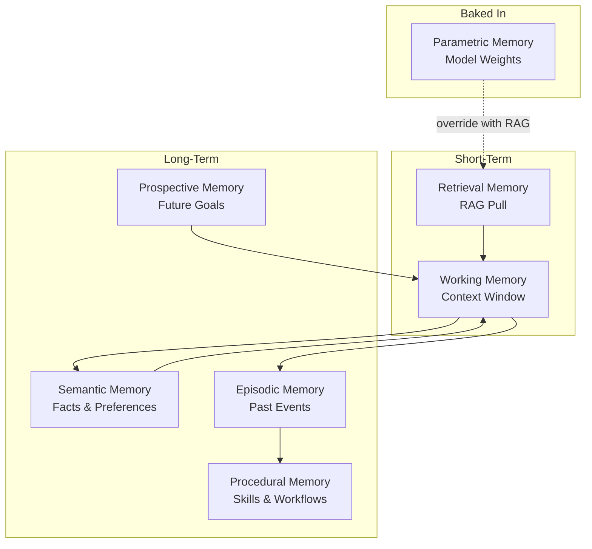

# Agent Memory Types

> A deep guide to the seven memory layers in LLM agents — what each one does, when to add it, and the top repos to implement it.

*Last reviewed: 2026-06-22*

Agents without memory are stateless functions dressed in chat UI. Memory is what turns a one-shot Q&A bot into a system that remembers users, learns from failures, plans ahead, and retrieves the right knowledge at the right time.

**Practical takeaway:** Start with working memory. Add semantic memory when users expect persistence across sessions. Layer episodic, procedural, and prospective memory only when your agent must plan, learn, and adapt over time.

---

## Contents

- [The Seven Memory Types](#the-seven-memory-types)
- [Memory Layering Strategy](#memory-layering-strategy)
- [Top Repositories & Frameworks](#top-repositories--frameworks)
- [Comparison Matrix](#comparison-matrix)
- [Implementation Patterns](#implementation-patterns)
- [Evaluation & Benchmarks](#evaluation--benchmarks)
- [Production Checklist](#production-checklist)
- [Further Reading](#further-reading)

---

## The Seven Memory Types

### 1. In-Context / Working Memory (Short-Term)

**What it is:** Everything the model can currently see inside its context window — system prompt, recent messages, tool outputs, and intermediate reasoning steps.

**Analogy:** Human working memory — holds what you are thinking about *right now*.

**Characteristics:**

- Bounded by context window (4K–200K+ tokens depending on model)
- Volatile — lost when the session ends unless persisted externally
- Highest fidelity, zero retrieval latency

**Implementation:**

- Conversation buffer (last N turns)
- LangGraph `State` object passed between nodes
- Sliding window + summarization when buffer fills

**When sufficient alone:** Single-session assistants, stateless Q&A, tool-calling agents with short task horizons.

**Repos:**

- [LangGraph Memory](https://langchain-ai.github.io/langgraph/concepts/memory/) — Thread-scoped state and checkpointing
- [NirDiamant/Agent_Memory_Techniques — Conversation Buffer](https://github.com/NirDiamant/Agent_Memory_Techniques) — Runnable notebooks for buffer patterns

---

### 2. Semantic Memory (Long-Term)

**What it is:** A persistent store of facts, preferences, and domain knowledge about a user or topic — decoupled from when it was learned.

**Analogy:** Knowing that Paris is the capital of France, or that a user prefers dark mode.

**Characteristics:**

- Structured facts extracted from conversations or documents
- Retrieved by semantic similarity or graph traversal
- Updated when new facts supersede old ones

**Implementation:**

- Vector store of extracted fact embeddings
- Knowledge graph nodes (entity → attribute → value)
- User profile documents updated in place

**When to add:** Users expect the agent to remember them across sessions ("What did I tell you about my project last week?").

**Repos:**

- [mem0ai/mem0](https://github.com/mem0ai/mem0) — Auto-extracts and stores salient facts; graph layer (Mem0g) for relationships
- [langchain-ai/langmem](https://github.com/langchain-ai/langmem) — Semantic Collections + Profiles on LangGraph `BaseStore`
- [getzep/graphiti](https://github.com/getzep/graphiti) — Temporal knowledge graph with fact invalidation

---

### 3. Episodic Memory (Long-Term)

**What it is:** A log of specific past events — full conversations, task runs, decisions, and outcomes — so the agent can learn from experience.

**Analogy:** Remembering *what happened* and *when*: "Last Tuesday the deployment failed because of a missing env var."

**Characteristics:**

- Time-stamped interaction traces
- Includes context of success/failure
- Enables case-based reasoning ("last time we saw this error, we did X")

**Implementation:**

- Conversation logs with metadata (timestamp, outcome, user feedback)
- Reflexion-style trajectory storage
- Episode retrieval by similarity to current situation

**When to add:** Agents that debug recurring problems, personal assistants that reference past interactions, multi-session workflows.

**Repos:**

- [NirDiamant/Agent_Memory_Techniques — Episodic Memory](https://github.com/NirDiamant/Agent_Memory_Techniques/tree/main/all_techniques/09_episodic_memory)
- [langchain-ai/langmem](https://github.com/langchain-ai/langmem) — Episodic few-shot examples and summaries
- [TsinghuaC3I/Awesome-Memory-for-Agents](https://github.com/TsinghuaC3I/Awesome-Memory-for-Agents) — Papers: REMem, SYNAPSE, AriGraph

---

### 4. Procedural Memory (Long-Term)

**What it is:** The agent's knowledge of *how to do things* — skills, tool usage patterns, workflows, and behavioral rules.

**Analogy:** Knowing how to ride a bike without consciously reasoning through each pedal stroke.

**Characteristics:**

- Encodes successful action sequences
- Reduces re-planning for repeated tasks
- Can be prompt templates, skill libraries, or fine-tuned behaviors

**Implementation:**

- Stored workflow templates triggered by intent
- Voyager-style skill libraries (code + description)
- System prompt evolution from successful runs (Memp, TokMem research)
- DSPy-optimized prompt programs

**When to add:** Agents that repeat complex multi-step workflows (onboarding flows, incident response playbooks, data pipelines).

**Repos:**

- [NirDiamant/Agent_Memory_Techniques — Procedural Memory](https://github.com/NirDiamant/Agent_Memory_Techniques/tree/main/all_techniques/11_procedural_memory)
- [stanfordnlp/dspy](https://github.com/stanfordnlp/dspy) — Optimizable procedural programs from examples
- Papers: [Memp (2025)](https://arxiv.org/abs/2508.06433), [TokMem (2025)](https://arxiv.org/abs/2510.00444)

---

### 5. External / Retrieval Memory (Short-Term + Long-Term)

**What it is:** Knowledge stored outside the model in a vector database (or hybrid index) and pulled into context at inference time via similarity search.

**Analogy:** A reference library you consult when you need facts you do not carry in your head.

**Characteristics:**

- This is **RAG itself** — distinct from agent memory about the user
- Scales beyond context window limits
- Requires ingestion pipeline, chunking, and retrieval quality controls

**Implementation:**

- Vector DB (FAISS, Qdrant, Pinecone, pgvector)
- Hybrid dense + sparse retrieval
- GraphRAG for global/summary queries

**When to add:** Any agent answering questions over a document corpus, codebase, or knowledge base.

**Repos:** See [README.md — Vector Databases](README.md#vector-databases), [production-rag-pipeline.md](production-rag-pipeline.md)

---

### 6. Parametric Memory (Long-Term)

**What it is:** Knowledge baked into the model's weights during pretraining or fine-tuning — language, reasoning patterns, and general world knowledge.

**Analogy:** Things you "just know" without looking them up.

**Characteristics:**

- No retrieval latency
- Cannot be updated without retraining or fine-tuning
- Source of hallucination when conflated with retrieved facts

**Implementation:**

- Base model selection (frontier vs domain-fine-tuned)
- LoRA/QLoRA fine-tuning on domain corpus
- RAG reduces reliance on parametric memory for factual queries

**When to leverage:** General reasoning, code generation patterns, language fluency. **When to override with RAG:** Domain-specific facts, time-sensitive data, private corpora.

**Repos:**

- [UKPLab/sentence-transformers](https://github.com/UKPLab/sentence-transformers) — Embedding fine-tuning
- [huggingface/peft](https://github.com/huggingface/peft) — Parameter-efficient fine-tuning
- [FlagOpen/FlagEmbedding](https://github.com/FlagOpen/FlagEmbedding) — BGE family training

---

### 7. Prospective Memory (Short-Term + Long-Term)

**What it is:** The agent's ability to remember future intentions and scheduled goals — things it planned to do but has not yet executed.

**Analogy:** "Remind me to check the deploy status in 30 minutes."

**Characteristics:**

- Critical for long-horizon and multi-step planning agents
- Requires durable task queues and scheduling
- Bridges sessions across time

**Implementation:**

- Scheduled job systems (Temporal timers, Celery, cron)
- Task lists in agent state with pending/completed status
- Human-in-the-loop approval gates with deferred execution

**When to add:** Agents that schedule follow-ups, monitor long-running processes, or execute multi-day workflows.

**Repos:**

- [temporalio/sdk-python](https://github.com/temporalio/sdk-python) — Durable timers and long-running workflows
- [langchain-ai/langgraph](https://github.com/langchain-ai/langgraph) — `interrupt()` for human approval + resume
- [pradithya/langgraph-temporal](https://github.com/pradithya/langgraph-temporal) — LangGraph + Temporal for durable agent execution

---

## Memory Layering Strategy

| Stage | Memory Stack | Use Case |
| :--- | :--- | :--- |
| MVP | Working + Retrieval | Document Q&A chatbot |
| V1 | + Semantic | Personal assistant remembering user prefs |
| V2 | + Episodic | Support agent learning from past tickets |
| V3 | + Procedural | Automation agent with reusable playbooks |
| V4 | + Prospective | Long-horizon planning agent with scheduled tasks |

---

## Top Repositories & Frameworks

| Repository | Focus | Best For |
| :--- | :--- | :--- |
| [NirDiamant/Agent_Memory_Techniques](https://github.com/NirDiamant/Agent_Memory_Techniques) | 30 runnable notebooks | Learning all memory types hands-on |
| [TsinghuaC3I/Awesome-Memory-for-Agents](https://github.com/TsinghuaC3I/Awesome-Memory-for-Agents) | Curated papers & surveys | Research landscape |
| [mem0ai/mem0](https://github.com/mem0ai/mem0) | Universal memory layer API | Fast integration, AWS Agent SDK provider |
| [letta-ai/letta](https://github.com/letta-ai/letta) | Self-editing memory (MemGPT) | Agents that manage their own context |
| [getzep/graphiti](https://github.com/getzep/graphiti) | Temporal knowledge graph | Facts that change over time |
| [langchain-ai/langmem](https://github.com/langchain-ai/langmem) | LangGraph-native primitives | Teams already on LangGraph |
| [langchain-ai/langgraph](https://github.com/langchain-ai/langgraph) | Stateful agent graphs | Working memory + checkpointing |

---

## Comparison Matrix

| Framework | Semantic | Episodic | Procedural | Temporal Consistency | Self-Host | LangGraph Native |
| :--- | :--- | :--- | :--- | :--- | :--- | :--- |
| Mem0 | ✅ | ✅ | Partial | Basic | ✅ | Via integration |
| Letta | ✅ | ✅ | ✅ | Core/Recall/Archival tiers | ✅ | Via integration |
| Zep/Graphiti | ✅ | ✅ | — | ✅ Bi-temporal | ✅ | Via integration |
| LangMem | ✅ | ✅ | ✅ | Profiles | ✅ | ✅ Native |

*Benchmark note: Zep/Graphiti reports 71.2% on LongMemEval vs Mem0's ~49% in independent comparisons (2025–2026). Always validate on your own eval set.*

---

## Implementation Patterns

### Pattern 1: Extract-on-Write (Mem0 style)

After each turn, an LLM extracts salient facts → stores in vector/graph → retrieves on next turn.

### Pattern 2: Self-Editing Context (Letta / MemGPT)

Agent explicitly reads, writes, and summarizes its own memory blocks as part of its reasoning loop.

### Pattern 3: Temporal Invalidation (Zep / Graphiti)

New facts invalidate old assertions with validity windows — retrieval returns only current truth.

### Pattern 4: RAG as External Memory

Corpus indexed separately; agent memory stores user-specific state, not domain documents.

**Critical distinction:** Do not conflate **user memory** (semantic/episodic) with **knowledge base** (retrieval memory). They have different update frequencies, privacy requirements, and retention policies.

---

## Evaluation & Benchmarks

| Benchmark | What It Tests |
| :--- | :--- |
| [LoCoMo](https://arxiv.org/abs/2402.17753) | Very long-term conversational memory |
| [LongMemEval](https://arxiv.org/abs/2410.10813) | Multi-session recall and reasoning |
| Mem0 paper eval | Memory extraction accuracy vs full-context baseline |

**Tools:** [Ragas](https://github.com/explodinggradients/ragas), custom golden sets with cross-session questions.

---

## Production Checklist

- [ ] Working memory buffer with summarization when context fills
- [ ] Clear separation: user memory vs knowledge base (RAG index)
- [ ] Data retention policy (GDPR/CCPA) for persistent memory
- [ ] Memory extraction latency budgeted (extra LLM call per turn)
- [ ] Temporal consistency strategy for facts that change
- [ ] User controls: view, edit, delete stored memories
- [ ] Eval set with cross-session recall questions

---

## Further Reading

- [IBM: What Is AI Agent Memory?](https://www.ibm.com/think/topics/ai-agent-memory)
- [Mem0 paper (2025)](https://arxiv.org/abs/2504.19413)
- [Zep paper (2025)](https://arxiv.org/abs/2501.13956)
- [CoALA: Cognitive Architectures for Language Agents (Princeton 2023)](https://arxiv.org/abs/2309.02427)
- [README — Agent Memory & Stateful Context](README.md#agent-memory--stateful-context)

([back to main resource](README.md))
