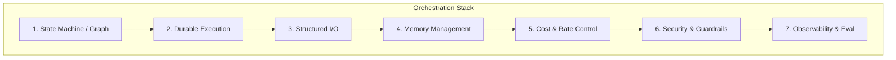

# Production Agentic Orchestration

> Beyond the Python while-loop: what real agentic orchestration requires, and the repos that implement it.

*Last reviewed: 2026-06-22*

"You are not building Agentic AI. You wrote a Python while-loop with an OpenAI API key."

The meme is harsh but directionally correct. Calling something "agentic" because it calls an LLM in a loop is like calling a bash script a distributed system. Real production agent orchestration requires infrastructure for parsing, memory, cost control, security, and durable execution — not just LangChain imports.

This guide maps what production-grade orchestration actually entails, with repos and patterns for each layer.

---

## Contents

- [The Gap: Demo vs Production](#the-gap-demo-vs-production)
- [Orchestration Layers](#orchestration-layers)
- [State Machines vs While-Loops](#state-machines-vs-while-loops)
- [Durable Execution](#durable-execution)
- [JSON / Structured Output Reliability](#json--structured-output-reliability)
- [Memory Management at Scale](#memory-management-at-scale)
- [Cost & Token Control](#cost--token-control)
- [Security for Autonomous Agents](#security-for-autonomous-agents)
- [Top Repositories](#top-repositories)
- [Architecture Patterns](#architecture-patterns)
- [Production Checklist](#production-checklist)
- [Further Reading](#further-reading)

---

## The Gap: Demo vs Production

| Demo Agent | Production Agent |
| :--- | :--- |
| `while True: llm.call()` | Stateful graph with defined nodes and edges |
| Hope JSON parses | Schema validation + retry on parse failure |
| Context in a string variable | Tiered memory with eviction policies |
| No timeout | Hard timeouts + fallback models |
| Unlimited LLM calls | Token budgets, circuit breakers, cost attribution |
| Full DB write access | Read-only roles, honey-pot tables, tool sandboxes |
| Dies on process crash | Durable execution with replay |
| `print()` debugging | Distributed tracing, eval pipelines |

---

## Orchestration Layers



---

## State Machines vs While-Loops

**Anti-pattern:**

```python
while retries < 3:
    result = llm.invoke(prompt)
    if "done" in result:
        break
    retries += 1
```

**Problems:** No typed state, no conditional routing visibility, no checkpointing, no human-in-the-loop, no observability per step.

**Production pattern — LangGraph state machine:**

```python
class AgentState(TypedDict):
    question: str
    documents: list
    generation: str
    retry_count: int
    grounding_score: float

# Nodes: retrieve → grade → generate → verify
# Edges: conditional on grade/grounding scores
# Checkpoint: persist state between turns
```

**Why graphs win:**

- Every node is independently testable
- Conditional edges are explicit (not buried in if-statements)
- State is typed and inspectable
- Checkpoints enable human-in-the-loop and crash recovery
- LangSmith/Langfuse trace each node separately

**Repos:**

- [langchain-ai/langgraph](https://github.com/langchain-ai/langgraph) — Industry standard for cyclic agent workflows
- [langchain-ai/langgraph/examples/rag](https://github.com/langchain-ai/langgraph/tree/main/examples/rag) — CRAG, Self-RAG, adaptive patterns
- [deepset-ai/haystack](https://github.com/deepset-ai/haystack) — DAG-based auditable pipelines

---

## Durable Execution

**Problem:** LangGraph with Redis checkpointing is powerful in concept but brittle in practice — race conditions, stale state, agents stuck without clear reporting (documented by Grid Dynamics migration case study).

**Solution:** Separate the *reasoning graph* (LangGraph) from the *durability layer* (Temporal).

| Concern | LangGraph Alone | LangGraph + Temporal |
| :--- | :--- | :--- |
| Process crash mid-agent | State may be lost or corrupted | Replay from last checkpoint |
| LLM timeout | Manual retry logic | Automatic retry with backoff policy |
| Long-running (hours/days) | Not designed for it | Native support |
| Human approval gate | `interrupt()` with checkpointer | Durable interrupt + resume |
| Exactly-once tool calls | Your problem | Activity-level guarantees |

**Pattern:**

- LangGraph decides *what* to do next
- Temporal ensures each step *actually completes*
- Side effects (LLM calls, DB writes, API calls) run as Temporal Activities
- Workflow code stays deterministic (no network I/O in workflow itself)

**Repos:**

- [temporalio/sdk-python](https://github.com/temporalio/sdk-python) — Official Temporal Python SDK with LangGraph plugin
- [pradithya/langgraph-temporal](https://github.com/pradithya/langgraph-temporal) — Experimental LangGraph ↔ Temporal bridge
- [Temporal LangGraph Integration Docs](https://docs.temporal.io/develop/python/integrations/langgraph)

**Case study:** [Grid Dynamics: Prototype to Production Agentic AI](https://temporal.io/blog/prototype-to-prod-ready-agentic-ai-grid-dynamics) — migrated from LangGraph + Redis to Temporal after maintenance burden became unsustainable.

---

## JSON / Structured Output Reliability

**The meme is real:** "Fine-tuning a local 70B model just to parse your garbage JSON outputs."

**Production approaches (in order of pragmatism):**

| Approach | When to Use |
| :--- | :--- |
| **Provider structured output** | OpenAI `response_format`, Anthropic tool use, Gemini JSON mode |
| **Pydantic + `with_structured_output()`** | LangChain/LangGraph native; retries on validation failure |
| **Outlines / Instructor** | Constrained decoding guarantees valid JSON |
| **Grammar-based (GBNF)** | Local models via llama.cpp, vLLM guided decoding |
| **Fine-tuned small parser** | Last resort when frontier models still fail your schema |

**Pattern — parse with retry:**

```python
from pydantic import BaseModel

class GradeResult(BaseModel):
    relevant: bool
    score: float

grader = llm.with_structured_output(GradeResult)
for attempt in range(3):
    try:
        return grader.invoke(prompt)
    except ValidationError:
        prompt = add_format_correction(prompt)
raise ParseFailure("Grader failed after 3 attempts")
```

**Repos:**

- [pydantic/pydantic](https://github.com/pydantic/pydantic) — Schema validation
- [dottxt-ai/outlines](https://github.com/dottxt-ai/outlines) — Constrained generation
- [567-labs/instructor](https://github.com/567-labs/instructor) — Structured outputs across providers
- [bhavyameghnani/Corrective-RAG-Self-Reflective-RAG](https://github.com/bhavyameghnani/Corrective-RAG-Self-Reflective-RAG) — Pydantic throughout pipeline

---

## Memory Management at Scale

**The meme:** "Writing custom vector-store memory allocators in C++."

**What that actually means in production:**

- Working memory eviction when context fills (summarize, compress, archive)
- Semantic memory extraction without unbounded growth
- Memory deduplication (don't store "user likes Python" 47 times)
- Tiered storage: hot (in-context) → warm (vector DB) → cold (object storage)
- Per-user memory quotas

**Repos:**

- [letta-ai/letta](https://github.com/letta-ai/letta) — Agent self-manages core/recall/archival memory tiers
- [mem0ai/mem0](https://github.com/mem0ai/mem0) — Automatic fact extraction with dedup
- [langchain-ai/langmem](https://github.com/langchain-ai/langmem) — Collections + Profiles with eviction

See [agent-memory-types.md](agent-memory-types.md) for the full seven-type taxonomy.

---

## Cost & Token Control

**The meme:** "Manually throttling token limits so your swarm doesn't buy $40,000 of AWS compute to solve a captcha."

**Production controls:**

| Control | Implementation |
| :--- | :--- |
| Per-request token budget | Estimate before call; reject if over red line |
| Per-agent iteration cap | `max_retries = 2` on all loops |
| Per-user daily budget | OpenMeter / custom metering |
| Model routing | Simple queries → Haiku; complex → Opus |
| Semantic cache | GPTCache / RedisVL — skip duplicate calls |
| Circuit breaker | Stop all calls to provider after N failures |
| Swarm budget | Global token pool shared across agent fleet |

**Repos:**

- [BerriAI/litellm](https://github.com/BerriAI/litellm) — Budget limits, routing, cost dashboard
- [AgentOps-AI/tokencost](https://github.com/AgentOps-AI/tokencost) — Pre-flight cost estimation
- [openmeterio/openmeter](https://github.com/openmeterio/openmeter) — Usage metering + Stripe billing
- [zilliztech/GPTCache](https://github.com/zilliztech/GPTCache) — Semantic caching

---

## Security for Autonomous Agents

**The meme:** "Setting up a honey-pot database so the agents don't drop your production tables when they get confused."

**Production security for tool-using agents:**

| Risk | Mitigation |
| :--- | :--- |
| SQL injection via generated queries | Read-only DB role; parameterized queries only |
| Destructive tool calls | Allowlist tools; block DROP/DELETE at policy layer |
| Honey-pot tables | Fake tables that log access attempts and alert |
| Runaway agent loops | `max_iterations` + cost circuit breaker |
| Cross-tenant data access | ACL filters before every tool call |
| Code execution | Sandboxed containers (E2B, Docker, WASM) |

**Repos:**

- [NVIDIA/NeMo-Guardrails](https://github.com/NVIDIA/NeMo-Guardrails) — Agentic security: code/SQL/template/XSS injection detection
- [e2b-dev/E2B](https://github.com/e2b-dev/E2B) — Sandboxed code execution for agents
- [vanna-ai/vanna](https://github.com/vanna-ai/vanna) — Text-to-SQL with read-only enforcement patterns

See [rag-security.md](rag-security.md) for the full four-layer security model.

---

## Top Repositories

| Repository | What It Proves |
| :--- | :--- |
| [langchain-ai/langgraph](https://github.com/langchain-ai/langgraph) | Stateful cyclic agent graphs |
| [temporalio/sdk-python](https://github.com/temporalio/sdk-python) | Durable execution for agents |
| [stanfordnlp/dspy](https://github.com/stanfordnlp/dspy) | Optimizable agent programs (not hand-tuned prompts) |
| [microsoft/autogen](https://github.com/microsoft/autogen) | Multi-agent orchestration |
| [crewAIInc/crewAI](https://github.com/crewAIInc/crewAI) | Role-based agent crews |
| [Bhavesh716/Self-healing-RAG-pipeline](https://github.com/Bhavesh716/Self-healing-RAG-pipeline) | Self-correction loop with honest fallback |
| [gurezende/SelfHealingRAG](https://github.com/gurezende/SelfHealingRAG) | Diagnose failure → apply targeted healing |
| [truefoundry/cognita](https://github.com/truefoundry/cognita) | Modular production RAG with independent scaling |
| [agentset-ai/agentset](https://github.com/agentset-ai/agentset) | Open-source production agentic RAG infra |

---

## Architecture Patterns

### Pattern 1: Router + Specialist Agents

```
Query → Semantic Router → [Simple RAG | Agentic RAG | Human Escalation]
```

Cheap path for 70% of queries. Agentic path only when needed.

### Pattern 2: Supervisor + Workers (CrewAI / AutoGen)

```
Supervisor Agent → delegates to → [Researcher, Writer, Critic]
```

### Pattern 3: Graph with Checkpoints (LangGraph)

```
retrieve → grade → [rewrite | generate] → verify → [retry | done]
```

State persisted at every node. Human can inspect and approve.

### Pattern 4: Durable Workflow (Temporal + LangGraph)

```
Temporal Workflow → Activity: retrieve → Activity: grade → Activity: generate
```

Survives crashes. Automatic retries. Long-running tasks.

---

## Production Checklist

- [ ] State machine graph (not while-loop) with typed state
- [ ] `max_iterations` on every cyclic path
- [ ] Structured output with Pydantic validation + retry
- [ ] Durable execution for long-running or high-stakes agents
- [ ] Tiered memory with eviction and deduplication
- [ ] Token budget per request, user, and global swarm
- [ ] Tool allowlist with read-only data access
- [ ] Honey-pot / audit for destructive operation attempts
- [ ] Distributed tracing per agent node
- [ ] Eval pipeline (RAGAS/DeepEval) in CI

---

## Further Reading

- [Anthropic: Building Effective Agents](https://www.anthropic.com/research/building-effective-agents)
- [Temporal + LangGraph: Reliable AI Agents](https://devopsvibe.io/en/blog/temporal-langgraph-reliable-agents)
- [Grid Dynamics: Prototype to Production Agentic AI](https://temporal.io/blog/prototype-to-prod-ready-agentic-ai-grid-dynamics)
- [rag-architectures.md](rag-architectures.md) — Agentic RAG patterns
- [rag-failure-handling.md](rag-failure-handling.md) — What breaks and how to recover
- [agent-memory-types.md](agent-memory-types.md) — Memory layer design

([back to main resource](README.md))
