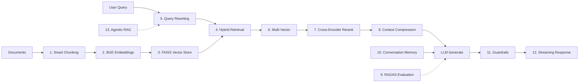

# Production RAG Pipeline — 13 Components

> The full-stack reference pipeline for production-grade RAG: from smart chunking through agentic retrieval, with top repos for each layer.

*Last reviewed: 2026-06-22*

A production RAG system is not one model call. It is a pipeline of specialized components — each addressing a specific failure mode. This guide maps all 13 layers, what each does, and where to find battle-tested implementations.

---

## Contents

- [Pipeline Overview](#pipeline-overview)
- [The 13 Components](#the-13-components)
- [Reference Stack](#reference-stack)
- [Top End-to-End Repositories](#top-end-to-end-repositories)
- [Component Deep Dives](#component-deep-dives)
- [Production Checklist](#production-checklist)
- [Further Reading](#further-reading)

---

## Pipeline Overview



---

## The 13 Components

| # | Component | What It Does | Key Technology |
| :--- | :--- | :--- | :--- |
| 1 | **Smart Chunking** | Semantic, recursive, and context-aware document splitting | chonkie, LlamaIndex SemanticSplitter |
| 2 | **BGE Embeddings** | Free, local, high-quality dense vectors (~130MB for small) | `BAAI/bge-small-en-v1.5`, `bge-m3` |
| 3 | **FAISS Vector Store** | High-performance local similarity search with persistence | faiss-cpu / faiss-gpu |
| 4 | **Hybrid Retrieval** | Vector + BM25 keyword search fused via Reciprocal Rank Fusion | rank-bm25 + FAISS |
| 5 | **Query Rewriting** | LLM-powered expansion, reformulation, and HyDE | LangChain MultiQuery, HyDE |
| 6 | **Multi-Vector Retrieval** | Raw + summary embeddings per chunk for better recall | Parent-child, small-to-big |
| 7 | **Cross-Encoder Re-ranking** | Precision re-scoring of top-K candidates | `ms-marco-MiniLM-L-6-v2` |
| 8 | **Context Compression** | LLM-based extraction + redundancy removal before generation | LangChain ContextualCompression |
| 9 | **RAGAS Evaluation** | Context relevance, faithfulness, answer relevance scoring | ragas |
| 10 | **Conversation Memory** | Session-based history with context window management | LangGraph state, Mem0 |
| 11 | **Guardrails** | Groundedness checking, hallucination detection, confidence scoring | NeMo, LLM Guard, TruLens |
| 12 | **Streaming** | Server-Sent Events (SSE) for real-time token streaming | FastAPI StreamingResponse |
| 13 | **Agentic RAG** | AI agent dynamically selects retrieval strategy per query | LangGraph, CRAG, Adaptive RAG |

---

## Reference Stack

**Local / zero-cost dev stack:**

| Layer | Choice |
| :--- | :--- |
| LLM | Ollama (Llama 3 / Mistral) |
| Embeddings | `BAAI/bge-small-en-v1.5` |
| Vector Store | FAISS (embedded) |
| Sparse | BM25 (rank-bm25) |
| Reranker | `cross-encoder/ms-marco-MiniLM-L-6-v2` |
| Eval | Ragas |
| API | FastAPI |

**Production mid-scale stack:**

| Layer | Choice |
| :--- | :--- |
| Vector DB | Qdrant or Weaviate (managed) |
| Embeddings | `BAAI/bge-m3` or Cohere embed-v4 |
| Reranker | Cohere Rerank API or BGE-Reranker-v2-m3 |
| Orchestration | LangGraph |
| Observability | Langfuse or Arize Phoenix |
| Gateway | LiteLLM |

---

## Top End-to-End Repositories

These repos implement most or all 13 components in a deployable system:

| Repository | Components Covered | Highlights |
| :--- | :--- | :--- |
| [Naresh1401/Enterprise-Rag-Pipeline](https://github.com/Naresh1401/Enterprise-Rag-Pipeline) | 1–9, 11–12 | BGE + FAISS + BM25 RRF + reranker + RAGAS + FastAPI + Streamlit |
| [ara-5/Enterprise-Agentic-RAG-Platform](https://github.com/ara-5/Genai-rag-agent) | 1–13 | Full agentic loop, CRAG, Docker, RAGAS CI gate |
| [prabhaharanv/production-hybrid-rag](https://github.com/prabhaharanv/production-hybrid-rag) | 1–12 | HyDE, semantic cache, guardrails, abstention, math eval framework |
| [Hamzakhan001/production-rag-platform](https://github.com/Hamzakhan001/production-rag-platform) | 4–12 | AWS event-driven, multi-layer guardrails, Prometheus + RAGAS |
| [ankitshri00132/Advanced-RAG-System](https://github.com/ankitshri00132/Advanced-RAG-System) | 1–13 | Qdrant hybrid BGE+BM42, CRAG, LangSmith, FastAPI |
| [agentset-ai/agentset](https://github.com/agentset-ai/agentset) | 1–13 | Open-source production RAG infra with agentic reasoning |
| [truefoundry/cognita](https://github.com/truefoundry/cognita) | 1–11 | Modular RAG with independent scaling per component |

---

## Component Deep Dives

### 1. Smart Chunking

**Why it matters:** Wrong chunking silently degrades retrieval regardless of embedding quality.

| Strategy | When to Use |
| :--- | :--- |
| Fixed-size (256–512 tokens) | Baseline, uniform text |
| Recursive character split | General mixed formats |
| Semantic chunking | Heterogeneous density, narrative docs |
| Document-type aware | PDFs, tables, code, HTML |
| Hierarchical (small-to-big) | Multi-hop retrieval |

**Repos:**

- [chonkie-ai/chonkie](https://github.com/chonkie-ai/chonkie) — Fast multi-strategy chunking
- [umarbutler/semchunk](https://github.com/umarbutler/semchunk) — No-embedding semantic split
- [LlamaIndex SemanticSplitterNodeParser](https://docs.llamaindex.ai/en/stable/module_guides/loading/node_parsers/modules/)

---

### 2. BGE Embeddings

**Model:** [BAAI/bge-small-en-v1.5](https://huggingface.co/BAAI/bge-small-en-v1.5) — ~130MB, runs locally, strong MTEB retrieval scores.

**Alternatives:**

| Model | Size | Best For |
| :--- | :--- | :--- |
| `bge-small-en-v1.5` | ~130MB | Local dev, CPU-friendly |
| `bge-base-en-v1.5` | ~440MB | Better quality, still local |
| `bge-m3` | ~2.2GB | Multilingual, multi-granularity |

**Repos:** [FlagOpen/FlagEmbedding](https://github.com/FlagOpen/FlagEmbedding), [UKPLab/sentence-transformers](https://github.com/UKPLab/sentence-transformers)

**Rule:** Same model for indexing and querying. Always.

---

### 3. FAISS Vector Store

High-performance approximate nearest neighbor search. Persists to disk with `faiss.write_index()`.

**When to use:** Local dev, <10M vectors, full control, no managed DB cost.

**When to graduate:** Qdrant, Milvus, Pinecone for filtering, multi-tenant, horizontal scale.

**Repos:** [facebookresearch/faiss](https://github.com/facebookresearch/faiss)

---

### 4. Hybrid Retrieval (Vector + BM25 + RRF)

**Why:** Dense vectors miss exact matches (IDs, error codes, dates). BM25 misses semantic paraphrases. Hybrid catches both.

**Fusion:** Reciprocal Rank Fusion (RRF) with `k=60` is the standard:

```
RRF_score(d) = Σ 1 / (k + rank_i(d))
```

**Repos:**

- [Intelligent-Internet/psql_bm25s](https://github.com/Intelligent-Internet/psql_bm25s) — BM25 in PostgreSQL
- [LlamaIndex QueryFusionRetriever](https://docs.llamaindex.ai/en/stable/examples/retrievers/ensemble_retrieval/)

---

### 5. Query Rewriting

| Technique | What It Does |
| :--- | :--- |
| **HyDE** | Generate hypothetical answer, embed it instead of query |
| **Multi-Query** | Generate N paraphrases, retrieve for each, deduplicate |
| **Step-Back** | Ask abstract version first, then retrieve |
| **Decomposition** | Break complex query into sub-queries |

**Repos:** [LangChain MultiQueryRetriever](https://python.langchain.com/docs/how_to/MultiQueryRetriever/), [NirDiamant/RAG_Techniques](https://github.com/NirDiamant/RAG_Techniques)

---

### 6. Multi-Vector Retrieval

Store multiple embeddings per chunk (raw text + LLM-generated summary). Retrieve on summary, return raw text to LLM.

**Pattern:** Parent-child chunking — small chunks for search, large parent for generation context.

**Repos:** [LlamaIndex Hierarchical Node Parser](https://docs.llamaindex.ai/en/stable/module_guides/loading/node_parsers/modules/)

---

### 7. Cross-Encoder Re-ranking

Bi-encoder (embedding) retrieval is fast but coarse. Cross-encoder attends to query-document pairs jointly for precision.

**Standard model:** `cross-encoder/ms-marco-MiniLM-L-6-v2` (~80MB, CPU-viable)

**Pattern:** Retrieve top-50 → rerank → pass top-5 to LLM.

**Repos:**

- [PrithivirajDamodaran/FlashRank](https://github.com/PrithivirajDamodaran/FlashRank) — CPU-only reranking
- [BAAI/bge-reranker-v2-m3](https://huggingface.co/BAAI/bge-reranker-v2-m3) — Top open-source quality

---

### 8. Context Compression

Remove redundant sentences from retrieved chunks before stuffing into prompt. Reduces token cost and lost-in-the-middle noise.

**Methods:**

- LLM-based extractive compression
- Embedding similarity deduplication
- LongLLMLingua / LLMLingua token pruning

**Repos:** [LangChain Contextual Compression](https://python.langchain.com/docs/how_to/contextual_compression/)

---

### 9. RAGAS Evaluation

**Metrics:**

| Metric | Question Answered |
| :--- | :--- |
| **Faithfulness** | Is the answer grounded in context? |
| **Answer Relevance** | Does the answer address the question? |
| **Context Precision** | Are top-ranked chunks relevant? |
| **Context Recall** | Did we retrieve all necessary info? |

**CI pattern:** Fail build if `faithfulness < 0.70` on golden set.

**Repos:** [explodinggradients/ragas](https://github.com/explodinggradients/ragas), [confident-ai/deepeval](https://github.com/confident-ai/deepeval)

---

### 10. Conversation Memory

Session history management with context window budgeting:

- Keep last N turns verbatim
- Summarize older turns
- Extract persistent facts to semantic memory (Mem0)

**Repos:** [mem0ai/mem0](https://github.com/mem0ai/mem0), [langchain-ai/langmem](https://github.com/langchain-ai/langmem)

See [agent-memory-types.md](agent-memory-types.md) for full memory taxonomy.

---

### 11. Guardrails

Pre- and post-generation safety:

- **Input:** Prompt injection detection, PII scan
- **Retrieval:** Filter unauthorized chunks
- **Output:** Groundedness check, hallucination flag, toxicity filter

**Repos:**

- [NVIDIA/NeMo-Guardrails](https://github.com/NVIDIA/NeMo-Guardrails)
- [protectai/llm-guard](https://github.com/protectai/llm-guard)
- [truera/trulens](https://github.com/truera/trulens)

See [rag-security.md](rag-security.md) for full security architecture.

---

### 12. Streaming (SSE)

Return tokens as they generate. Critical for perceived latency on 2–10s generation calls.

**FastAPI pattern:**

```python
from fastapi.responses import StreamingResponse

async def token_stream():
    async for chunk in llm.astream(prompt):
        yield f"data: {chunk.content}\n\n"

return StreamingResponse(token_stream(), media_type="text/event-stream")
```

**Repos:** [vllm-project/vllm](https://github.com/vllm-project/vllm) (self-hosted streaming), OpenAI/Anthropic native SSE APIs

---

### 13. Agentic RAG

Dynamic retrieval strategy selection per query — route to vector, web, SQL, or multi-step decomposition.

**Repos:** [langchain-ai/langgraph](https://github.com/langchain-ai/langgraph), [Mohamedkhattab02/Agentic-RAG-with-LangGraph](https://github.com/Mohamedkhattab02/Agentic-RAG-with-LangGraph)

See [rag-architectures.md](rag-architectures.md) for architecture comparison.

---

## Production Checklist

- [ ] All 13 components mapped to concrete implementations
- [ ] Hybrid retrieval (dense + sparse) enabled
- [ ] Cross-encoder reranking (top-50 → top-5)
- [ ] Query rewriting for ambiguous inputs
- [ ] RAGAS eval in CI with faithfulness gate
- [ ] Conversation memory with summarization
- [ ] Input + output guardrails
- [ ] SSE streaming on API
- [ ] Agentic routing for complex queries only
- [ ] Failure handling per [rag-failure-handling.md](rag-failure-handling.md)

---

## Further Reading

- [README — Reference Architectures](README.md#reference-architectures)
- [benchmarks.md](benchmarks.md) — Evidence-backed performance data
- [rag-pitfalls.md](rag-pitfalls.md) — What breaks when components are missing
- [NirDiamant/RAG_Techniques](https://github.com/NirDiamant/RAG_Techniques) — Runnable notebook for each technique

([back to main resource](README.md))
