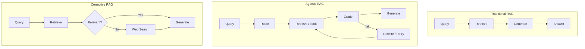

# RAG Architectures

> Traditional, Agentic, Enhanced Agentic, and Corrective RAG — the architectures production teams actually ship, with repos and case studies.

*Last reviewed: 2026-06-22*

Retrieval architecture is quietly becoming one of the most important concepts in AI system design interviews. Companies want engineers who understand production RAG workflows, agent orchestration, retrieval accuracy, and hallucination reduction.

These are the architectures that evolved from research papers into production systems — including Uber's Genie on-call copilot.

---

## Contents

- [Architecture Overview](#architecture-overview)
- [Traditional RAG](#traditional-rag)
- [Agentic RAG](#agentic-rag)
- [Enhanced Agentic RAG (EAg-RAG)](#enhanced-agentic-rag-eag-rag)
- [Corrective RAG (CRAG)](#corrective-rag-crag)
- [Self-RAG](#self-rag)
- [Adaptive RAG](#adaptive-rag)
- [Decision Matrix](#decision-matrix)
- [Top Repositories](#top-repositories)
- [Production Case Studies](#production-case-studies)
- [Further Reading](#further-reading)

---

## Architecture Overview



| Architecture | Complexity | Latency | Best Failure Mode Addressed |
| :--- | :--- | :--- | :--- |
| Traditional RAG | Low | 1× | None (baseline) |
| Agentic RAG | High | 2–4× | Multi-step reasoning, tool selection |
| Enhanced Agentic RAG | High | 2–3× | Domain-specific retrieval quality |
| Corrective RAG (CRAG) | Medium | 1.5–2× | Weak/stale retrieval |
| Self-RAG | High | 3–5× | Hallucination, unsupported answers |
| Adaptive RAG | Medium | 1–3× | Wrong retrieval source |

---

## Traditional RAG

**Pattern:** Retrieve semantically similar documents from a vector database → pass top-K chunks to LLM → generate answer.

**Flow:**

```
Query → Embed → Vector Search → Top-K Chunks → Prompt → LLM → Answer
```

**Strengths:**

- Fast and simple
- Predictable cost and latency
- Sufficient for ~70% of straightforward factual Q&A

**Weaknesses:**

- No recovery from bad retrieval
- No query optimization
- No grounding verification
- Single retrieval pass

**When to use:** MVP, narrow domain, high query repetition, strict latency SLOs (<2s).

**Repos:**

- [NirDiamant/RAG_Techniques](https://github.com/NirDiamant/RAG_Techniques) — Baseline notebooks
- [weaviate/Verba](https://github.com/weaviate/Verba) — Golden RAGtriever with best-practice defaults
- [chroma-core/chroma](https://github.com/chroma-core/chroma) — Local dev stack

---

## Agentic RAG

**Pattern:** Uses agents to decide which tools and retrieval workflows to use. The LLM plans multi-step workflows, selects retrievers, and adjusts strategy based on intermediate results.

**Core capabilities:**

- **Multi-step reasoning** — Break complex queries into sub-tasks
- **Tool use** — SQL, APIs, calculators, web search
- **Self-correction** — Validate context and retry
- **Dynamic routing** — Pick retrieval strategy per query

**Flow:**

```
Query → Agent Planner → [Vector DB | SQL | Web | Code] → Grade → Generate → Verify → Answer
                              ↑__________________________|
```

**When to use:**

- Complex, multi-hop questions ("Compare X and Y across these 5 documents")
- Engineering queries requiring tool integration
- Tasks requiring validation (fact-checking, citation verification)

**Trade-offs:** Higher latency (multiple LLM calls), increased cost, non-deterministic behavior, harder debugging.

**Repos:**

- [langchain-ai/langgraph](https://github.com/langchain-ai/langgraph) — Canonical cyclic agent graphs
- [microsoft/autogen](https://github.com/microsoft/autogen) — Multi-agent collaboration
- [crewAIInc/crewAI](https://github.com/crewAIInc/crewAI) — Role-based agent crews
- [SciPhi-AI/R2R](https://github.com/SciPhi-AI/R2R) — Production agentic retrieval API
- [infiniflow/ragflow](https://github.com/infiniflow/ragflow) — Deep document understanding + agentic features

---

## Enhanced Agentic RAG (EAg-RAG)

**Pattern:** Production evolution of agentic RAG pioneered at Uber for their Genie on-call copilot. Adds specialized pre- and post-processing agents around a hybrid retrieval core.

**Uber's results:** 27% relative increase in acceptable answers, 60% relative reduction in incorrect advice.

### Components

**Pre-processing agents:**

| Agent | Role |
| :--- | :--- |
| **Query Optimizer** | Refines ambiguous queries; decomposes complex queries into simpler sub-queries |
| **Source Identifier** | Narrows document scope using titles, summaries, and FAQs as routing context |

**Retrieval:**

- Hybrid: dense vector search **union** BM25 keyword retrieval
- Enriched metadata per chunk (summaries, FAQs, keywords)

**Post-processing agent:**

- Deduplicates retrieved chunks
- Structures context by positional order in original documents (preserves narrative flow)

**Flow:**

```
Query → Query Optimizer → Source Identifier → Hybrid Retrieve → Post-Processor → Generate
```

**When to use:** Enterprise knowledge bases with heterogeneous documents, on-call/support copilots, policy/compliance Q&A where wrong answers are costly.

**References:**

- [Uber: Enhanced Agentic-RAG Blog](https://www.uber.com/us/en/blog/enhanced-agentic-rag/)
- [Uber: Genie On-Call Copilot](https://www.uber.com/us/en/blog/genie-ubers-gen-ai-on-call-copilot/)
- [ZenML Case Study](https://www.zenml.io/llmops-database/enhanced-agentic-rag-for-internal-on-call-support-copilot)

**Implementation inspiration:**

- [Mohamedkhattab02/Agentic-RAG-with-LangGraph](https://github.com/Mohamedkhattab02/Agentic-RAG-with-LangGraph) — Adaptive + CRAG + Self-RAG combined
- [ara-5/Enterprise-Agentic-RAG-Platform](https://github.com/ara-5/Genai-rag-agent) — Production hybrid + CRAG stack

---

## Corrective RAG (CRAG)

**Pattern:** Adds an evaluation layer *before* generation. A lightweight retrieval evaluator scores retrieved passages and routes to corrective actions when quality is low.

**Paper:** [Corrective Retrieval Augmented Generation (Jan 2024)](https://arxiv.org/pdf/2401.15884)

**Routing decisions:**

| Verdict | Action |
| :--- | :--- |
| **Correct** | Refine docs (decompose into knowledge strips) → Generate |
| **Incorrect** | Rewrite query → Web search → Refine → Generate |
| **Ambiguous** | Combine internal docs + web search → Generate |

**Key insight:** CRAG addresses **retrieval failure**, not generation failure. It is narrower and faster than Self-RAG.

**When to use:**

- Retrieval ambiguity is the root cause of bad answers
- Freshness matters (web search fallback)
- Latency budget allows one extra evaluator LLM call

**Repos:**

- [aayushmaanhooda/Corrective-RAG](https://github.com/aayushmaanhooda/Corrective-RAG) — LangGraph + FAISS + Tavily
- [bhavyameghnani/Corrective-RAG-Self-Reflective-RAG](https://github.com/bhavyameghnani/Corrective-RAG-Self-Reflective-RAG) — CRAG + Self-RAG with Pydantic
- [langchain-ai/langgraph/examples/rag](https://github.com/langchain-ai/langgraph/tree/main/examples/rag) — Official CRAG cookbook

---

## Self-RAG

**Pattern:** Adds reflection tokens that gate four decisions per query: whether to retrieve, whether passages are relevant, whether generation is supported, and whether the answer is useful.

**Paper:** [Self-RAG: Learning to Retrieve, Generate, and Critique (2023)](https://arxiv.org/abs/2310.11511)

**Flow:**

```
Query → Retrieve? → Retrieve → Relevant? → Generate → Supported? → Useful? → Answer
         ↓ No                      ↓ No              ↓ No           ↓ No
      Generate               Re-retrieve         Regenerate      Retry / Abstain
```

**When to use:**

- Strict grounding requirements (legal, medical, finance)
- Multi-hop QA where answer synthesis is the primary failure mode
- Latency budget allows 3–5× inference passes

**Trade-off vs CRAG:** Self-RAG costs more (multiple reflection loops) but catches hallucinations CRAG misses.

**Repos:**

- [bhavyameghnani/Corrective-RAG-Self-Reflective-RAG](https://github.com/bhavyameghnani/Corrective-RAG-Self-Reflective-RAG)
- [langchain-ai/langgraph/examples/rag](https://github.com/langchain-ai/langgraph/tree/main/examples/rag) — Self-RAG cookbook

---

## Adaptive RAG

**Pattern:** Routes each question to the *right* retrieval source — local vector store, web search, SQL database, or no retrieval at all.

**When to use:** Multi-source deployments where different query types need different backends.

**Repos:**

- [Mohamedkhattab02/Agentic-RAG-with-LangGraph](https://github.com/Mohamedkhattab02/Agentic-RAG-with-LangGraph)
- [aurelio-labs/semantic-router](https://github.com/aurelio-labs/semantic-router) — Fast semantic routing without LLM inference

---

## Decision Matrix

| Condition | Recommended Architecture |
| :--- | :--- |
| MVP / narrow domain / strict latency | Traditional RAG |
| Multi-hop, tool use, complex reasoning | Agentic RAG |
| Enterprise KB, heterogeneous docs, high stakes | Enhanced Agentic RAG (EAg-RAG) |
| Weak/stale retrieval, freshness needs | Corrective RAG (CRAG) |
| Hallucination risk, strict grounding | Self-RAG |
| Multiple indexes / data sources | Adaptive RAG |
| Budget-conscious production | CRAG over Self-RAG; route only hard queries to agentic path |

**Hybrid production pattern:** Traditional RAG for simple queries (semantic-router) → CRAG for ambiguous → Self-RAG for high-stakes only.

---

## Top Repositories

| Repository | Architectures Covered |
| :--- | :--- |
| [NirDiamant/RAG_Techniques](https://github.com/NirDiamant/RAG_Techniques) | All patterns with runnable notebooks |
| [Mohamedkhattab02/Agentic-RAG-with-LangGraph](https://github.com/Mohamedkhattab02/Agentic-RAG-with-LangGraph) | Adaptive + CRAG + Self-RAG |
| [ankitshri00132/Advanced-RAG-System](https://github.com/ankitshri00132/Advanced-RAG-System) | Adaptive + CRAG + hybrid Qdrant |
| [ara-5/Enterprise-Agentic-RAG-Platform](https://github.com/ara-5/Genai-rag-agent) | Agentic + CRAG + production API |
| [langchain-ai/langgraph/examples/rag](https://github.com/langchain-ai/langgraph/tree/main/examples/rag) | Official CRAG + Self-RAG cookbooks |
| [microsoft/graphrag](https://github.com/microsoft/graphrag) | Graph-based advanced retrieval |

---

## Production Case Studies

- **Uber Genie** — Traditional RAG → Enhanced Agentic RAG; saved ~13,000 engineering hours; 48.9% helpfulness rate across 70K+ questions
- **LinkedIn Galene** — Custom ANN on Lucene for domain-specific ranking at scale
- **DoorDash** — Vector retrieval integrated into existing ranking pipeline

See [showcase.md](showcase.md) for full case studies.

---

## Further Reading

- [Self-RAG vs CRAG in Production (Axiom Logica)](https://axiomlogica.com/ai-ml/self-rag-vs-crag-langgraph-production-rag)
- [Anthropic: Building Effective Agents](https://www.anthropic.com/research/building-effective-agents)
- [LangGraph RAG Video Tutorial (CRAG + Self-RAG)](https://www.youtube.com/watch?v=pbAd8O1Lvm4)
- [RAG Failure Handling](rag-failure-handling.md) — What to do when each architecture breaks
- [Production RAG Pipeline](production-rag-pipeline.md) — 13-component reference stack

([back to main resource](README.md))
