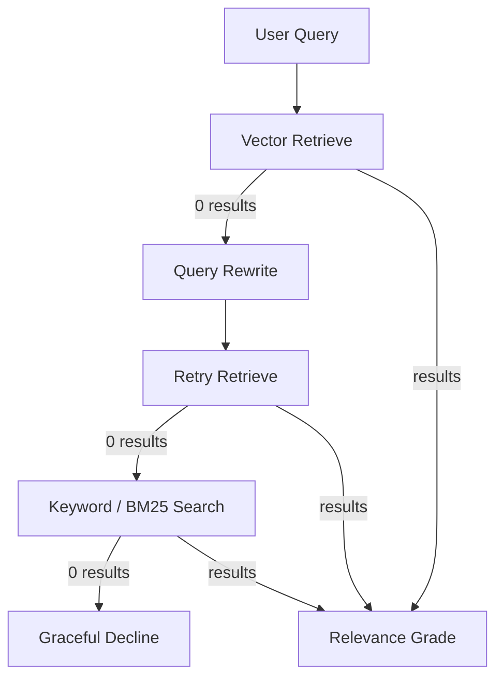
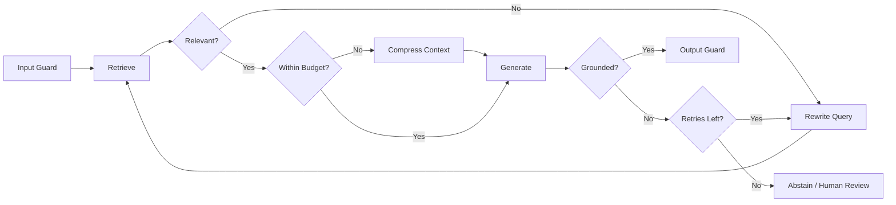

# RAG Pipeline Failure Handling

> Seven ways production RAG pipelines silently break — and the industry patterns, repos, and guardrails to handle each one.

*Last reviewed: 2026-06-22*

A naive RAG system is a linear chain: retrieve → stuff context → generate. In production, every link in that chain fails independently. The difference between a demo and a system users trust is not whether failures happen — it is what your pipeline does when they do.

**Core principle:** Failure handling is not about preventing breakage. It is about routing every failure to a defined outcome: retry, degrade, abstain, or escalate — never hallucinate.

---

## Contents

- [The Seven Failure Modes](#the-seven-failure-modes)
- [Unified Fallback Architecture](#unified-fallback-architecture)
- [Top Repositories & Implementations](#top-repositories--implementations)
- [Frameworks & Libraries](#frameworks--libraries)
- [Evaluation & Observability](#evaluation--observability)
- [Production Checklist](#production-checklist)
- [Further Reading](#further-reading)

---

## The Seven Failure Modes

### 1. No Chunks Retrieved (Empty Context)

**What happens:** The retriever returns zero documents. Empty context is passed to the LLM anyway. The model fills the gap with parametric knowledge and hallucinates confidently.

**Why it happens:**

- Query vocabulary mismatch with indexed corpus
- Overly aggressive metadata filters (role, tenant, date range)
- Embedding model drift or index corruption
- User asks about topics not in the knowledge base

**Fix — Fallback chain:**



1. **Query rewrite** — LLM reformulates the query (HyDE, multi-query, step-back prompting)
2. **Keyword fallback** — BM25 / sparse retrieval catches exact terms vectors miss
3. **Web search fallback** — Tavily, Serper, or internal search index (Corrective RAG pattern)
4. **Graceful decline** — Return a fixed message: *"I couldn't find relevant information in the knowledge base."* Never call the LLM with empty context.

**Similarity threshold:** Even if results exist, reject batches where `max(score) < threshold` (typical starting range: 0.65–0.75 for cosine similarity — tune on your eval set).

---

### 2. Wrong Chunks Retrieved (Low Relevance)

**What happens:** Documents are returned but they are off-topic. The LLM faithfully synthesizes garbage and the answer sounds authoritative but is wrong.

**Why it happens:**

- Semantic similarity ≠ relevance for multi-hop or comparative queries
- Chunk boundaries split critical context
- No reranking after initial retrieval
- Top-K too large without filtering

**Fix:**

| Layer | Action | Tool Examples |
| :--- | :--- | :--- |
| Pre-generation | Similarity score threshold on top result | Vector DB score metadata |
| Pre-generation | Cross-encoder reranking (top-50 → top-5) | `ms-marco-MiniLM-L-6-v2`, Cohere Rerank, BGE-Reranker |
| Pre-generation | LLM relevance grader (binary or 1–5) | LangGraph `grade_documents` node |
| Post-generation | Grounding score vs retrieved chunks | RAGAS Faithfulness, TruLens |

**Rule:** Do not pass ungraded chunks to the generator. Retrieve wide (top-20 to top-50), rerank narrow (top-3 to top-5).

---

### 3. LLM Never Responds (Timeout / Hang)

**What happens:** The LLM API hangs. The user stares at a spinner. No error, no fallback.

**Fix:**

- **Hard timeout:** 10 seconds is a reasonable starting point for chat; 30–60s for long-context synthesis
- **Fallback model:** Route to a smaller, faster model (Haiku, GPT-4o-mini, local Ollama) on timeout
- **Circuit breaker:** After N consecutive timeouts, stop calling the primary provider for M minutes
- **Streaming + heartbeat:** SSE keeps the connection alive; cancel server-side if no tokens within threshold

**Implementation repos:** [LiteLLM](https://github.com/BerriAI/litellm) (timeout + fallback routing), [LangGraph](https://github.com/langchain-ai/langgraph) conditional edges on timeout exceptions.

---

### 4. Too Many Requests (429 / Rate Limits)

**What happens:** Naive RAG forwards the raw provider error to the user.

**Fix — Exponential backoff with jitter:**

```
Attempt 1 → fail → wait 2s
Attempt 2 → fail → wait 4s
Attempt 3 → fail → wait 8s
Max 3 retries → graceful error or fallback provider
```

- Use **idempotency keys** for retried generation requests
- **Queue** burst traffic instead of parallel hammering
- **LLM gateway** centralizes retry logic: [LiteLLM](https://github.com/BerriAI/litellm), [Portkey](https://github.com/Portkey-AI/gateway)

---

### 5. Context Window Overflow

**What happens:** Retrieved chunks + conversation history + system prompt exceed the model's context limit. The API truncates silently or errors.

**Fix — Adaptive prompting:**

1. **Estimate token count** before every LLM call ([tiktoken](https://github.com/openai/tiktoken), [tokencost](https://github.com/AgentOps-AI/tokencost))
2. If over budget:
   - Trim to **top-3 chunks** after reranking
   - **Summarize chunks** with a cheap model before main generation
   - **Route to long-context model** (Claude, Gemini 1.5+) only when necessary
3. **Conversation summarization** — compress older turns, keep recent N messages

**Anti-pattern:** Stuffing 50 chunks because "more context = better answers." Models suffer from [lost-in-the-middle](https://arxiv.org/abs/2307.03172) degradation.

---

### 6. Runaway Cost (Token Bill Shock)

**What happens:** Long conversations + large retrieved context = massive token count on every call. Nobody notices until month-end.

**Fix — Cost guardrails:**

| Threshold | Action |
| :--- | :--- |
| **Yellow line** | Switch to cheaper model, reduce top-K, enable semantic cache |
| **Red line** | Reject request with user-facing message; log for review |

- **Estimate cost before every LLM call** — [tokencost](https://github.com/AgentOps-AI/tokencost)
- **Track spend** per user, per session, per day — [OpenMeter](https://github.com/openmeterio/openmeter), [Helicone](https://github.com/Helicone/helicone)
- **Circuit breakers** at tenant and global level
- **Prompt caching** for shared system prompts and static context blocks

---

### 7. Ungrounded Answer (Hallucination After Retrieval)

**What happens:** The LLM generates a confident answer not supported by retrieved chunks. Users believe it.

**Fix — Post-generation grounding check:**

1. Score answer against retrieved context (RAGAS Faithfulness, NLI-based claim verification)
2. If grounding score < threshold:
   - **Do not deliver** the answer directly
   - Route to **human review** queue
   - **Flag** with confidence badge for the user
   - **Retry** with stricter prompt ("cite only from context")

**Repos implementing full loop:** [Bhavesh716/Self-healing-RAG-pipeline](https://github.com/Bhavesh716/Self-healing-RAG-pipeline), [gurezende/SelfHealingRAG](https://github.com/gurezende/SelfHealingRAG)

---

## Unified Fallback Architecture

Production systems combine all seven handlers in a **stateful graph**, not a linear script:



**Iteration cap:** Always set `max_retries` (typically 2–3). Without it, agentic loops run until the bill arrives.

---

## Top Repositories & Implementations

| Repository | Stars | What It Demonstrates |
| :--- | :--- | :--- |
| [Bhavesh716/Self-healing-RAG-pipeline](https://github.com/Bhavesh716/Self-healing-RAG-pipeline) | — | Query rewrite + grounding grade + honest "I don't know" fallback |
| [gurezende/SelfHealingRAG](https://github.com/gurezende/SelfHealingRAG) | — | LLM-as-judge diagnoses failure reason, applies targeted healing strategy |
| [ara-5/Enterprise-Agentic-RAG-Platform](https://github.com/ara-5/Genai-rag-agent) | — | Full stack: CRAG, web fallback, RAGAS CI gate, Docker |
| [Mohamedkhattab02/Agentic-RAG-with-LangGraph](https://github.com/Mohamedkhattab02/Agentic-RAG-with-LangGraph) | — | Adaptive + Corrective + Self-RAG in one LangGraph state machine |
| [bhavyameghnani/Corrective-RAG-Self-Reflective-RAG](https://github.com/bhavyameghnani/Corrective-RAG-Self-Reflective-RAG) | — | CRAG + Self-RAG with FAISS, Pydantic structured grading |
| [prabhaharanv/production-hybrid-rag](https://github.com/prabhaharanv/production-hybrid-rag) | — | Abstention check, rate limiting, guardrails, mathematical eval framework |
| [langchain-ai/langgraph — RAG examples](https://github.com/langchain-ai/langgraph/tree/main/examples/rag) | — | Official CRAG and Self-RAG cookbooks |

---

## Frameworks & Libraries

- [LangGraph](https://github.com/langchain-ai/langgraph) — Stateful cyclic graphs for retry loops, conditional routing, and human-in-the-loop
- [Ragas](https://github.com/explodinggradients/ragas) — Faithfulness, answer relevance, context precision scoring
- [TruLens](https://github.com/truera/trulens) — RAG Triad feedback functions on every pipeline step
- [LiteLLM](https://github.com/BerriAI/litellm) — Timeout, fallback model routing, exponential backoff across 100+ providers
- [semantic-router](https://github.com/aurelio-labs/semantic-router) — Route simple queries to cheap path, complex to agentic path
- [GPTCache](https://github.com/zilliztech/GPTCache) — Semantic cache reduces duplicate expensive calls

---

## Evaluation & Observability

Log every failure path, not just happy paths:

| Event | What to Log |
| :--- | :--- |
| Empty retrieval | Query, filters applied, rewrite attempts |
| Low relevance | Top-K scores, grader verdict, threshold used |
| Timeout | Model, latency, fallback model used |
| Rate limit | Provider, retry count, backoff duration |
| Context overflow | Token count pre/post trim, chunks dropped |
| Cost breach | Estimated cost, threshold triggered, action taken |
| Ungrounded answer | Grounding score, flagged claims, human review ID |

**Tools:** [Langfuse](https://github.com/langfuse/langfuse), [LangSmith](https://www.langchain.com/langsmith), [Arize Phoenix](https://github.com/Arize-ai/phoenix), [OpenLIT](https://github.com/openlit/openlit)

---

## Production Checklist

- [ ] Empty-retrieval fallback chain (rewrite → keyword → decline)
- [ ] Similarity threshold + cross-encoder reranking before generation
- [ ] LLM timeout (10s default) + smaller-model fallback
- [ ] Exponential backoff on 429 (max 3 retries)
- [ ] Token estimation + adaptive context trimming
- [ ] Yellow/red cost thresholds with circuit breakers
- [ ] Post-generation grounding score with abstain path
- [ ] `max_retries` cap on all agentic loops
- [ ] Tracing on every failure branch

---

## Further Reading

- [Corrective RAG paper (CRAG)](https://arxiv.org/pdf/2401.15884) — Retrieval evaluator + web search fallback
- [Self-RAG paper](https://arxiv.org/abs/2310.11511) — Reflection tokens for retrieve/generate/critique
- [CallSphere: Agentic RAG with LangGraph](https://callsphere.ai/blog/agentic-rag-langgraph-iterative-retrieval-2026) — Iteration caps and fallback node patterns
- [Towards AI: Building a Fully Self-Healing RAG System](https://pub.towardsai.net/building-a-fully-self-healing-rag-system-ec21b2028809)
- [RAG Pitfalls & Anti-patterns](rag-pitfalls.md) — Related failure modes in the parent repo

([back to main resource](README.md))
