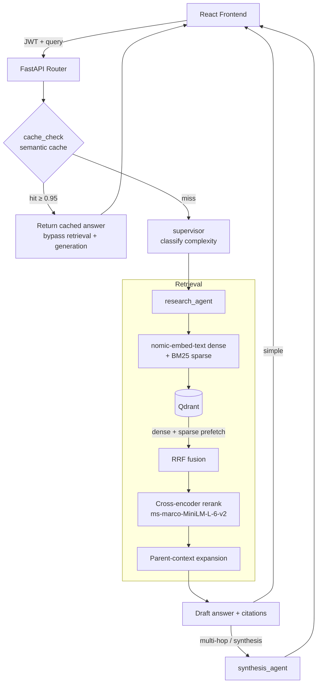

# Hermes — Agentic RAG Research Assistant

> Agentic RAG over PDFs, URLs, and YouTube with grounded citations. Hybrid dense + BM25 retrieval with Reciprocal Rank Fusion and cross-encoder reranking, orchestrated as a LangGraph retrieval + synthesis pipeline behind a JWT-secured FastAPI, with semantic caching and RAGAS-based quality tracking.


---

## Portfolio positioning

HERMES is the **Applied AI / agentic RAG** portfolio star (foundation-model stack, hybrid retrieval, LangGraph agents, semantic cache, honest RAGAS).

**Suggested CV order**

- Applied AI / Optimization (BMW-adjacent): HaulRank → **HERMES** → JurisGuard (1–2 bullets) → TALASH
- Agentic systems: NEXUS → **HERMES** (expanded) → JurisGuard (short) → HaulRank

**Not claimed here:** SSO/SCIM/WORM legal platforms, multi-tenant production SaaS, or user-profile personalization (see NEXUS). JurisGuard remains a supporting on-prem / air-gap story elsewhere — not this repo’s lead claim.

See [`docs/CV_BULLETS.md`](docs/CV_BULLETS.md) for ready-to-paste CV lines.

---

## What it does

- **Ingest** PDFs, web pages, and YouTube transcripts into a hybrid vector store.
- **Ask** natural-language questions and get answers grounded in the ingested sources, with citation cards that link back to the page, URL, or video timestamp.
- **Retrieve** with hybrid dense + sparse search, fuse with RRF, and rerank with a cross-encoder before any LLM call.
- **Cache** semantically similar questions to skip the pipeline on repeats.
- **Track** answer quality with RAGAS (faithfulness, answer relevancy, context precision/recall).
- **Multi-turn memory:** last N turns in Postgres feed a query-rewrite step so follow-ups retrieve with prior entities (not long-term user profiles). Disable with `HERMES_MULTI_TURN=0`.
- **Named tools + traces:** research always calls `hybrid_search` first; API/UI return `tool_trace` (empty-KB answers do not invent sources).
- **Workspace-scoped KB:** ingest stamps `user_id` on Qdrant payloads; query filters by the JWT user. Re-ingest after upgrading from pre-ACL collections.
- **Real token streaming:** `POST /api/research/stream` emits SSE token events (JSON `POST /api/research` still available).
- **MCP:** `uv run python -m src.mcp.server` exposes `hermes_search` / `hermes_research` over stdio for MCP Inspector.
---

## Architecture



The LangGraph pipeline is: `START → cache_check → [END on hit | supervisor → query_rewrite → research_agent → (synthesis_agent) → END]`. The supervisor classifies query complexity; simple queries finish after research, while multi-hop/synthesis queries get a second synthesis pass.

---

## Core components

### Hybrid retrieval (`backend/src/rag/retriever.py`)
- **Dense** embeddings via `nomic-embed-text` (Ollama) capture semantic meaning.
- **Sparse** BM25 vectors via `fastembed` capture exact lexical / keyword matches.
- Qdrant runs both as prefetches and fuses them with **Reciprocal Rank Fusion (RRF)**.
- **Parent-child chunking** (`chunker.py`): small child chunks are indexed for precise retrieval, but the larger parent chunk is returned to the LLM for context. Parent text is persisted in the Qdrant payload so expansion works across processes and restarts.

### Cross-encoder reranking (`backend/src/rag/reranker.py`)
Vector similarity scores candidates independently. The `ms-marco-MiniLM-L-6-v2` cross-encoder rescores the query against each candidate jointly, and contexts below `MIN_RERANK_SCORE` (default `0.35`) are dropped before the prompt is built.

### Semantic cache (`backend/src/rag/cache.py`)
A Redis-backed cache embeds each query and compares against stored queries by cosine similarity (threshold `0.95`). On a hit, `cache_check` (the first graph node) returns the stored answer and **bypasses retrieval and generation** — an honest latency optimization, not a bypass of "the entire pipeline" before classification.

### LangGraph agents (`backend/src/agents/`)
- `cache_check.py` — semantic cache gate (entry node).
- `supervisor.py` — classifies complexity (simple / multi-hop / synthesis).
- `query_rewrite.py` — expands follow-ups using prior turns before retrieval.
- `research.py` — forced `hybrid_search` tool, rerank, draft answer + citations + `tool_trace`.
- `synthesis.py` — refines multi-hop / cross-document answers.
- `stream_research.py` — real token SSE event generator.

### FastAPI + JWT (`backend/src/`)
- `POST /api/auth/register`, `POST /api/auth/login` — JWT auth.
- `POST /api/research` — JSON Q&A (Bearer token required).
- `POST /api/research/stream` — SSE token stream (same auth/body).
- `POST /api/ingest/pdf`, `/api/ingest/url`, `/api/ingest/youtube` — ingestion (stamps `user_id`).
- `GET /api/eval/dashboard`, `POST /api/eval/run` — RAGAS reporting.

### MCP (`backend/src/mcp/server.py`)
```bash
cd backend && uv run python -m src.mcp.server
# Connect MCP Inspector via stdio — tools: hermes_search, hermes_research
```
`hermes_research` is a local/dev tool (no JWT); do not expose unauthenticated in production.
---

## Evaluation (RAGAS)

Quality is measured with RAGAS using a local Ollama judge (`llama3.1:8b`) over a golden Q&A set. Latest run (`backend/eval_report.json`, 10 questions):

| Metric | Score |
|---|---|
| Faithfulness | 0.75 |
| Answer relevancy | 0.72 |
| Context precision | 0.72 |
| Context recall | 0.81 |

Run an evaluation:

```bash
# via API (background job, JWT required)
curl -X POST localhost:8000/api/eval/run -H "Authorization: Bearer <token>"

# or directly
cd backend && uv run python -m src.evaluation.ragas_eval
```

RAGAS is not part of CI (it depends on a running Ollama judge and takes several minutes). CI runs the mocked unit tests; an integration test exercises the real retriever locally.

---

## Setup

### 1. Start infrastructure

```bash
docker compose up -d postgres redis qdrant
# optional: run a local LLM/embedding server too
# docker compose --profile local up -d
```

You also need an Ollama server reachable at `OLLAMA_API_BASE` serving `nomic-embed-text` (embeddings) and `llama3.1:8b` / `llama3.2:3b` (generation).

### 2. Configure environment

```bash
cp backend/.env.example backend/.env
# edit values as needed (SECRET_KEY is required in production)
```

### 3. Backend

```bash
cd backend
uv sync
uv run uvicorn src.main:app --host 0.0.0.0 --port 8000 --reload
```

### 4. Frontend

```bash
cd frontend
npm install
npm run dev
```

---

## Tests

| Suite | Command | Requires |
|---|---|---|
| Unit (CI) | `cd backend && uv run pytest -m "not integration"` | Postgres (+ Redis optional) |
| Integration | `cd backend && uv run pytest -m integration` | Qdrant + Ollama + Redis |
| RAGAS | `cd backend && uv run python -m src.evaluation.ragas_eval` | Full stack + judge model |

```bash
cd backend
uv run pytest -m "not integration"      # unit tests (mocked, used in CI)
uv run pytest -m integration            # real Qdrant + Ollama + Redis required
```

---

## Project structure

```text
hermes/
├── backend/
│   ├── src/
│   │   ├── agents/
│   │   │   ├── cache_check.py   # semantic cache gate (entry node)
│   │   │   ├── supervisor.py    # complexity classification + routing
│   │   │   ├── query_rewrite.py # multi-turn retrieval rewrite
│   │   │   ├── research.py      # hybrid_search tool + draft + citations
│   │   │   ├── synthesis.py     # multi-hop / cross-doc refinement
│   │   │   ├── stream_research.py
│   │   │   └── graph.py         # LangGraph wiring
│   │   ├── tools/               # hybrid_search, fetch_parent, web_fetch
│   │   ├── mcp/                 # MCP stdio server
│   │   ├── rag/
│   │   │   ├── factory.py       # shared retriever singleton
│   │   │   ├── retriever.py     # Qdrant hybrid search + RRF + ACL filter
│   │   │   ├── reranker.py      # cross-encoder reranking
│   │   │   ├── chunker.py       # parent-child chunking
│   │   │   └── cache.py         # Redis semantic cache
│   │   ├── ingestion/           # pdf / url / youtube loaders
│   │   ├── routers/             # FastAPI endpoints
│   │   ├── evaluation/          # RAGAS eval + golden dataset
│   │   ├── auth.py              # JWT auth
│   │   └── main.py             # FastAPI app (entrypoint: src.main:app)
│   └── tests/
├── frontend/                    # React + Vite UI
└── docker-compose.yml
```

---

## Scope

This is a focused implementation of agentic RAG. Intentionally **not** included: CRAG/Self-RAG reflection loops, long-term user-profile personalization, Juris-class RBAC/SSO/SCIM/WORM, and competing with enterprise legal platforms. Workspace-scoped KB filtering is not a full RBAC platform.
