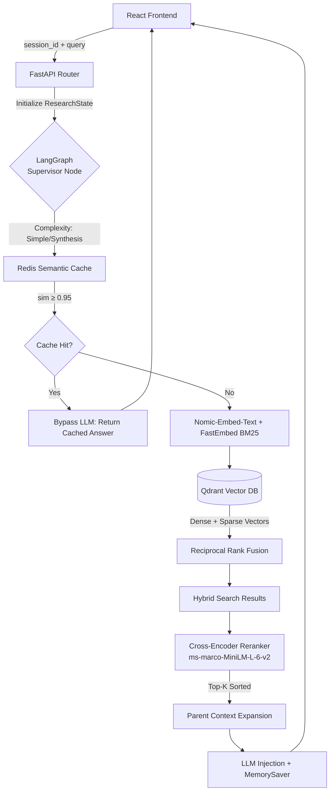

# ⚡ Hermes: Enterprise-Grade Agentic RAG System

> **A production-ready Retrieval-Augmented Generation architecture engineered for extreme accuracy, dynamic agentic routing, and mathematically verified contextual grounding.**


---

## 🏗️ 1. System Architecture: The Life of a Query

Hermes executes a highly sequenced, deterministic data flow designed to intercept redundant queries early, dynamically route execution paths, and algorithmically score retrieved context before ever interacting with an LLM.



---

## 🔬 2. Core Engineering Innovations

<details>
<summary><b>🛠️ Advanced Retrieval Stack (Hybrid Search, RRF, Chunking)</b></summary>
<br>
Naive RAG frequently fails at exact keyword retrieval (e.g., serial numbers or specific UUIDs). Hermes bridges this computational gap by executing two isolated retrieval protocols asynchronously:
<ul>
  <li><b>Dense Vectors</b> (`nomic-embed-text`): Captures broad semantic meaning.</li>
  <li><b>Sparse Vectors</b> (`BM25` via fastembed): Secures rigid terminology and exact lexical matches.</li>
</ul>
Results are fused algorithmically using <b>Reciprocal Rank Fusion (RRF)</b> to yield mathematically optimal result sets. Furthermore, the system employs <b>Parent-Child Hierarchical Chunking</b>: the database isolates extremely microscopic "child" chunks for high-precision retrieval, but natively traverses a relational graph to feed the LLM the overarching "parent" document for broader situational context, heavily mitigating hallucination logic.
</details>

<details>
<summary><b>⚖️ Cross-Encoder Reranking</b></summary>
<br>
Cosine similarity is incredibly fast but mathematically blunt—it grades vectors independently. To guarantee enterprise accuracy, Hermes intercepts the raw Qdrant Top-N results and pushes them through a heavy neural network (`ms-marco-MiniLM-L-6-v2`). The Cross-Encoder evaluates the specific user query against every retrieved passage <i>jointly</i>, filtering out vector noise and guaranteeing pinpoint relevance before the context window is ever constructed.
</details>

<details>
<summary><b>🏎️ Semantic Caching (Bypassing LLM Inference)</b></summary>
<br>
To radically suppress repetitive GPU cycles, Hermes implements a semantic Vector Cache over <b>Upstash Redis</b>. 
<br><br>
<b>The Float-Noise Vector Bug:</b> During performance testing, minor floating-point mathematical discrepancies between identical query embeddings caused false-negative cache misses. Additionally, early architecture iterations incorrectly cached <i>pure contexts</i>, entirely failing to bypass the heavy LLM execution block. 
<br><br>
<b>The Fix:</b> We rigorously decoupled the cache and enforced a strict <code>&ge; 0.95</code> semantic fallback threshold stringency to block false-positive intersections. The serialization payload was overhauled to capture the true final <i>Answer String</i> intrinsically. Now, conceptually isomorphic queries successfully short-circuit the entire LangGraph pipeline, yielding 0-latency inference costs.
</details>

<details>
<summary><b>🤖 Agentic Routing & Conversational Memory</b></summary>
<br>
Instead of linear procedural LLM chains, Hermes utilizes compiled cyclic workflows operating over LangGraph:
<ul>
  <li><b>`supervisor_node`</b>: Classifies incoming complexities dynamically, dictating the optimal retrieval depth protocol.</li>
  <li><b>`MemorySaver`</b>: Persists long-term, multi-turn contexts utilizing native episodic checkpointers. The React frontend actively captures and syncs a unique <code>session_id</code> to browser <code>sessionStorage</code>, passing it within every HTTP payload to perfectly hydrate the LangGraph conversational execution tree without amnesia.</li>
</ul>
</details>

---

## ⚖️ 3. Engineering Trade-offs & System Post-Mortem

Designing an enterprise pipeline requires conscious architectural concessions.

### 📉 Latency vs. Accuracy (The Reranker Tax)
We consciously accepted the severe computational latency penalty of running a `ms-marco` neural Cross-Encoder. While bypassing it reduces TTFB (Time-To-First-Byte) heavily, mathematically blunt vector similarity creates unacceptably high retrieval hallucination rates on complex data repositories. Accuracy natively supersedes speed in enterprise RAG.

### 📉 Why No "Self-RAG" (Yet)
While implementing a native reflection loop (having the LLM natively grade its exact retrieved chunks and re-querying the database autonomously) guarantees maximal reliability, we omitted it for V1. Injecting an isolated evaluation LLM jump prior to the primary synthesis block universally breached our sub-3-second TTFB targets, damaging the real-time chat UX.

### 📉 Why No Query Expansion
We opted against upfront prompt rewriting (generating multiple synthetic query variants before hitting the database). Because we optimized the Hybrid Vector space (RRF + BM25), the dense semantic fallback handles varying terminology gradients flawlessly, rendering the massive latency bump of LLM-based Query Expansion computationally redundant.

---

## 📁 4. Project Structure & Setup

```text
hermes/
├── backend/
│   ├── src/
│   │   ├── agents/
│   │   │   ├── graph.py       # LangGraph Orchestration & MemorySaver
│   │   │   ├── research.py    # LLM Organic Synthesis
│   │   │   └── supervisor.py  # Inference Classification Routing
│   │   ├── rag/
│   │   │   ├── cache.py       # Redis Semantic Intercept
│   │   │   ├── retriever.py   # Qdrant Hybrid RRF Protocol
│   │   │   ├── reranker.py    # ms-marco Cross-Encoder
│   │   │   └── chunker.py     # Parent-Child mapping logic
│   │   └── routers/           # FastAPI Endpoints
│   └── main.py
├── frontend/
│   ├── src/
│   │   ├── components/        # React Glassmorphism UI
│   │   ├── pages/
│   │   │   ├── ResearchView.jsx
│   │   │   └── Analytics.jsx
│   │   └── api/
│   └── vite.config.js
└── README.md
```

### ⚙️ Required Configuration (`.env`)
```env
# Backend /.env
QDRANT_URL=http://localhost:6333
QDRANT_API_KEY=your-api-key
REDIS_URL=redis://localhost:6379
OLLAMA_API_BASE=http://localhost:11434
```

### 🚀 Bootstrapping the System

**1. Initialize the FastAPI LangGraph Pipeline**
```bash
cd backend
uv run uvicorn src.main:app --host 0.0.0.0 --port 8000 --reload
```

**2. Boot the React Frontend Dashboard**
```bash
cd frontend
npm install
npm run dev
```

---
*Architected and engineered as a high-performance demonstration of Enterprise AI Engineering.*
