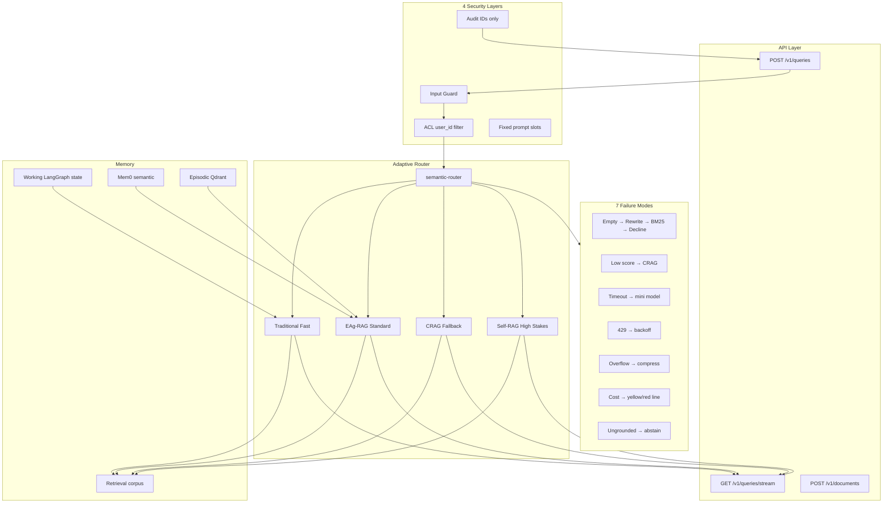
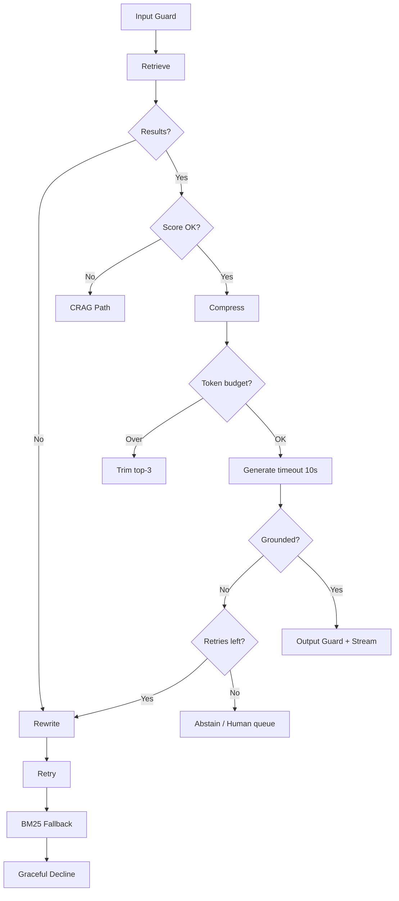

# HERMES v2 — Lethal Production Research RAG Plan

**Repo:** [`C:\Users\mhamd\Desktop\PROJECT\HERMES`](C:\Users\mhamd\Desktop\PROJECT\HERMES)  
**Guides:** [`RAG_ARCHITECTURES`](C:\Users\mhamd\Desktop\PROJECT\NEXT_BIG_THING\RAG_ARCHITECTURES)  
**Goal:** Make HERMES the portfolio flagship for **multi-source hybrid RAG + adaptive architectures + eval CI** — honestly measured, production-hardened, demo-ready.

---

## Target Architecture (End State)



---

## Honest Current State

| Dimension | Score | Reality |
| :--- | :--- | :--- |
| Hybrid retrieval | 75% | Qdrant dense+sparse RRF works |
| LangGraph | 50% | 3 nodes only; no CRAG/Self-RAG |
| Memory | 15% | MemorySaver wired; `messages` never populated |
| Security | 20% | JWT only; shared corpus; default SECRET_KEY |
| SSE | 10% | Fake progress events |
| Eval | 40% | Offline RAGAS; scores **below targets** (0.72–0.81) |
| Production | 25% | No compose; CI mocks everything |
| **Silent killer bugs** | — | Dual retriever singleton + RAM parent store |

**Portfolio rule:** Never cite 0.91 faithfulness or 493 golden pairs until CI proves it.

---

## Phase 0 — Critical Bug Fixes (Week 1)

*Nothing else matters until these are fixed — they silently degrade every answer.*

### 0.1 Dual retriever singleton (P0)

**Bug:** [`routers/ingest.py`](C:\Users\mhamd\Desktop\PROJECT\HERMES\backend\src\routers\ingest.py) creates `_retriever` A; [`agents/research.py`](C:\Users\mhamd\Desktop\PROJECT\HERMES\backend\src\agents\research.py) lines 13–19 creates `_retriever` B. Parents ingested via API live in A's memory; queries use B's empty `_parent_store`.

**Fix:**
1. Create [`src/rag/factory.py`](C:\Users\mhamd\Desktop\PROJECT\HERMES\backend\src\rag\factory.py):

```python
_retriever: HermesRetriever | None = None

def get_retriever() -> HermesRetriever:
    global _retriever
    if _retriever is None:
        _retriever = HermesRetriever(use_cache=True, use_reranker=True)
    return _retriever
```

2. Replace all local singletons in `ingest.py`, `research.py`, any loaders.
3. Add integration test: ingest PDF → query → assert parent context length > child length.

---

### 0.2 Persist parent chunks in Qdrant (P0)

**Bug:** [`retriever.py`](C:\Users\mhamd\Desktop\PROJECT\HERMES\backend\src\rag\retriever.py) line 68 `_parent_store: dict` — lost on restart.

**Fix (guide: [production-rag-pipeline.md §6 Multi-Vector](C:\Users\mhamd\Desktop\PROJECT\NEXT_BIG_THING\RAG_ARCHITECTURES\production-rag-pipeline.md)):**

Option A (recommended): Store parent text in Qdrant payload on child points:

```python
payload={
    "text": child.text,
    "parent_id": parent.id,
    "parent_text": parent.text,  # NEW — hydrate without RAM
    "chunk_index": child.index,
    ...
}
```

Option B: Second collection `hermes_parents` keyed by `parent_id`.

Update `query()` lines 190–191 to read `parent_text` from payload first, fall back to `_parent_store` for backward compat.

**Migration:** Re-ingest script or one-time backfill from existing child payloads if parent_text added going forward only.

---

### 0.3 Ingest failure handling (P0)

**Bug:** [`url_loader.py`](C:\Users\mhamd\Desktop\PROJECT\HERMES\backend\src\ingestion\url_loader.py) returns `{"status": "failed"}` without raising; [`ingest.py`](C:\Users\mhamd\Desktop\PROJECT\HERMES\backend\src\routers\ingest.py) sets `job.status = "ok"` anyway.

**Fix:**
```python
result = load_url(url)
if result.get("status") == "failed":
    job.status = "error"
    job.error_msg = result.get("error", "unknown")
    raise HTTPException(422, detail=job.error_msg)
```

Same pattern for YouTube loader.

---

### 0.4 Cache interface mismatch (P1)

**Bug:** [`retriever.py`](C:\Users\mhamd\Desktop\PROJECT\HERMES\backend\src\rag\retriever.py) cache returns contexts-only; [`research.py`](C:\Users\mhamd\Desktop\PROJECT\HERMES\backend\src\agents\research.py) line 30 requires `"answer" in cached`.

**Fix:** Remove cache check from retriever.query(); keep cache only at research_node layer (already sets full object at line 128–132). Or unify: retriever returns `{contexts, answer, citations}` on cache hit.

---

### 0.5 Useless relevance filter (P1)

**Bug:** [`research.py`](C:\Users\mhamd\Desktop\PROJECT\HERMES\backend\src\rag\retriever.py) line 46: `> -100` never filters.

**Fix (guide: [rag-failure-handling.md §2](C:\Users\mhamd\Desktop\PROJECT\NEXT_BIG_THING\RAG_ARCHITECTURES\rag-failure-handling.md)):**

```python
MIN_RERANK_SCORE = float(os.getenv("MIN_RERANK_SCORE", "0.35"))
contexts = [c for c in contexts if c.get("reranker_score", 0) >= MIN_RERANK_SCORE]
```

---

## Phase 1 — Production Foundation (Weeks 2–3)

### 1.1 Centralized config

**New file:** [`src/config.py`](C:\Users\mhamd\Desktop\PROJECT\HERMES\backend\src\config.py) (Pydantic Settings)

Consolidate all hardcoded values from `retriever.py`, `cache.py`, `auth.py`, `main.py`:

| Setting | Default | Guide ref |
| :--- | :--- | :--- |
| `embedding_model` | `BAAI/bge-m3` | [README embeddings](C:\Users\mhamd\Desktop\PROJECT\NEXT_BIG_THING\RAG_ARCHITECTURES\README.md) |
| `reranker_model` | `BAAI/bge-reranker-v2-m3` | [pipeline §7](C:\Users\mhamd\Desktop\PROJECT\NEXT_BIG_THING\RAG_ARCHITECTURES\production-rag-pipeline.md) |
| `retrieval_top_k` | 50 | [rag-pitfalls §Top-K](C:\Users\mhamd\Desktop\PROJECT\NEXT_BIG_THING\RAG_ARCHITECTURES\rag-pitfalls.md) |
| `rerank_top_k` | 5 | Same |
| `min_rerank_score` | 0.35 | [failure §2](C:\Users\mhamd\Desktop\PROJECT\NEXT_BIG_THING\RAG_ARCHITECTURES\rag-failure-handling.md) |
| `cache_similarity_threshold` | 0.95 | [README caching](C:\Users\mhamd\Desktop\PROJECT\NEXT_BIG_THING\RAG_ARCHITECTURES\README.md) |
| `max_retries` | 3 | [failure unified graph](C:\Users\mhamd\Desktop\PROJECT\NEXT_BIG_THING\RAG_ARCHITECTURES\rag-failure-handling.md) |
| `llm_timeout_seconds` | 10 | [failure §3](C:\Users\mhamd\Desktop\PROJECT\NEXT_BIG_THING\RAG_ARCHITECTURES\rag-failure-handling.md) |
| `grounding_threshold` | 0.75 | [pipeline §9](C:\Users\mhamd\Desktop\PROJECT\NEXT_BIG_THING\RAG_ARCHITECTURES\production-rag-pipeline.md) |

**New file:** `.env.example` with all vars documented.

---

### 1.2 Docker Compose full stack

**New:** [`docker-compose.yml`](C:\Users\mhamd\Desktop\PROJECT\HERMES\docker-compose.yml) at repo root:

| Service | Image | Port |
| :--- | :--- | :--- |
| `postgres` | postgres:15 | 5432 |
| `redis` | redis:7 | 6379 |
| `qdrant` | qdrant/qdrant | 6333 |
| `backend` | build ./backend | 8000 |
| `frontend` | build ./frontend | 5173 |
| `ollama` | ollama/ollama (profile: local) | 11434 |

Pre-download in Dockerfile: cross-encoder, bge-m3 (or mount volume).

Guide: [README Reference Architecture §1 Local Stack](C:\Users\mhamd\Desktop\PROJECT\NEXT_BIG_THING\RAG_ARCHITECTURES\README.md#1-the-local--dev-stack-zero-to-one).

---

### 1.3 Postgres checkpointer (replace MemorySaver)

**Current:** [`graph.py`](C:\Users\mhamd\Desktop\PROJECT\HERMES\backend\src\agents\graph.py) line 60 `MemorySaver()` — in-process, not horizontal.

**Fix (guide: [agent-memory-types.md §1](C:\Users\mhamd\Desktop\PROJECT\NEXT_BIG_THING\RAG_ARCHITECTURES\agent-memory-types.md)):**

```python
from langgraph.checkpoint.postgres import PostgresSaver
memory = PostgresSaver.from_conn_string(settings.database_url_sync)
```

Enables crash recovery + human-in-loop later.

---

### 1.4 Per-user corpus isolation (Security Layer 2)

**Current:** Single `hermes_docs` collection — all users share KB.

**Fix (guide: [rag-security.md §Layer 2](C:\Users\mhamd\Desktop\PROJECT\NEXT_BIG_THING\RAG_ARCHITECTURES\rag-security.md)):**

1. Add `user_id` to Qdrant payload on every ingest in [`retriever.py`](C:\Users\mhamd\Desktop\PROJECT\HERMES\backend\src\rag\retriever.py) `ingest()`.
2. Add mandatory filter on every `query()`:

```python
Filter(must=[FieldCondition(key="user_id", match=MatchValue(value=user_id))])
```

3. Pass `user_id` from JWT through `run_research()` → research_node → retriever.

---

### 1.5 Structured logging + audit (Security Layer 4)

**Replace `print()`** with structlog across agents.

**Extend `QueryLog`** in [`db.py`](C:\Users\mhamd\Desktop\PROJECT\HERMES\backend\src\db.py):

| New column | Purpose |
| :--- | :--- |
| `session_id` | Thread tracking |
| `route_taken` | fast/standard/crag/self |
| `retrieval_doc_ids` | JSON list of chunk IDs — **not full text** |
| `latency_ms` | End-to-end |
| `grounding_score` | Populate faithfulness |
| `failure_mode` | empty/low_score/timeout/abstain/null |

Guide: [rag-security.md §Layer 4](C:\Users\mhamd\Desktop\PROJECT\NEXT_BIG_THING\RAG_ARCHITECTURES\rag-security.md) — log IDs not content.

---

## Phase 2 — Traditional RAG Fast Path + Adaptive Router (Week 4)

### 2.1 semantic-router replaces LLM supervisor

**Current:** [`supervisor.py`](C:\Users\mhamd\Desktop\PROJECT\HERMES\backend\src\agents\supervisor.py) calls Ollama 3b on every query (~2–3s). Duplicate unused [`llm/router.py`](C:\Users\mhamd\Desktop\PROJECT\HERMES\backend\src\llm\router.py).

**Fix (guide: [rag-architectures.md §Adaptive](C:\Users\mhamd\Desktop\PROJECT\NEXT_BIG_THING\RAG_ARCHITECTURES\rag-architectures.md)):**

**New:** `src/routing/semantic_router.py`

| Route | Example utterances | Pipeline |
| :--- | :--- | :--- |
| `fast` | "What is RAG?", "Define embedding" | Traditional: retrieve → rerank → generate → END |
| `standard` | "Compare BM25 vs dense retrieval" | EAg-RAG path |
| `crag` | "Latest news on X" (stale corpus) | CRAG with rewrite |
| `self_rag` | User flag `?mode=strict` or low prior grounding | Self-RAG loop |

Delete LLM call from supervisor; supervisor becomes thin wrapper setting `state["route"]`.

**Dependency:** add `semantic-router` to pyproject.toml.

---

### 2.2 Expand LangGraph for route-specific subgraphs

**Rewrite [`graph.py`](C:\Users\mhamd\Desktop\PROJECT\HERMES\backend\src\agents\graph.py):**

```
START → router_node → [fast_path | standard_path | crag_path | self_rag_path] → END
```

**Fast path nodes** (Traditional RAG — [rag-architectures.md §Traditional](C:\Users\mhamd\Desktop\PROJECT\NEXT_BIG_THING\RAG_ARCHITECTURES\rag-architectures.md)):

```
retrieve_wide(50) → rerank(5) → threshold_check → generate → END
```

Skip synthesis agent entirely. Use `simple` model tier.

---

### 2.3 Retrieve wide, rerank narrow

**Current:** `research.py` line 43 `top_k=5` — too narrow for recall.

**Fix (guide: [rag-pitfalls.md](C:\Users\mhamd\Desktop\PROJECT\NEXT_BIG_THING\RAG_ARCHITECTURES\rag-pitfalls.md)):**

```python
candidates = retriever.query(query, top_k=settings.retrieval_top_k)  # 50
contexts = rerank(query, candidates, top_k=settings.rerank_top_k)     # 5
```

Verify [`retriever.py`](C:\Users\mhamd\Desktop\PROJECT\HERMES\backend\src\rag\retriever.py) already prefetches `top_k * 4` — align config.

---

### 2.4 Context compression (Pipeline #8)

**New:** `src/rag/compress.py`

Before LLM call in research_node:
1. Dedupe chunks with cosine similarity > 0.95 on embeddings
2. Restore document order by `chunk_index` ([EAg post-processor pattern](C:\Users\mhamd\Desktop\PROJECT\NEXT_BIG_THING\RAG_ARCHITECTURES\rag-architectures.md))
3. Hard token cap via tiktoken — trim lowest-scoring chunks first

Guide: [production-rag-pipeline.md §8](C:\Users\mhamd\Desktop\PROJECT\NEXT_BIG_THING\RAG_ARCHITECTURES\production-rag-pipeline.md), [rag-failure-handling.md §5](C:\Users\mhamd\Desktop\PROJECT\NEXT_BIG_THING\RAG_ARCHITECTURES\rag-failure-handling.md).

---

### 2.5 Failure modes #1 and #2 (partial chain)

**New node:** `handle_empty_retrieval` in `src/agents/fallback.py`

```
if no contexts after threshold:
  1. query_rewrite (HyDE or LLM paraphrase) → retry retrieve (once)
  2. if still empty → BM25-only sparse search
  3. if still empty → GRACEFUL_DECLINE (never call LLM)
```

Guide: [rag-failure-handling.md §1](C:\Users\mhamd\Desktop\PROJECT\NEXT_BIG_THING\RAG_ARCHITECTURES\rag-failure-handling.md).

**Extend `ResearchState`:**

```python
rewrite_count: int
failure_mode: Optional[str]
graceful_decline: bool
```

---

## Phase 3 — CRAG + Self-RAG (Weeks 5–6)

### 3.1 CRAG grader node

**Guide:** [rag-architectures.md §CRAG](C:\Users\mhamd\Desktop\PROJECT\NEXT_BIG_THING\RAG_ARCHITECTURES\rag-architectures.md)

**New files:**
- `src/agents/crag.py` — `grade_retrieval_node`, `rewrite_query_node`, `web_search_fallback_node`
- `src/rag/grader.py` — Pydantic structured output

```python
class RetrievalGrade(BaseModel):
    verdict: Literal["correct", "incorrect", "ambiguous"]
    max_score: float
    reasoning: str
```

**Graph insertion (standard + crag routes):**

```
retrieve → grade_retrieval →
  correct → compress → generate
  incorrect → rewrite → retrieve → [web_search optional] → generate
  ambiguous → merge internal + web → generate
```

**Web fallback:** Tavily or DuckDuckGo ([NEXUS already uses ddgs pattern](C:\Users\mhamd\Desktop\PROJECT\NEXUS\backend\src\agents\tools.py)) — add `tools/web_search.py`.

---

### 3.2 Query rewriting / HyDE (Pipeline #5)

**New:** `src/rag/query_transform.py`

| Function | When | Guide |
| :--- | :--- | :--- |
| `hyde_embed(query)` | Technical corpus, vocabulary mismatch | [README §Query Transformation](C:\Users\mhamd\Desktop\PROJECT\NEXT_BIG_THING\RAG_ARCHITECTURES\README.md#query-transformation--routing) |
| `multi_query_expand(query, n=3)` | Ambiguous queries | Same |
| `decompose_query(query)` | Comparative multi-doc | [rag-architectures EAg](C:\Users\mhamd\Desktop\PROJECT\NEXT_BIG_THING\RAG_ARCHITECTURES\rag-architectures.md) |

Used in CRAG rewrite node and EAg query optimizer.

---

### 3.3 Self-RAG reflection loop

**Guide:** [rag-architectures.md §Self-RAG](C:\Users\mhamd\Desktop\PROJECT\NEXT_BIG_THING\RAG_ARCHITECTURES\rag-architectures.md)

**New nodes in `src/agents/self_rag.py`:**

```
generate → check_grounded →
  supported → check_useful →
    useful → END
    not useful → retry (if retries < max)
  not supported → retry OR abstain
```

**Structured checks (Pydantic + `with_structured_output`):**

```python
class GroundingCheck(BaseModel):
    is_supported: bool
    unsupported_claims: list[str]
    confidence: float
```

**Abstain message:** Fixed string — never deliver ungrounded answer silently ([failure mode #7](C:\Users\mhamd\Desktop\PROJECT\NEXT_BIG_THING\RAG_ARCHITECTURES\rag-failure-handling.md)).

Populate `QueryLog.faithfulness` from `confidence`.

---

### 3.4 Complete 7-mode failure graph

**Rewrite graph as unified state machine** per [rag-failure-handling.md §Unified Fallback](C:\Users\mhamd\Desktop\PROJECT\NEXT_BIG_THING\RAG_ARCHITECTURES\rag-failure-handling.md):



**Failure mode #3:** Wrap `get_completion` in [`providers.py`](C:\Users\mhamd\Desktop\PROJECT\HERMES\backend\src\llm\providers.py) with timeout; fallback to `gpt-4o-mini` / `llama-3.1-8b`.

**Failure mode #4:** LiteLLM retry policy — already partial; add exponential backoff 2/4/8s.

**Failure mode #6:** tokencost yellow/red lines in router before generation.

---

## Phase 4 — EAg-RAG + Memory Stack (Weeks 7–8)

### 4.1 EAg-RAG components

**Guide:** [rag-architectures.md §EAg-RAG](C:\Users\mhamd\Desktop\PROJECT\NEXT_BIG_THING\RAG_ARCHITECTURES\rag-architectures.md) (Uber Genie pattern)

| Component | New file | Integration |
| :--- | :--- | :--- |
| **Query Optimizer** | `src/agents/query_optimizer.py` | Decompose multi-hop before retrieve on `standard` route |
| **Source Identifier** | `src/rag/source_filter.py` | Qdrant filter on `source_type`, `source` metadata from ingest |
| **Post-processor** | `src/rag/post_processor.py` | Dedupe + restore `chunk_index` order after rerank |
| **Enriched metadata** | extend `ingest()` | LLM summary per parent chunk at ingest; store `summary_embedding` |

**Multi-vector (Pipeline #6):** Embed both raw child text AND parent summary; retrieve on summary, return parent text to LLM.

---

### 4.2 Seven memory types

**Guide:** [agent-memory-types.md](C:\Users\mhamd\Desktop\PROJECT\NEXT_BIG_THING\RAG_ARCHITECTURES\agent-memory-types.md)

| # | Type | HERMES v2 implementation | Priority |
| :--- | :--- | :--- | :--- |
| 1 | **Working** | Add `messages: list` to `ResearchState`; frontend sends history; summarize when >10 turns | P0 |
| 2 | **Semantic** | **Mem0** — extract user research prefs ("interested in hybrid search") per `user_id` | P1 |
| 3 | **Episodic** | Qdrant collection `hermes_episodes`: past (query, answer, thumbs) tuples; retrieve top-3 similar episodes at query start | P1 |
| 4 | **Procedural** | Store successful route+source combos that led to high grounding scores | P2 |
| 5 | **Retrieval** | Per-user Qdrant corpus — already Phase 1.4 | Done |
| 6 | **Parametric** | LiteLLM model tiers — document in README | Done |
| 7 | **Prospective** | `ResearchSession.follow_up_at` + Celery beat "check back on this topic" — optional P3 | P3 |

**Working memory wiring:**

1. [`state.py`](C:\Users\mhamd\Desktop\PROJECT\HERMES\backend\src\agents\state.py) — add `messages: list[dict]`
2. [`graph.py`](C:\Users\mhamd\Desktop\PROJECT\HERMES\backend\src\agents\graph.py) — accept `messages` in `run_research()`
3. [`routers/research.py`](C:\Users\mhamd\Desktop\PROJECT\HERMES\backend\src\routers\research.py) — Pydantic body includes `messages`, `session_id`
4. [`ResearchView.jsx`](C:\Users\mhamd\Desktop\PROJECT\HERMES\frontend\src\pages\ResearchView.jsx) — POST history array from sessionStorage

**Mem0 integration:** `src/memory/semantic.py` — call after successful answer; inject retrieved facts into system prompt slot.

---

### 4.3 Upgrade embeddings to BGE-M3

**Guide:** [README §Embedding Models](C:\Users\mhamd\Desktop\PROJECT\NEXT_BIG_THING\RAG_ARCHITECTURES\README.md#embedding-models), [rag-pitfalls §Mismatched Embedders](C:\Users\mhamd\Desktop\PROJECT\NEXT_BIG_THING\RAG_ARCHITECTURES\rag-pitfalls.md)

**Change [`retriever.py`](C:\Users\mhamd\Desktop\PROJECT\HERMES\backend\src\rag\retriever.py):**
- Replace Ollama `nomic-embed-text` with `sentence-transformers` BGE-M3 (1024-dim)
- **Full re-index required** — new Qdrant collection `hermes_docs_v2` or migration script
- Update `VECTOR_DIM`, cache embeddings model

**Keep sparse BM25** via fastembed — already hybrid per guide.

---

### 4.4 Smart chunking upgrade (Pipeline #1)

**Current:** Fixed recursive 1000/200 in [`chunker.py`](C:\Users\mhamd\Desktop\PROJECT\HERMES\backend\src\rag\chunker.py).

**Upgrade (guide: [rag-pitfalls §Fixed Chunk Size](C:\Users\mhamd\Desktop\PROJECT\NEXT_BIG_THING\RAG_ARCHITECTURES\rag-pitfalls.md)):**

| Source type | Strategy | Library |
| :--- | :--- | :--- |
| PDF | Doc-type aware + page metadata | unstructured (already fallback in pdf_loader) |
| URL | trafilatura → semantic chunks | chonkie SemanticChunker |
| YouTube | Segment-aware (~120s groups) | Already partially done |
| Code pasted | Larger chunks, language-aware | chonkie |

Fix mutable default `metadata: dict = {}` line 50 → `metadata: dict | None = None`.

---

## Phase 5 — Security + API + Real SSE (Week 9)

### 5.1 Four security layers

**Guide:** [rag-security.md](C:\Users\mhamd\Desktop\PROJECT\NEXT_BIG_THING\RAG_ARCHITECTURES\rag-security.md)

| Layer | Implementation | File |
| :--- | :--- | :--- |
| **1 Input guard** | `llm-guard` or regex rail — block injection before retrieve | `src/security/input_guard.py` + middleware |
| **2 ACL** | Per-user Qdrant filter (Phase 1.4) | `retriever.py` |
| **3 Fixed template** | Replace [`research.py`](C:\Users\mhamd\Desktop\PROJECT\HERMES\backend\src\agents\research.py) lines 99–114 with XML slots | `src/prompts/templates.py` |
| **4 Audit** | Extended QueryLog — IDs only | `db.py` |

**Fixed prompt template:**

```text
<system>...</system>
<context>
{retrieved_chunks}
</context>
<history>
{sanitized_history}
</history>
<question>
{sanitized_query}
</question>
```

**Presidio at ingest:** Scan PDF/URL text before embedding ([rag-security.md](C:\Users\mhamd\Desktop\PROJECT\NEXT_BIG_THING\RAG_ARCHITECTURES\rag-security.md)).

**Rate limiting:** slowapi 10 req/min on `/v1/queries`, 5/min on ingest.

**SECRET_KEY:** Fail startup if default value in production env.

---

### 5.2 REST API v1

**Guide:** [rest-api-design.md](C:\Users\mhamd\Desktop\PROJECT\NEXT_BIG_THING\RAG_ARCHITECTURES\rest-api-design.md)

**New router:** `src/routers/v1/queries.py`

| Method | Path | Notes |
| :--- | :--- | :--- |
| POST | `/v1/queries` | Body: `{query, session_id, messages, stream: bool, mode: fast\|standard\|strict}` |
| GET | `/v1/queries/stream` | Real SSE — see 5.3 |
| GET | `/v1/sessions/{id}/messages` | Cursor pagination |
| POST | `/v1/documents` | Async ingest → 202 + job_id |
| GET | `/v1/jobs/{id}` | Ingestion status |
| GET | `/v1/evaluations` | Latest RAGAS report |

Keep legacy `/api/research` as alias during migration.

---

### 5.3 Real SSE streaming (Pipeline #12)

**Current fake:** [`routers/research.py`](C:\Users\mhamd\Desktop\PROJECT\HERMES\backend\src\routers\research.py) lines 65–76.

**Fix (guide: [production-rag-pipeline.md §12](C:\Users\mhamd\Desktop\PROJECT\NEXT_BIG_THING\RAG_ARCHITECTURES\production-rag-pipeline.md)):**

1. Add `get_completion_stream()` in [`providers.py`](C:\Users\mhamd\Desktop\PROJECT\HERMES\backend\src\llm\providers.py) using LiteLLM `stream=True`
2. Stream events:
   - `event: route` — `{route: "fast"}`
   - `event: retrieval` — `{citations: [...]}`
   - `event: token` — `{text: "..."}`
   - `event: grounding` — `{score: 0.91}`
   - `event: done` — `{session_id, model, cache_hit}`
3. Use `sse-starlette` EventSourceResponse (already in deps)
4. Run graph retrieve nodes sync, stream only generation phase
5. Update frontend `ResearchView.jsx` to consume EventSource

---

### 5.4 Semantic cache upgrade

**Current:** O(n) linear scan in [`cache.py`](C:\Users\mhamd\Desktop\PROJECT\HERMES\backend\src\rag\cache.py).

**Upgrade:** RedisVL vector index OR dedicated Qdrant `hermes_cache` collection with HNSW ([README §Caching](C:\Users\mhamd\Desktop\PROJECT\NEXT_BIG_THING\RAG_ARCHITECTURES\README.md#caching--performance)).

Scope keys: `user_id` + query embedding.

Invalidate on document ingest for that user.

---

## Phase 6 — Eval, CI, Observability (Weeks 10–12)

### 6.1 Golden dataset expansion

**Current:** 10 pairs in [`golden_dataset.py`](C:\Users\mhamd\Desktop\PROJECT\HERMES\backend\src\evaluation\golden_dataset.py).

**Target:** 50–100 triples `(question, ground_truth_answer, ground_truth_contexts)`

Sources:
- Existing 10
- RAGAS synthetic generation from indexed corpus ([rag-pitfalls §Eval](C:\Users\mhamd\Desktop\PROJECT\NEXT_BIG_THING\RAG_ARCHITECTURES\rag-pitfalls.md))
- Manual curation from integration test failures

---

### 6.2 RAGAS + DeepEval CI gate

**Guide:** [production-rag-pipeline.md §9](C:\Users\mhamd\Desktop\PROJECT\NEXT_BIG_THING\RAG_ARCHITECTURES\production-rag-pipeline.md)

**Update [`.github/workflows/ci.yml`](C:\Users\mhamd\Desktop\PROJECT\HERMES\.github\workflows\ci.yml):**

```yaml
jobs:
  unit:
    ...
  integration:
    services: [postgres, redis, qdrant]
    run: pytest testers/ -v
  eval:
    if: github.event_name == 'pull_request'
    run: python -m src.evaluation.ragas_eval --ci
    # Fail if faithfulness < 0.80 OR context_recall < 0.85
```

Add **DeepEval** for regression on CRAG/Self-RAG paths ([README §Eval](C:\Users\mhamd\Desktop\PROJECT\NEXT_BIG_THING\RAG_ARCHITECTURES\README.md#evaluation--benchmarking)).

Fix `ragas_eval.py` — scope Redis flush to `hermes:*` keys only.

---

### 6.3 Langfuse tracing

**Guide:** [README §Observability](C:\Users\mhamd\Desktop\PROJECT\NEXT_BIG_THING\RAG_ARCHITECTURES\README.md#observability--tracing)

Instrument every LangGraph node:
- Input/output state keys (not full chunk text)
- Latency per node
- Route taken
- Retrieval scores
- Grounding score

Replace Analytics dashboard static JSON with Langfuse embed OR keep both.

---

### 6.4 Integration test expansion

**Extend [`testers/test_pipeline.py`](C:\Users\mhamd\Desktop\PROJECT\HERMES\backend\testers\test_pipeline.py):**

| Test | Validates |
| :--- | :--- |
| Parent hydration after restart | Phase 0.2 |
| Per-user isolation | Phase 1.4 |
| Fast path skips synthesis | Phase 2 |
| CRAG triggers on low score | Phase 3 |
| Self-RAG abstains on ungrounded | Phase 3 |
| Empty retrieval → decline (no LLM) | Failure #1 |
| SSE returns token events | Phase 5.3 |
| Injection blocked | Security L1 |

Fix Windows path: use `tempfile.NamedTemporaryFile(suffix=".pdf")`.

---

## 13 Pipeline Components — Final Scorecard

| # | Component | v1 | v2 Target |
| :--- | :--- | :--- | :--- |
| 1 Smart chunking | Recursive fixed | chonkie semantic + doc-type |
| 2 Embeddings | nomic/Ollama | BGE-M3 |
| 3 Vector store | Qdrant | Qdrant + parent persistence |
| 4 Hybrid retrieval | RRF dense+sparse | Same + BM25 fallback chain |
| 5 Query rewriting | None | HyDE + multi-query + CRAG rewrite |
| 6 Multi-vector | Broken parent store | Summary + raw embeddings |
| 7 Cross-encoder rerank | ms-marco | BGE-reranker-v2-m3 + threshold |
| 8 Context compression | None | Dedupe + token cap |
| 9 RAGAS eval | Offline, below target | CI gate faithfulness ≥ 0.80 |
| 10 Conversation memory | Broken | Working + Mem0 + episodic |
| 11 Guardrails | None | Input guard + grounding check |
| 12 Streaming | Fake SSE | Real token SSE |
| 13 Agentic RAG | 3-node basic | Adaptive + EAg + CRAG + Self-RAG |

---

## Five RAG Architectures — HERMES v2 Coverage

| Architecture | v1 | v2 Implementation |
| :--- | :--- | :--- |
| Traditional RAG | Partial | `fast` route — retrieve→rerank→generate |
| Agentic RAG | Basic 3-node | Tool use via web_search in CRAG |
| EAg-RAG | None | query_optimizer + source_filter + post_processor |
| CRAG | None | grade_retrieval node + rewrite + web fallback |
| Self-RAG | None | grounding/useful checks + abstain |
| Adaptive RAG | LLM supervisor | semantic-router → route-specific subgraph |

---

## Target Metrics (CI-Enforced)

| Metric | v1 (actual) | v2 Target |
| :--- | :--- | :--- |
| RAGAS faithfulness | 0.75 | ≥ 0.80 |
| RAGAS answer relevancy | 0.72 | ≥ 0.78 |
| RAGAS context precision | 0.72 | ≥ 0.80 |
| RAGAS context recall | 0.81 | ≥ 0.85 |
| Fast path p50 latency | ~3s LLM + retrieve | < 5s total (excl. air-gap) |
| Standard path p50 | ~15–25s | < 12s |
| Golden set size | 10 | 50+ |
| Integration tests in CI | 0 | 20+ |
| Injection pass rate | untested | 0 critical passes |
| Parent context after restart | **Broken** | 100% |

---

## New Directory Structure (v2)

```
backend/src/
├── config.py                 # NEW — centralized settings
├── prompts/
│   └── templates.py          # NEW — fixed security templates
├── routing/
│   └── semantic_router.py    # NEW — adaptive routes
├── security/
│   └── input_guard.py        # NEW — Layer 1
├── memory/
│   ├── semantic.py           # NEW — Mem0
│   └── episodic.py           # NEW — episode index
├── agents/
│   ├── graph.py              # REWRITE — multi-route graph
│   ├── state.py              # EXTEND — messages, grades, retries
│   ├── fallback.py           # NEW — 7 failure modes
│   ├── crag.py               # NEW
│   ├── self_rag.py           # NEW
│   ├── query_optimizer.py    # NEW — EAg
│   ├── post_processor.py     # NEW — EAg (or rag/)
│   └── supervisor.py         # SIMPLIFY — delegate to router
├── rag/
│   ├── factory.py            # NEW — single retriever singleton
│   ├── retriever.py          # FIX — parent persist, ACL, wide retrieve
│   ├── query_transform.py    # NEW — HyDE, multi-query
│   ├── compress.py           # NEW
│   ├── grader.py             # NEW — CRAG Pydantic
│   └── source_filter.py      # NEW — EAg
├── tools/
│   └── web_search.py         # NEW — CRAG fallback
├── routers/
│   └── v1/
│       ├── queries.py        # NEW — REST v1
│       └── documents.py      # NEW — async ingest
└── evaluation/
    ├── golden_dataset.py     # EXPAND — 50+ pairs
    ├── ragas_eval.py         # CI mode
    └── deepeval_ci.py        # NEW
```

---

## 12-Week Timeline

| Week | Deliverable | Exit criteria |
| :--- | :--- | :--- |
| 1 | Phase 0 bugs | Parent text survives restart; single retriever |
| 2 | Config + Docker + ACL | `docker compose up` works end-to-end |
| 3 | Postgres checkpointer + logging | Session survives backend restart |
| 4 | semantic-router + fast path + compression | 40% queries skip synthesis |
| 5 | CRAG grader + HyDE + rewrite chain | Low-score queries recover |
| 6 | Self-RAG + full failure graph | Ungrounded answers abstain |
| 7 | EAg-RAG pre/post agents | Multi-hop recall improves on eval |
| 8 | Mem0 + episodic + BGE-M3 re-index | Cross-session prefs work |
| 9 | Security 4-layer + REST v1 + real SSE | Injection demo blocked |
| 10 | Golden set 50+ + RAGAS CI | PR fails on regression |
| 11 | Langfuse + DeepEval + integration CI | All testers/ in CI |
| 12 | README honest metrics + demo video | Portfolio-ready |

---

## Demo Script (Portfolio Killer)

1. Upload PDF + URL + YouTube — show ingest job status
2. **Fast path:** "What is hybrid search?" — sub-5s, citations, route badge
3. **Standard EAg:** "Compare RRF vs single dense retrieval across my sources" — query decompose, multi-source citations
4. **CRAG:** Ask about topic not in corpus — rewrite → web search → grounded answer with external source tag
5. **Self-RAG strict mode:** Adversarial doc in corpus — abstain with confidence badge
6. **Security:** Prompt injection → blocked at Layer 1
7. **ACL:** User B queries User A's doc → zero results
8. **Memory:** "Remember I prefer concise answers" → next session respects Mem0 fact
9. **SSE:** Show tokens streaming live
10. **Analytics:** Langfuse trace + RAGAS dashboard with CI badge

---

## What NOT to Do

- Do not claim 0.91 faithfulness until CI proves it
- Do not add Temporal until core graph is stable (mention in README architecture section only)
- Do not add all 7 memory types at once — Working → Mem0 → Episodic in that order
- Do not switch vector DB — Qdrant hybrid is correct per guides
- Do not build gRPC internal services — REST+SSE is sufficient for portfolio

---

## Bottom Line

HERMES v2 becomes lethal by fixing **silent bugs first**, then implementing the **RAG_ARCHITECTURES taxonomy** as an explicit LangGraph state machine with CI-gated eval — not by adding more README adjectives.

**First commit:** Phase 0.1 + 0.2 (retriever factory + parent persistence). Everything else builds on correct retrieval.
